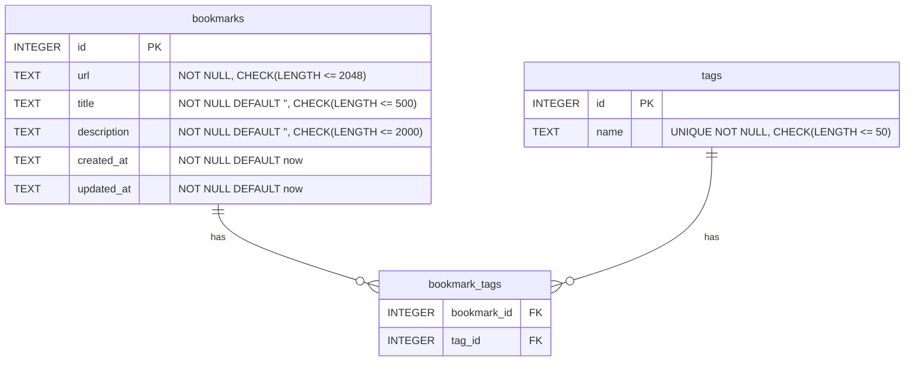

# feat: Bookmark Manager with Tags and Search

## Enhancement Summary

**Deepened on:** 2026-04-09
**Agents used:** 9 (quality-gate, security, performance, architecture, python, simplicity, data-integrity, pattern-consistency, best-practices)

### Key Improvements
1. Removed SSRF module, preferences blueprint, and card view (simplicity -- ~165 LOC saved)
2. Added type hints, usage examples, transaction constraints, and search SQL template (swarm clarity)
3. Added indexes, CSRF protection, random SECRET_KEY, sort_order validation (security + performance)

### Simplifications Applied
- **SSRF protection dropped** -- single-user personal tool on localhost; no untrusted users
- **Preferences blueprint dropped** -- hardcode defaults; sort order via query param
- **Card view dropped** -- list view only; add card later if desired
- **default_tags and auto_fetch_title toggle dropped** -- always attempt fetch; no per-pref toggles

---

## Overview

A personal web bookmark manager built with Flask + SQLite following the sandbox's
established app factory pattern. Users save URLs with titles, descriptions, and
free-form tags, then search across all fields. Sort order is a query parameter.

Single-user, no auth. (see brainstorm: docs/brainstorms/2026-04-09-bookmark-manager-brainstorm.md)

## What is Changing

A new top-level `bookmark-manager/` directory with the standard sandbox Flask app
structure: app factory, SQLite with WAL mode, raw SQL models, Jinja2 templates,
and blueprints for bookmarks and tags.

## What Must Not Change

- No modifications to any existing sandbox apps (task-tracker, url-shortener, etc.)
- No new Python dependencies beyond `flask>=3.0` (urllib is stdlib)
- Follow the exact same patterns as task-tracker for db.py, app factory, models

## How We'll Know It Worked

1. `python run.py` starts without errors
2. Can create, edit, delete bookmarks with tags
3. Search finds bookmarks by title, URL, or tag name
4. Auto-fetch populates title from URL (3s timeout, graceful fallback)
5. Sort dropdown works (newest, oldest, a-z) via query parameter
6. Pagination works (20 items per page)
7. Orphan tags are cleaned up after bookmark edits AND deletes
8. Empty states show helpful messages

## Most Likely Way This Plan is Wrong

The auto-fetch title feature could be slow or fail on many sites. If it causes
swarm integration issues, stub `fetch_page_title` to always return None and fix
post-assembly.

---

## Proposed Solution

### Data Model



### Schema Details

```sql
PRAGMA foreign_keys = ON;

CREATE TABLE IF NOT EXISTS bookmarks (
    id INTEGER PRIMARY KEY AUTOINCREMENT,
    url TEXT NOT NULL CHECK(length(url) <= 2048),
    title TEXT NOT NULL DEFAULT '' CHECK(length(title) <= 500),
    description TEXT NOT NULL DEFAULT '' CHECK(length(description) <= 2000),
    created_at TEXT NOT NULL DEFAULT (strftime('%Y-%m-%d %H:%M:%S', 'now')),
    updated_at TEXT NOT NULL DEFAULT (strftime('%Y-%m-%d %H:%M:%S', 'now'))
);

CREATE TABLE IF NOT EXISTS tags (
    id INTEGER PRIMARY KEY AUTOINCREMENT,
    name TEXT NOT NULL UNIQUE CHECK(length(name) <= 50)
);

CREATE TABLE IF NOT EXISTS bookmark_tags (
    bookmark_id INTEGER NOT NULL REFERENCES bookmarks(id) ON DELETE CASCADE,
    tag_id INTEGER NOT NULL REFERENCES tags(id) ON DELETE CASCADE,
    PRIMARY KEY (bookmark_id, tag_id)
);

-- Indexes for JOIN and sort performance
CREATE INDEX IF NOT EXISTS idx_bookmark_tags_tag_id ON bookmark_tags(tag_id);
CREATE INDEX IF NOT EXISTS idx_bookmarks_created_at ON bookmarks(created_at);
CREATE INDEX IF NOT EXISTS idx_bookmarks_title ON bookmarks(title);
```

### Design Decisions (resolved from brainstorm + SpecFlow + deepening)

| Decision | Choice | Rationale |
|----------|--------|-----------|
| Duplicate URLs | Warn but allow | User may want same URL with different tags/notes |
| URL validation | Require http:// or https:// | Block javascript: XSS; reject bare domains |
| Tag input | Comma-separated text field | Simplest; tags can't contain commas (acceptable) |
| Tag normalization | Case-insensitive, store lowercase | `name.lower().strip()` before INSERT |
| Auto-fetch timing | Synchronous on form submit, BEFORE get_db() | No JS complexity; 3s timeout; don't hold DB connection during fetch |
| Auto-fetch failure | Flash message + blank title field | User fills in manually; title is optional |
| SSRF protection | None (dropped) | Single-user personal tool on localhost; no untrusted users |
| Multi-word search | Split on spaces, AND all terms via EXISTS | Each term must match in title OR url OR tags |
| Orphan tag cleanup | Application-level after edit AND delete | Delete tags with zero bookmark_tags rows |
| Sort options | newest, oldest, a-z via query param | created_at DESC, created_at ASC, title ASC |
| Pagination | Offset-based with page numbers, 20/page hardcoded | Simple for web UI; cursor pagination overkill |
| Page out of range | Redirect to page 1 | Prevents empty/error pages |
| Delete confirmation | Browser confirm() dialog | Minimal JS, prevents accidents |
| Required fields | URL only; title and tags optional | Description also optional |
| Character limits | URL 2048, title 500, description 2000, tag 50 | Enforced in schema CHECK + server-side |
| Empty states | Helpful messages with add link | "No bookmarks yet" / "No results found" |
| LIKE escaping | Escape % and _ in search input | Prevents wildcard injection |
| CSRF | Session-based token, no extra dependencies | Manual implementation using Flask session |
| SECRET_KEY | Random at startup via secrets.token_hex | Never hardcode; prevents session forgery |
| Preferences | Hardcoded constants, no preferences table | YAGNI; add preferences later if needed |
| View mode | List only, no card view | Build card view later if desired |

---

## File Structure

```
bookmark-manager/
  run.py
  requirements.txt
  app/
    __init__.py
    db.py
    models.py
    schema.sql
    fetch_title.py
    blueprints/
      bookmarks/
        __init__.py
        routes.py
      tags/
        __init__.py
        routes.py
    templates/
      layout.html
      bookmarks/
        list.html
        detail.html
        form.html
      tags/
        list.html
    static/
      style.css
```

---

## Shared Interface Spec

This spec is the single source of truth for all swarm agents.

### Constants

```python
# models.py top-level constants
from typing import Final

ITEMS_PER_PAGE: Final[int] = 20
SORT_OPTIONS: Final[list[str]] = ['newest', 'oldest', 'a-z']
SORT_LABELS: Final[dict[str, str]] = {
    'newest': 'Newest First',
    'oldest': 'Oldest First',
    'a-z': 'A-Z by Title',
}
SORT_MAP: Final[dict[str, str]] = {
    'newest': 'created_at DESC',
    'oldest': 'created_at ASC',
    'a-z': 'title ASC',
}
```

### Usage Patterns (MANDATORY -- swarm agents must follow these)

```python
import sqlite3
from app.db import get_db
from app.models import create_bookmark, set_bookmark_tags, get_all_bookmarks

# READ pattern (list, detail, search, tags)
with get_db() as conn:
    bookmarks = get_all_bookmarks(conn, sort_order='newest', limit=20, offset=0)

# WRITE pattern (create, update, delete) -- use immediate=True
with get_db(immediate=True) as conn:
    bookmark_id = create_bookmark(conn, url, title, description)  # returns int, NOT a Row
    set_bookmark_tags(conn, bookmark_id, tag_names)  # uses the int id directly
    # Both calls MUST be in the same get_db() block (one transaction)

# CREATE route pattern -- fetch title BEFORE opening db connection
title = fetch_page_title(url) if not user_title else user_title
with get_db(immediate=True) as conn:
    bookmark_id = create_bookmark(conn, url, title or '', description)
    set_bookmark_tags(conn, bookmark_id, tag_names)

# DELETE route pattern -- cleanup orphan tags in same transaction
with get_db(immediate=True) as conn:
    delete_bookmark(conn, bookmark_id)
    cleanup_orphan_tags(conn)
```

### Model Functions (models.py)

All functions take `conn: sqlite3.Connection` as the first argument.
Return types are exact -- do NOT treat an int return as a Row object.
All functions MUST have type hints.

```python
import sqlite3

# --- Bookmarks ---

def get_all_bookmarks(
    conn: sqlite3.Connection,
    sort_order: str = 'newest',
    limit: int = 20,
    offset: int = 0,
) -> list[sqlite3.Row]:
    """Returns list of sqlite3.Row. Each row: id, url, title, description, created_at, updated_at.
    sort_order MUST be validated against SORT_OPTIONS. Use SORT_MAP to build ORDER BY clause.
    Never interpolate sort_order into SQL directly."""

def get_bookmark(conn: sqlite3.Connection, bookmark_id: int) -> sqlite3.Row | None:
    """Returns sqlite3.Row or None. Row: id, url, title, description, created_at, updated_at."""

def get_bookmark_count(conn: sqlite3.Connection) -> int:
    """Returns int -- total number of bookmarks."""

def get_bookmarks_by_url(conn: sqlite3.Connection, url: str) -> list[sqlite3.Row]:
    """Returns list of sqlite3.Row matching the given URL. Used for duplicate warnings."""

def create_bookmark(conn: sqlite3.Connection, url: str, title: str, description: str) -> int:
    """Returns int -- the new bookmark's id (cursor.lastrowid). NOT a Row."""

def update_bookmark(conn: sqlite3.Connection, bookmark_id: int, url: str, title: str, description: str) -> None:
    """Returns None. Sets updated_at = strftime('%Y-%m-%d %H:%M:%S', 'now') in the UPDATE."""

def delete_bookmark(conn: sqlite3.Connection, bookmark_id: int) -> None:
    """Returns None. CASCADE removes bookmark_tags rows. Caller must call cleanup_orphan_tags."""

# --- Sort Validation ---

def _sort_clause(sort_order: str) -> str:
    """Returns ORDER BY clause string. Raises ValueError for unknown sort orders.
    Uses SORT_MAP dict -- never interpolates raw parameter into SQL."""

# --- Tags ---

def get_all_tags(conn: sqlite3.Connection) -> list[sqlite3.Row]:
    """Returns list of sqlite3.Row. Each row: id, name, bookmark_count (computed via LEFT JOIN)."""

def get_tag_by_name(conn: sqlite3.Connection, name: str) -> sqlite3.Row | None:
    """Returns sqlite3.Row or None. Row: id, name."""

def get_or_create_tag(conn: sqlite3.Connection, name: str) -> int:
    """Returns int -- the tag's id. Uses INSERT OR IGNORE. name is lowercased and stripped."""

def get_tags_for_bookmark(conn: sqlite3.Connection, bookmark_id: int) -> list[sqlite3.Row]:
    """Returns list of sqlite3.Row. Each row: id, name."""

def get_tags_for_bookmarks(conn: sqlite3.Connection, bookmark_ids: list[int]) -> dict[int, list[sqlite3.Row]]:
    """Returns dict mapping bookmark_id -> list of tag Rows.
    Fetches all tags for a batch of bookmarks in ONE query (prevents N+1).
    Uses: SELECT bt.bookmark_id, t.id, t.name FROM bookmark_tags bt
          JOIN tags t ON t.id = bt.tag_id WHERE bt.bookmark_id IN (?, ?, ...)
    Groups results in Python. Returns empty list for bookmarks with no tags."""

def set_bookmark_tags(conn: sqlite3.Connection, bookmark_id: int, tag_names: list[str]) -> None:
    """Returns None. tag_names is a list of strings.
    Deletes existing bookmark_tags for this bookmark.
    For each name: lowercases, strips, skips empty, calls get_or_create_tag.
    Inserts new bookmark_tags rows.
    Then calls cleanup_orphan_tags.
    MUST be called in the same get_db() block as create/update_bookmark."""

def cleanup_orphan_tags(conn: sqlite3.Connection) -> None:
    """Returns None. DELETE FROM tags WHERE id NOT IN (SELECT DISTINCT tag_id FROM bookmark_tags)."""

# --- Search ---

def _escape_like(term: str) -> str:
    """Private helper. Escapes \\, %, and _ for LIKE patterns. Returns escaped string."""

def search_bookmarks(
    conn: sqlite3.Connection,
    query: str,
    sort_order: str = 'newest',
    limit: int = 20,
    offset: int = 0,
) -> list[sqlite3.Row]:
    """Returns list of sqlite3.Row. Same columns as get_all_bookmarks.
    Splits query on spaces. For EACH term, adds an AND clause:
      (b.title LIKE ? ESCAPE '\\' OR b.url LIKE ? ESCAPE '\\\\'
       OR EXISTS (
         SELECT 1 FROM bookmark_tags bt
         JOIN tags t ON bt.tag_id = t.id
         WHERE bt.bookmark_id = b.id AND t.name LIKE ? ESCAPE '\\\\'
       ))
    Each term produces 3 parameters. Uses EXISTS (not flat JOIN + DISTINCT).
    Uses parameterized queries (?) -- never string interpolation."""

def search_bookmark_count(conn: sqlite3.Connection, query: str) -> int:
    """Returns int -- count of bookmarks matching the query."""

# --- Bookmarks by Tag ---

def get_bookmarks_by_tag(
    conn: sqlite3.Connection,
    tag_name: str,
    sort_order: str = 'newest',
    limit: int = 20,
    offset: int = 0,
) -> list[sqlite3.Row]:
    """Returns list of sqlite3.Row. Same columns as get_all_bookmarks.
    Filters to bookmarks that have the given tag."""

def get_bookmarks_by_tag_count(conn: sqlite3.Connection, tag_name: str) -> int:
    """Returns int -- count of bookmarks with this tag."""
```

### fetch_title.py

Simple URL title fetcher. No SSRF protection needed (single-user personal tool).

```python
import re
import urllib.request
import urllib.error

FETCH_TIMEOUT: int = 3  # seconds

def fetch_page_title(url: str) -> str | None:
    """Fetches URL with FETCH_TIMEOUT, extracts <title> tag content.
    Returns None on ANY error (timeout, network, parse, non-HTML).
    Uses urllib.request.urlopen with timeout.
    Reads at most 100KB to avoid downloading large files.
    Implementation:
      try:
          resp = urllib.request.urlopen(url, timeout=FETCH_TIMEOUT)
          content = resp.read(100_000).decode('utf-8', errors='ignore')
          match = re.search(r'<title[^>]*>(.*?)</title>', content, re.IGNORECASE | re.DOTALL)
          return match.group(1).strip() if match else None
      except Exception:
          return None
    """
```

### App Factory (__init__.py)

```python
import secrets
from flask import Flask, redirect, url_for

def create_app(db_path=None):
    app = Flask(__name__)
    app.config['SECRET_KEY'] = secrets.token_hex(24)  # random per startup, never hardcoded

    if db_path:
        app.config['DB_PATH'] = db_path
    else:
        app.config['DB_PATH'] = 'bookmarks.db'

    with app.app_context():
        init_db(app)

    # CSRF protection via before_request hook
    # Generate session['csrf_token'] if absent
    # Validate on every POST request
    # Provide csrf_token to all templates via context_processor

    @app.route('/')
    def index():
        return redirect(url_for('bookmarks.index'))

    # Register blueprints
    app.register_blueprint(bookmarks_bp, url_prefix='/bookmarks')
    app.register_blueprint(tags_bp, url_prefix='/tags')

    return app
```

### CSRF Protection (in __init__.py)

```python
import secrets
from flask import session, request, abort

@app.before_request
def csrf_protect():
    if 'csrf_token' not in session:
        session['csrf_token'] = secrets.token_hex(16)
    if request.method == 'POST':
        token = request.form.get('csrf_token', '')
        if token != session.get('csrf_token'):
            abort(403)

@app.context_processor
def inject_csrf():
    return {'csrf_token': session.get('csrf_token', '')}
```

All POST forms must include: `<input type="hidden" name="csrf_token" value="{{ csrf_token }}">`

### URL Validation (in bookmarks/routes.py, owned by routes agent)

```python
from urllib.parse import urlparse

def validate_url(url: str) -> str:
    """Validate and return the cleaned URL. Raises ValueError with message on failure.
    Rejects empty, > 2048 chars, non-http(s) schemes, missing netloc."""
    url = url.strip()
    if not url:
        raise ValueError("URL is required")
    if len(url) > 2048:
        raise ValueError("URL must be 2048 characters or less")
    parsed = urlparse(url)
    if parsed.scheme not in ('http', 'https'):
        raise ValueError("URL must start with http:// or https://")
    if not parsed.netloc:
        raise ValueError("Invalid URL")
    return url

# Usage in route:
# try:
#     url = validate_url(request.form['url'])
# except ValueError as e:
#     flash(str(e), 'error')
#     return redirect(url_for('bookmarks.new_bookmark'))
```

### Route Blueprints

**bookmarks blueprint** (url_prefix='/bookmarks')

| Method | Path | Function Name | Behavior |
|--------|------|---------------|----------|
| GET | / | index | List bookmarks with pagination and sort (query params: page, sort, q). |
| GET | /new | new_bookmark | Show add form. |
| POST | /new | create_bookmark_route | Validate URL. Auto-fetch title if title empty. Create bookmark + set tags in one transaction. Flash success. Redirect to index. |
| GET | /\<int:id\>/edit | edit_bookmark | Show edit form with current values + tags. |
| POST | /\<int:id\>/edit | update_bookmark_route | Validate. Update bookmark + reconcile tags in one transaction. Flash success. Redirect to detail. |
| POST | /\<int:id\>/delete | delete_bookmark_route | Delete bookmark + cleanup orphan tags in one transaction. Flash success. Redirect to index. |
| GET | /\<int:id\> | show_bookmark | Show bookmark detail with tags. |

**Route handler naming uses `_route` suffix on POST handlers to avoid shadowing model imports.**

**tags blueprint** (url_prefix='/tags')

| Method | Path | Function Name | Behavior |
|--------|------|---------------|----------|
| GET | / | index | List all tags with bookmark counts. |
| GET | /\<name\> | show | List bookmarks with this tag, paginated. |

### Template Context and Usage Examples

Each template receives these variables. Usage examples are mandatory for swarm agents.

**layout.html** (base template):
- All templates extend this. Must include `{{ csrf_token }}` via context processor.
- Must include nav links to `/bookmarks` and `/tags`.

**bookmarks/list.html**:
- `bookmarks` (list of Row), `page` (int), `total_pages` (int), `query` (str or ''), `tag_filter` (str or ''), `sort_order` (str), `bookmark_tags` (dict: bookmark_id -> list of tag Row), `sort_options` (SORT_LABELS dict)

```jinja2
{# Tag display pattern -- use .get() to handle bookmarks with no tags #}

  <a href="{{ url_for('tags.show', name=tag['name']) }}">{{ tag['name'] }}</a>


{# Sort dropdown #}
<select name="sort" onchange="this.form.submit()">
  
    <option value="{{ key }}" {{ 'selected' if key == sort_order }}>{{ label }}</option>
  
</select>
```

**bookmarks/detail.html**: `bookmark` (Row), `tags` (list of tag Row)

**bookmarks/form.html**: `bookmark` (Row or None for new), `tags_str` (str, comma-separated), `is_edit` (bool)

```jinja2
{# Form action changes based on is_edit #}
<form method="post" action="{{ url_for('bookmarks.update_bookmark_route', id=bookmark['id']) if is_edit else url_for('bookmarks.create_bookmark_route') }}">
  <input type="hidden" name="csrf_token" value="{{ csrf_token }}">
  {# ... fields ... #}
</form>
```

**tags/list.html**: `tags` (list of Row with bookmark_count)

---

## Swarm Agent Assignment

| Agent | Role | Files |
|-------|------|-------|
| core | Schema, db, models, fetch_title, run.py, requirements.txt, app factory with CSRF | `bookmark-manager/run.py`, `bookmark-manager/requirements.txt`, `bookmark-manager/app/__init__.py`, `bookmark-manager/app/db.py`, `bookmark-manager/app/models.py`, `bookmark-manager/app/schema.sql`, `bookmark-manager/app/fetch_title.py` |
| routes | All blueprint routes. validate_url lives in bookmarks/routes.py. | `bookmark-manager/app/blueprints/bookmarks/__init__.py`, `bookmark-manager/app/blueprints/bookmarks/routes.py`, `bookmark-manager/app/blueprints/tags/__init__.py`, `bookmark-manager/app/blueprints/tags/routes.py` |
| templates | All templates and static CSS | `bookmark-manager/app/templates/layout.html`, `bookmark-manager/app/templates/bookmarks/list.html`, `bookmark-manager/app/templates/bookmarks/detail.html`, `bookmark-manager/app/templates/bookmarks/form.html`, `bookmark-manager/app/templates/tags/list.html`, `bookmark-manager/app/static/style.css` |

---

## Acceptance Criteria

- [ ] `cd bookmark-manager && pip install -r requirements.txt && python run.py` starts on port 5000
- [ ] Create bookmark with URL, title, description, comma-separated tags
- [ ] Auto-fetch title populates from URL when title left empty (3s timeout, graceful fallback)
- [ ] Duplicate URL shows warning flash but allows save
- [ ] Edit bookmark -- change fields and tags, orphan tags cleaned up
- [ ] Delete bookmark with confirmation dialog, orphan tags cleaned up
- [ ] Search finds bookmarks by partial title, URL, or tag match (multi-word AND)
- [ ] Browse by tag shows filtered bookmark list
- [ ] Sort dropdown works (newest, oldest, a-z) via query parameter
- [ ] Pagination works (20 items per page)
- [ ] Empty states show helpful messages ("No bookmarks yet", "No results found")
- [ ] URL validation rejects non-http(s) and > 2048 chars
- [ ] Tag names normalized to lowercase, stripped
- [ ] Search escapes LIKE wildcards (%, _)
- [ ] All SQL uses parameterized queries (? placeholders)
- [ ] CSRF token on all POST forms
- [ ] All model functions have type hints

## Sources & References

### Origin

- **Brainstorm:** [docs/brainstorms/2026-04-09-bookmark-manager-brainstorm.md](docs/brainstorms/2026-04-09-bookmark-manager-brainstorm.md) -- key decisions: free-form tags, LIKE search, web UI, WAL mode

### Internal References

- App factory pattern: `task-tracker/app/__init__.py`
- Database module: `task-tracker/app/db.py`
- Model functions: `task-tracker/app/models.py`
- Schema conventions: `task-tracker/app/schema.sql`

### Solution Doc Lessons Applied

- WAL mode + timeout=10 for concurrent writes (url-shortener)
- Atomic SQL for counters (url-shortener)
- Spec scalar return types for swarm agents (task-tracker-categories)
- Context manager usage examples are mandatory for swarm (acid-test)
- Guard empty lists before max() (todo-app)
- Deduplicate before count math (habit-tracker)
- INSERT OR IGNORE for tag deduplication (best-practices research)
- EXISTS subquery pattern for search (performance review)
- Batch tag fetching to prevent N+1 (performance review)

### Deepening Review Findings Applied

| Finding | Source Agent | Resolution |
|---------|-------------|------------|
| Drop SSRF module (YAGNI) | simplicity | Removed; simple urllib with timeout |
| Drop preferences blueprint | simplicity | Removed; hardcoded constants |
| Drop card view | simplicity | Removed; list view only |
| Add type hints | python-reviewer | Added to all function signatures |
| validate_url should raise ValueError | python-reviewer | Changed from tuple return |
| sort_order SQL injection via ORDER BY | python + security | Added SORT_MAP + _sort_clause |
| Missing get_db() usage examples | architecture | Added Usage Patterns section |
| Missing scalar return usage example | architecture | Added to Usage Patterns |
| Tag reconciliation needs same transaction | data-integrity | Added explicit constraint in Usage Patterns |
| Missing idx_bookmark_tags_tag_id index | performance | Added to schema |
| URL fetch must happen before get_db() | performance | Added to Usage Patterns |
| N+1 query in bookmark list | performance | Added get_tags_for_bookmarks batch function |
| EXISTS subquery for search | performance | Added SQL template to search_bookmarks spec |
| No CSRF protection | security | Added session-based CSRF |
| Hardcoded SECRET_KEY | security | Changed to secrets.token_hex |
| No root route | architecture | Added redirect / -> /bookmarks |
| Missing title CHECK constraint | data-integrity + architecture | Added to schema |
| Orphan cleanup after delete | data-integrity | Added to delete route and Usage Patterns |
| Route handler naming | pattern-consistency | Added _route suffix convention |
| Template usage examples | architecture | Added Jinja2 examples |
| Preference key injection | security | Removed (no preferences table) |
| Missing get_bookmarks_by_url | data-integrity | Added for duplicate URL warnings |

## Feed-Forward

- **Hardest decision:** Whether to keep SSRF protection. Dropped it -- 9 review agents agreed it's YAGNI for a single-user personal tool, and it eliminates the DNS TOCTOU critical vulnerability entirely.
- **Rejected alternatives:** Full preferences system (over-engineered), card view (speculative), SSRF module (unnecessary for personal tool), FTS5 search (overkill).
- **Least confident:** Auto-fetch title. Simplified to plain urllib with 3s timeout and 100KB read limit. If it causes swarm integration issues, stub to always return None.
