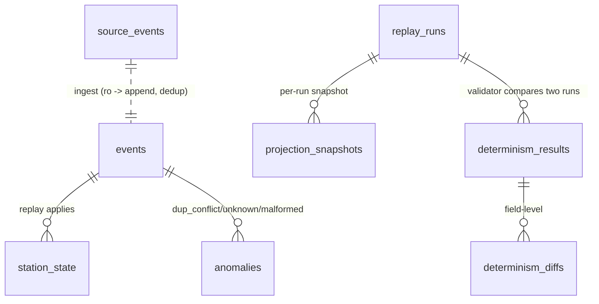

# CPAA Shadow Lab Event-Replay Simulator — Swarm Plan

> **Origin:** Authored from the Codex-hardened brief `docs/briefs/2026-06-06-cpaa-event-replay-simulator-brief.md`
> (origin document; brainstorm is internal to autopilot). Brief decisions carried forward verbatim;
> *(brief: Layer N)* points back to it.
>
> **Two-stage model (brief: Layer 12).** *Stage 1 (attended, now):* plan → deepen → spec-convergence
> (Codex + human structural verification, zero P0s) → frozen committed spec. *Stage 2 (unattended):*
> autopilot-swarm builds against the frozen spec; every Stage-2 gate is automated.

## Enhancement Summary
**Deepened on:** 2026-06-06 (11 parallel agents: spec-completeness, spec-consistency, EARS, Python, data-integrity, architecture, simplicity, performance, security, flow-trace, determinism-research).
**Key improvements folded in:**
1. **NON_DETERMINISTIC is a comparison result, not a run status** — run state machine is `{PENDING, RUNNING, COMPLETE_PASS, ABORTED}`; the determinism verdict lives in `determinism_results.match`. Resolves the validator-writes-replay_runs ownership contradiction.
2. **Projection snapshots** (`projection_snapshots`) persist each run's projection so two completed runs can be field-diffed (clean-room reset destroys live projection state).
3. **Run-lock rewritten** as a single guarded `INSERT … SELECT … WHERE NOT EXISTS(status='RUNNING')` + a stale-RUNNING reaper (prevents bricked unattended runs).
4. **Canonical hash byte recipe frozen** (RFC 8785-aligned) + Python 3.14 sqlite connect-mode + `open_live_ro` URI pinned.
5. **Dedup counters** get a real store (`dedup_counters`); `dup_exact` removed from the anomalies taxonomy.
6. **Wiring/Export completeness:** `apply_*`/`reset_*`, `get_events`, `parse_patch` (present-keys-only), `TS_FORMAT`/`TS_RE`, dispatch-map constant, `get_db` all enumerated; dispatch map moved to a core-owned module.
7. **Security binding rules:** CSRF mechanism + `X-CSRFToken` for JSON, SECRET_KEY fail-closed, serializer table allowlist literal, loopback bind, error-handler hygiene.
8. **Agent roster rebalanced to 24** with no hollow agents (drop metrics; merge live_guard into A2; split env/system; split validation_models ahead of validator; two test agents).

## 1. Overview
Build a **shadow-lab event-replay simulator**: an append-only event log with deterministic state
reconstruction, point-in-time replay, and a determinism-validation harness. It replays a read-only
corpus of synthetic CPAA gala telemetry into shadow-DB projections and proves those projections are
reproducible and isolated from the source.

The **meta-goal** (brief: Layer 3) is to validate the autopilot architecture at 20-25 agents — whether
inline deepening + worker spawn survive a swarm ~2× the validated 12-agent ceiling (Run 068). The app
is the workload; `context_proxy_chars` telemetry is the measurement.

### What must NOT change / must NOT be added (negative scope, enforced)
- **No production DB.** Local SQLite only (`live.db` READ-ONLY, `shadow.db` all writes).
- **No undeclared external calls / network.** Dev server binds `127.0.0.1` only.
- **No clock-speed/rewind time-travel** beyond point-in-time read (deferred).
- **No writable `live.db` handle** anywhere (ownership-gate failure).
- **No overlapping file ownership** across agents (overlap = Step 10.5w fail).
- **No re-opening** the 5 frozen (§3.1) or 6 pinned (§3.2) decisions.
- **Do NOT inherit** `cpaa-shadow-lab/schema.sql` unchanged (predates the frozen decisions).

### Reuse finding
A prior single-agent build at `cpaa-shadow-lab/` has the exact **1,595-event** seed and a deterministic
generator (`generate_scenario.py`, `seed=42`, 4 failure injections, 18:00-22:00 gala 2026-06-15).
**Decision:** reuse corpus + generator logic; the new spec **owns a new schema + a forked generator**
that stamps `idempotency_key`, assigns monotonic `event_id`, emits an out-of-order batch, and writes a
read-only `live.db`.

## 2. Tech Stack & Project Layout
Flask app factory + stdlib `sqlite3` (Python 3.14) + Jinja2; matches `docs/plans/2026-06-05-gig-outcome-tracker-plan.md`.

### Directory tree (paths relative to project root)
```
cpaa-replay/
  app/
    __init__.py          # create_app(), login_required, auth_bp (/auth/login,/auth/logout), blueprint registration, error handlers, CSRF, SECRET_KEY/APP_PASSWORD/env fail-closed, MAX_CONTENT_LENGTH
    config.py            # env config: LIVE_DB, SHADOW_DB, SECRET_KEY (all required, fail-closed)
    db.py                # get_db(immediate=False) shadow ctx mgr (WAL, foreign_keys, BEGIN IMMEDIATE); open_live_ro() read-only
    constants.py         # TS_FORMAT, TS_RE, RUN_STATES, ANOMALY_KINDS, _PROJECTION_TABLES, DISPATCH (event-type prefix -> module), EMPTY_PROJECTION_HASH
    serialization.py     # canonical_hash(conn) + canonical row serialization (RFC 8785-aligned)
    payload.py           # parse_json, parse_patch(payload, allowed) -> dict (present keys only; null->None), event_type/payload validation
    event_models.py      # append_event (INSERT OR IGNORE + classify), get_events, events_at_time; dedup_counters writer
    anomaly_models.py    # record_anomaly() — SINGLE WRITER of anomalies
    run_models.py        # state machine: start_run (guarded lock), mark_*, reap_stale_runs; SINGLE WRITER of replay_runs
    snapshot_models.py   # write_snapshot/read_snapshot — SINGLE WRITER of projection_snapshots
    validation_models.py # record_determinism + diffs — SINGLE WRITER of determinism_results/_diffs
    ingest.py            # read live.db (open_live_ro) -> append into shadow.db events
    ingest_routes.py     # bp: ingest
    replay_engine.py     # run lifecycle orchestration, reset, dispatch via DISPATCH, snapshot+hash, live pre/post hash
    proj_station.py      # apply_station + station_state (owner)
    proj_financial.py    # apply_financial + financial_state (owner)
    proj_environmental.py# apply_environmental + environmental_state (owner)
    proj_system.py       # apply_system + system_state (owner)
    replay_routes.py     # bp: replay
    validator.py         # two-snapshot compare -> determinism_results + diffs; live-unchanged assert
    live_guard.py        # live_content_hash(ro_conn) (read via query, not file bytes)
    validator_routes.py  # bp: validate
    dashboard_routes.py  # bp: dashboard
    templates/           # base.html, dashboard.html, run_detail.html, projection.html, 404.html, 400.html
  schema/
    live_schema.sql      # source_events
    shadow_schema.sql    # events, replay_runs, projection tables, projection_snapshots, dedup_counters, anomalies, determinism_results, determinism_diffs
  tools/
    generate_source.py   # forked generator -> live.db (idempotency_key, out-of-order batch, journal_mode=DELETE)
    init_db.py           # create live.db + shadow.db via executescript on raw conn
    compute_golden.py    # computes EMPTY_PROJECTION_HASH + golden corpus hash, frozen into constants.py
  tests/
    test_dedup.py test_determinism.py test_patch_semantics.py test_pointintime.py test_isolation.py conftest.py
  smoke_test.py
  run.sh                 # binds 127.0.0.1
  requirements.txt
```

## 3. Frozen + Pinned Decisions (authoritative)

### 3.1 The 5 FROZEN gap decisions (brief: Layer 7 — verbatim)
1. **Dedup** — globally-unique `idempotency_key` (UNIQUE); append via `INSERT OR IGNORE` inside
   `BEGIN IMMEDIATE`; first-write-wins. Duplicate key silently ignored + counted; same key + different
   payload ignored + logged as anomaly (never overwrites).
2. **Determinism** — same event sequence → identical projection, verified by hashing the
   canonically-serialized projection; deterministic iff two runs' hashes match; field-level diff on
   mismatch. (Byte recipe pinned §8 rule 8.)
3. **Shadow isolation** — `live.db` READ-ONLY, `shadow.db` all writes; replay never opens a writable
   `live.db` handle; "live unchanged" = `live.db` content hash identical pre/post (hashed via query).
4. **Ordering** — apply strictly by monotonic `event_id` assigned at append; equal `logical_ts`
   tie-breaks on `event_id`; point-in-time `WHERE logical_ts <= :t ORDER BY event_id`.
5. **Payload** — PATCH semantics; explicit `null` CLEARS the key, absent key unchanged. Unknown keys
   + per-event-type rules in §8.

### 3.2 The 6 NEWLY-PINNED cross-section decisions (refined by deepening)
- **A. Run lifecycle state machine.** `replay_runs.status ∈ {PENDING, RUNNING, COMPLETE_PASS, ABORTED}`.
  `NON_DETERMINISTIC` is **NOT** a run status — it is a determinism *comparison result*
  (`determinism_results.match=0`). Owned by `run_models.py`; consumed read-only elsewhere.
- **B. Run-level concurrency guard (atomic, no TOCTOU).** Acquire the lock with a SINGLE guarded
  statement inside `BEGIN IMMEDIATE`:
  `INSERT INTO replay_runs(run_id,status,started_at) SELECT :rid,'RUNNING',datetime('now') WHERE NOT EXISTS (SELECT 1 FROM replay_runs WHERE status='RUNNING');`
  then check `cursor.rowcount`: `1` = lock held (proceed); `0` = a run is active → **409** with the active
  `run_id`. A separate SELECT-probe then UPDATE is FORBIDDEN.
- **B′. Stale-RUNNING reaper.** On app start AND at the top of every `POST /replay`/`POST /ingest`,
  `run_models.reap_stale_runs(conn)` sets `status='ABORTED'` for any `RUNNING` row with
  `finished_at IS NULL AND started_at < datetime('now','-15 minutes')`. Prevents a crashed run from
  bricking the lock forever. `started_at` is `NOT NULL` for RUNNING rows.
- **C. Clean-room reset + 3-transaction sequence.** (T1) lock-acquire commits (so the 409 path can read
  the RUNNING row from another connection). (T2) one `BEGIN IMMEDIATE`: call each owner's `reset_*(conn)`
  (clears all 4 projection tables) → apply all events → `write_snapshot` → compute `projection_hash` →
  `mark_complete_pass`. (T3) any exception in T2 → `mark_aborted(run_id)` handler. The `events` log is
  append-only (never truncated).
- **D. Empty-projection canonical hash.** Zero rows across all projection tables yields a defined,
  stable hash (per the framed recipe §8.8, each table contributes `name\x1f0`). Empty log →
  `COMPLETE_PASS`, `events_applied=0`, hash == committed `EMPTY_PROJECTION_HASH` constant.
- **E. Single canonical timestamp format.** `logical_ts` is TEXT `YYYY-MM-DD HH:MM:SS` (SQLite datetime;
  lexicographic=chronological; never ISO-8601 T). `constants.TS_FORMAT`/`TS_RE` are the sole owners; the
  point-in-time `t` param and the serializer both use them. All stored times are UTC.
- **F. Single-writer tables.** Each table has exactly one writer module (§9). `anomalies` written only by
  `anomaly_models.record_anomaly(conn, …)` (callers pass their `conn`); `determinism_*` only by
  `validation_models`; `projection_snapshots` only by `snapshot_models`; `dedup_counters` only by
  `event_models`.

## 4. Data Model

### 4.1 `live.db` (READ-ONLY) — `schema/live_schema.sql`
```sql
CREATE TABLE source_events (
  seq INTEGER PRIMARY KEY, idempotency_key TEXT NOT NULL,
  logical_ts TEXT NOT NULL, event_type TEXT NOT NULL, payload TEXT NOT NULL, source TEXT NOT NULL);
```
Generator finishes with `PRAGMA journal_mode=DELETE; PRAGMA wal_checkpoint(TRUNCATE)` before close so the
app can open it `immutable=1` with a stable byte image.

### 4.2 `shadow.db` — `schema/shadow_schema.sql`
```sql
CREATE TABLE events (
  event_id INTEGER PRIMARY KEY AUTOINCREMENT,
  idempotency_key TEXT NOT NULL UNIQUE,
  logical_ts TEXT NOT NULL, event_type TEXT NOT NULL, payload TEXT NOT NULL,  -- payload stored canonicalized
  source TEXT NOT NULL, appended_at TEXT NOT NULL DEFAULT (datetime('now')));
CREATE INDEX idx_events_ts ON events(logical_ts, event_id);

CREATE TABLE replay_runs (
  run_id TEXT PRIMARY KEY,
  status TEXT NOT NULL CHECK (status IN ('PENDING','RUNNING','COMPLETE_PASS','ABORTED')),
  events_applied INTEGER NOT NULL DEFAULT 0,
  projection_hash TEXT,
  live_hash_pre TEXT, live_hash_post TEXT, reset_done INTEGER NOT NULL DEFAULT 0,
  started_at TEXT, finished_at TEXT,
  CHECK (status != 'COMPLETE_PASS' OR projection_hash IS NOT NULL),
  CHECK (status != 'RUNNING' OR started_at IS NOT NULL));
CREATE INDEX idx_runs_status ON replay_runs(status);

-- projection tables (clean-room truncated each run; one owner each)
CREATE TABLE station_state (station_id TEXT PRIMARY KEY, temp_c REAL, weight_g REAL, status TEXT, last_heartbeat TEXT);
CREATE TABLE financial_state (lot_id TEXT PRIMARY KEY, txn_total_cents INTEGER NOT NULL DEFAULT 0, bid_high_cents INTEGER NOT NULL DEFAULT 0);
CREATE TABLE environmental_state (k TEXT PRIMARY KEY, v TEXT);
CREATE TABLE system_state (k TEXT PRIMARY KEY, v TEXT);

-- per-run projection snapshot (enables field-level diff between two completed runs)
CREATE TABLE projection_snapshots (
  run_id TEXT NOT NULL, table_name TEXT NOT NULL, pk TEXT NOT NULL, row_json TEXT NOT NULL,
  PRIMARY KEY (run_id, table_name, pk),
  FOREIGN KEY (run_id) REFERENCES replay_runs(run_id) ON DELETE CASCADE);

CREATE TABLE dedup_counters (kind TEXT PRIMARY KEY CHECK (kind IN ('dup_exact','dup_conflict')), count INTEGER NOT NULL DEFAULT 0);

CREATE TABLE anomalies (
  id INTEGER PRIMARY KEY AUTOINCREMENT, run_id TEXT,
  kind TEXT NOT NULL CHECK (kind IN ('dup_conflict','unknown_key','malformed_payload')),
  idempotency_key TEXT, detail TEXT, created_at TEXT NOT NULL DEFAULT (datetime('now')),
  FOREIGN KEY (run_id) REFERENCES replay_runs(run_id) ON DELETE SET NULL);

CREATE TABLE determinism_results (
  id INTEGER PRIMARY KEY AUTOINCREMENT, run_a TEXT NOT NULL, run_b TEXT NOT NULL,
  match INTEGER NOT NULL CHECK (match IN (0,1)), created_at TEXT NOT NULL DEFAULT (datetime('now')));
CREATE TABLE determinism_diffs (
  id INTEGER PRIMARY KEY AUTOINCREMENT,
  result_id INTEGER NOT NULL REFERENCES determinism_results(id) ON DELETE CASCADE,
  table_name TEXT, pk TEXT, key TEXT, value_a TEXT, value_b TEXT);
```
*Note:* `dup_conflict` produces BOTH a `dedup_counters` increment AND an `anomalies` detail row;
`dup_exact` increments `dedup_counters` only (no anomaly), satisfying frozen #1.

### 4.3 Seed strategy
`tools/generate_source.py` forks `cpaa-shadow-lab/generate_scenario.py` (keeps `seed=42`, the 4 failure
injections, the 1,595-event taxonomy) and additionally: stamps a unique `idempotency_key`; writes
`live.db.source_events`; emits a deliberate out-of-order batch (a slice whose `seq` order ≠ `logical_ts`
order); finishes in `journal_mode=DELETE`.



### 4.4 Event Taxonomy & Dispatch Contract (FROZEN — coordinates generator, payload, projections, tests)
`constants.DISPATCH` maps each EXACT `event_type` to its single handler module (per-event-type, NOT
top-level prefix — so heartbeat updates `station_state` without violating one-writer). Unknown
`event_type` → `record_anomaly('unknown_key', detail='unmapped event_type')`, event skipped. The
generator (A4) MUST emit exactly these types/keys; projection handlers (C2-C5) MUST apply exactly these
rules; tests (F1/F2) assert against them.

| event_type | ~count | Handler / Table (PK) | Required payload keys | Apply rule |
|---|---|---|---|---|
| `system.heartbeat` | 1347 | proj_station / station_state (`station_id`) | `station_id` | upsert: `status='online'`, `last_heartbeat=logical_ts` |
| `telemetry.culinary.weight` | 88 | proj_station / station_state | `station_id`, `weight_g` (num\|null) | set `weight_g` (null clears) |
| `telemetry.culinary.temperature` | 45 | proj_station / station_state | `station_id`, `temp_c` (num\|null) | set `temp_c` (null clears) |
| `telemetry.financial.transaction` | 69 | proj_financial / financial_state (`lot_id`) | `lot_id`, `amount_cents` (int) | `txn_total_cents += amount_cents` (null → no-op) |
| `telemetry.financial.bid` | 20 | proj_financial / financial_state | `lot_id`, `amount_cents` (int) | `bid_high_cents = MAX(bid_high_cents, amount_cents)` (null → no-op) |
| `telemetry.environmental.weather` | 21 | proj_environmental / environmental_state (`k`) | `metric`, `value` | upsert `k=metric, v=value` (null clears v) |
| `system.operator_note` | 3 | proj_system / system_state (`k`) | `note_id`, `text` | upsert `k='note:'+note_id, v=text` |
| `system.alert.raised` | 1 | proj_system / system_state | `alert_id` | upsert `k='alert:'+alert_id, v='raised'` |
| `system.alert.resolved` | 1 | proj_system / system_state | `alert_id` | upsert `k='alert:'+alert_id, v='resolved'` |

**Two distinct validation stages (no overlap):**
- **Ingest-time (payload.py/ingest, §7):** structural checks on each source event BEFORE it is appended —
  valid JSON object, `event_type` in `DISPATCH`, required PK key present, size cap. Failure → anomaly
  (`malformed_payload`, or `unknown_key` for an unmapped `event_type`) and the event is SKIPPED (never
  enters the `events` log). The generator (A4) MUST emit only the types/keys above so this stage is clean.
- **Apply-time (proj_*.apply_*):** for an event already in the log, NON-PK keys follow PATCH null/absent
  rules (§8.7); a key not in that event type's allowed set → `record_anomaly('unknown_key')`, canonical
  columns untouched, and the event still applies its valid keys (NOT skipped).

**Single apply implementation:** the `proj_*.apply_*` handlers are the ONLY place the apply/merge rules
are coded. Full replay runs them against `shadow.db`; the point-in-time builder (`build_projection_at`)
runs the SAME handlers against a throwaway in-memory sqlite — there is no second reducer. This prevents
the after-latest == full-replay invariant from silently diverging.

## 5. Mandatory Spec Section 1 — Export Names Table
Scalar/Row returns include usage examples; signatures use PEP 585/604; `conn: sqlite3.Connection`,
rows are `sqlite3.Row`. Producing agent must match these character-for-character.

| Name | Type | Defined By | Used By |
|---|---|---|---|
| `create_app()` | factory | app/__init__.py | smoke, tests, run.sh |
| `get_db(immediate: bool=False)` | ctx mgr → `sqlite3.Connection` | db.py | route/engine layer (opens transactions) |
| `open_live_ro(path: str)` | → `sqlite3.Connection` (ro) | db.py | ingest.py, live_guard.py |
| `TS_FORMAT` / `TS_RE` / `RUN_STATES` / `ANOMALY_KINDS` / `_PROJECTION_TABLES` / `DISPATCH` / `EMPTY_PROJECTION_HASH` | constants | constants.py | serialization, payload, replay_engine, routes |
| `canonical_hash(conn) -> str` `# 64-char lowercase hex` | fn | serialization.py | replay_engine, validator |
| `parse_json(raw: str) -> dict \| None` | fn | payload.py | ingest, payload callers |
| `parse_patch(payload: dict, allowed: tuple) -> dict[str, object \| None]` `# PRESENT keys only; explicit null -> None; absent key omitted` | fn | payload.py | proj_station/financial/environmental/system, replay_engine |
| `append_event(conn, idempotency_key, logical_ts, event_type, payload_canonical, source) -> int` `# usage: eid = append_event(...)` | fn → int (event_id, all paths) | event_models.py | ingest.py |
| `get_events(conn) -> list[sqlite3.Row]` | fn (full scan, ORDER BY event_id) | event_models.py | replay_engine.py |
| `events_at_time(conn, t: str) -> list[sqlite3.Row]` | fn (ORDER BY event_id) | event_models.py | replay_routes.py, replay_engine.py (in build_projection_at) |
| `record_anomaly(conn, run_id: str \| None, kind: str, idempotency_key: str \| None, detail: str \| None) -> None` | fn | anomaly_models.py | ingest, event_models, proj_* (unknown_key/malformed), replay_engine, validator |
| `start_run(conn) -> tuple[str, bool]` `# (run_id, acquired) — guarded lock` | fn | run_models.py | replay_engine |
| `active_run(conn) -> str \| None` `# run_id of the RUNNING row, else None` | fn | run_models.py | replay_engine, ingest_routes |
| `mark_complete_pass(conn, run_id, *, events_applied, projection_hash, live_hash_pre, live_hash_post) -> None` / `mark_aborted(conn, run_id) -> None` / `reap_stale_runs(conn) -> int` | fn | run_models.py | replay_engine, ingest_routes (reap) |
| `write_snapshot(conn, run_id) -> None` | fn | snapshot_models.py | replay_engine |
| `read_snapshot(conn, run_id) -> dict[str, dict[str, dict]]` `# {table: {pk: row_dict}}` | fn | snapshot_models.py | validator |
| `apply_station(conn, row) -> None` / `reset_station(conn) -> None` | fn | proj_station.py | replay_engine.py |
| `apply_financial(conn, row) -> None` / `reset_financial(conn) -> None` | fn | proj_financial.py | replay_engine.py |
| `apply_environmental(conn, row) -> None` / `reset_environmental(conn) -> None` | fn | proj_environmental.py | replay_engine.py |
| `apply_system(conn, row) -> None` / `reset_system(conn) -> None` | fn | proj_system.py | replay_engine.py |
| `build_projection_at(conn, t: str) -> dict[str, dict[str, dict]]` `# SINGLE apply impl: opens a throwaway in-memory sqlite (projection schema), calls the SAME proj_*.apply_*/reset_* on it for events_at_time(t), reads result into dict; NEVER writes shadow.db` | fn | replay_engine.py | replay_routes.py |
| `live_content_hash(ro_conn) -> str` | fn (hash via query) | live_guard.py (owned by A2) | replay_engine, validator |
| `record_determinism(conn, run_a, run_b, match: int, diffs: list[dict]) -> int` `# diff item: {table_name,pk,key,value_a,value_b}; ordered by (table order, pk, key)` | fn → result_id | validation_models.py | validator.py |
| `login_required(view)` decorator; `auth.login`/`auth.logout` (POST/GET) | decorator + routes | app/__init__.py (A1) | all mutating routes; smoke/tests |

### Blueprints + url_for endpoints (static-literal routes before `<converter>` routes)
| Blueprint | url_for name | url_prefix | Endpoint | Method | Path |
|---|---|---|---|---|---|
| `ingest_bp` | ingest | /ingest | `ingest.run_ingest` | POST | /ingest/run |
| `replay_bp` | replay | /replay | `replay.start` | POST | /replay/run |
| | | | `replay.projection_at` | GET | /replay/projection/at |
| | | | `replay.run_detail` | GET | /replay/run/<run_id> |
| `validate_bp` | validate | /validate | `validate.run` | POST | /validate/run |
| | | | `validate.detail` | GET | /validate/<int:result_id> |
| `dashboard_bp` | dashboard | / | `dashboard.index` | GET | / |
| | | | `dashboard.runs` | GET | /runs |
| `auth_bp` | auth | /auth | `auth.login` | GET, POST | /auth/login |
| | | | `auth.logout` | POST | /auth/logout |

Auth: single-user lab. `POST /auth/login` checks a password from env (`APP_PASSWORD`, fail-closed),
sets `session['user']`; `login_required` redirects anonymous users to `auth.login`. Smoke/tests log in
via `POST /auth/login` then reuse the session cookie + a CSRF token fetched from the login form.
`auth_bp` is owned by A1-scaffold.

## 6. Mandatory Spec Section 2 — Cross-Boundary Wiring Table
| Consumer | Producer | Signature | Import Path | Purpose |
|---|---|---|---|---|
| all model/engine/route files | db.py | `get_db(immediate=False)` / `open_live_ro(path)` | `from app.db import get_db, open_live_ro` | DB access |
| serialization, payload, replay_engine, routes | constants.py | constants | `from app.constants import TS_RE, DISPATCH, _PROJECTION_TABLES, EMPTY_PROJECTION_HASH, RUN_STATES` | shared vocab |
| ingest.py | event_models.py | `append_event(...) -> int` | `from app.event_models import append_event` | dedup append |
| ingest.py | payload.py | `parse_json`, validation | `from app.payload import parse_json` | parse/validate |
| ingest.py / event_models.py / replay_engine / validator | anomaly_models.py | `record_anomaly(conn, run_id=None, ...)` | `from app.anomaly_models import record_anomaly` | anomalies |
| event_models.py | constants.py | `DISPATCH` validation, dedup counters table | `from app.constants import DISPATCH` | classify |
| replay_engine.py | event_models.py | `get_events(conn) -> list[Row]` | `from app.event_models import get_events` | full-replay scan |
| replay_routes.py, replay_engine.py | event_models.py | `events_at_time(conn, t)` | `from app.event_models import events_at_time` | point-in-time source (engine uses it inside build_projection_at) |
| replay_routes.py | replay_engine.py | `build_projection_at(conn, t) -> dict` | `from app.replay_engine import build_projection_at` | point-in-time projection (read-only, no DB write) |
| replay_engine.py | run_models.py | `start_run`, `mark_*`, `reap_stale_runs` | `from app.run_models import start_run, mark_complete_pass, mark_aborted, reap_stale_runs` | lifecycle+lock |
| ingest_routes.py | run_models.py | `reap_stale_runs(conn)`, `active_run(conn) -> str\|None` | `from app.run_models import reap_stale_runs, active_run` | reap + 409-if-RUNNING (ingest creates no run) |
| replay_engine.py | proj_station/financial/environmental/system | `apply_*(conn, row)` AND `reset_*(conn)` | `from app.proj_station import apply_station, reset_station` (×4) | dispatch + clean-room reset |
| proj_* (×4), replay_engine | payload.py | `parse_patch(payload, allowed) -> dict` | `from app.payload import parse_patch` | PATCH null/absent (present-keys-only) |
| proj_* (×4) | anomaly_models.py | `record_anomaly(conn, run_id, 'unknown_key'\|'malformed_payload', ...)` | `from app.anomaly_models import record_anomaly` | per-handler unknown/malformed |
| replay_engine.py | serialization.py / snapshot_models / live_guard | `canonical_hash`, `write_snapshot`, `live_content_hash` | respective imports | hash+snapshot+live |
| validator.py | snapshot_models / validation_models / live_guard | `read_snapshot`, `record_determinism`, `live_content_hash` | respective imports | two-run diff |

**Shared ordering contract:** `get_events` and `events_at_time` and the engine's apply loop MUST all use
identical `ORDER BY event_id` (no `logical_ts` in the ORDER BY) so equal-timestamp ties apply identically
across point-in-time and full replay.

## 7. Mandatory Spec Section 3 — Input Validation Prescriptions
| Route | Input | Validation | Error Response |
|---|---|---|---|
| `POST /auth/login` | `password` (form) + CSRF | non-empty; matches `APP_PASSWORD` | 401 (re-render with flash) |
| `POST /ingest/run` | login+CSRF | `reap_stale_runs`; no RUNNING row | 409 `{error,run_id}` |
| `POST /replay/run` | login+CSRF | `reap_stale_runs`; guarded lock (pinned B) | 409 `{error,run_id}` |
| `GET /replay/projection/at` | `t` (query) | matches `TS_RE` (`YYYY-MM-DD HH:MM:SS`) | 400 `{error:"invalid t; expected YYYY-MM-DD HH:MM:SS"}` |
| `GET /replay/run/<run_id>` | `run_id` path | `^[0-9a-f]{8}$`; exists | 404 `{error:"run not found"}` |
| `POST /validate/run` | `run_a,run_b` (JSON body) | Content-Type JSON; both present, `str`, `^[0-9a-f]{8}$`, `run_a != run_b`; both exist AND COMPLETE_PASS | 400/404/409 structured |
| `GET /validate/<int:result_id>` | `result_id` path | int converter; exists | 404 `{error:"result not found"}` |
| per-event payload (INGEST-TIME, in payload.py/ingest) | `payload` text | `parse_json` ok AND `isinstance(parsed,dict)`; `event_type` non-empty `str` ≤128 AND in `DISPATCH`; required PK key (per §4.4) present; payload ≤64KB | non-dict/oversize/bad-type/missing-PK → `record_anomaly('malformed_payload')`, event SKIPPED (not appended); `event_type` not in `DISPATCH` → `record_anomaly('unknown_key', detail='unmapped event_type')`, skipped |

Footer: `MAX_CONTENT_LENGTH = 256*1024` (oversize → 413). Parse with explicit guards; never trust Flask
converters for domain formats; reject before any DB write.

## 8. Mandatory Spec Section 4 — Coordinated Behaviors (binding rules)
1. **DB access** only via `get_db()` (shadow RW) and `open_live_ro()` (live RO). `row_factory =
   sqlite3.Row` set ONLY in db.py (both openers). Models receive `conn`; never open connections. ALL
   reads (even single-statement) go through these openers (no bare `sqlite3.connect`). TWO explicit
   exceptions, each a private throwaway connection that is NEVER the shadow or live DB: (a) `init_db.py`
   (raw conn for `executescript`, §8.11); (b) `build_projection_at` (an in-memory `:memory:` projection
   DB it creates, loads the projection schema into, applies handlers against, reads, and discards).
2. **Transaction scope is opened by the route/engine layer** (ingest_routes, replay_engine, validator,
   etc.) via `get_db(immediate=True)` → `BEGIN IMMEDIATE`. Model functions accept an already-open `conn`
   and never call `get_db`. `append_event` MUST be called inside the caller's BEGIN IMMEDIATE.
3. **sqlite connect-mode (Python 3.14):** use default legacy transaction control
   (`isolation_level=""`, do NOT pass `autocommit=`), `detect_types=0`. Transactions controlled by
   explicit `conn.execute("BEGIN IMMEDIATE")` + `commit()/rollback()`.
4. **PRAGMA** `journal_mode=WAL`, `foreign_keys=ON` on every **shadow** connection. NEVER set a write
   PRAGMA on the `open_live_ro` connection.
5. **`open_live_ro` URI (frozen #3):** `sqlite3.connect(f"file:{path}?mode=ro&immutable=1", uri=True)`;
   set `row_factory`. Any write on it must raise `sqlite3.OperationalError` (asserted in test_isolation).
6. **Timestamps** `YYYY-MM-DD HH:MM:SS` via `datetime('now')` (UTC) or `TS_RE`-validated input. No ISO-T.
7. **PATCH merge (frozen #5):** `parse_patch(payload, allowed)` returns a dict of ONLY the keys present
   in the payload, with explicit JSON `null` → Python `None`; absent keys are simply omitted (no
   sentinel). Handlers build the upsert `SET` clause from that dict's keys: present key with value →
   set; present key with `None` → set column NULL; omitted key → unchanged. Use SQL upsert `INSERT INTO
   t(...) VALUES(...) ON CONFLICT(pk) DO UPDATE SET col=excluded.col` (no Python read-modify-write).
   Additive counters (`txn_total_cents` `+=`, `bid_high_cents` `MAX`) treat present-`None` as a **no-op**
   (NOT a clear — those columns are NOT NULL). Keys not in the event type's `allowed` set (§4.4) →
   `record_anomaly('unknown_key')`, canonical columns untouched.
8. **Canonical serialization (frozen #2, pinned D/E; RFC 8785-aligned), sole owner serialization.py:**
   iterate `_PROJECTION_TABLES = ("station_state","financial_state","environmental_state","system_state")`
   in that order. Per table: `SELECT * ... ORDER BY <pk> COLLATE BINARY ASC`; build the block as
   `header = b"<table>\x1f<rowcount>"`; if zero rows the block is just `header`; else
   `header + b"\x00" + b"\x00".join(row_jsons)`. Join table blocks by `b"\x1e"`; encode UTF-8;
   SHA-256 the bytes. Each row → `json.dumps(row_dict, sort_keys=True, separators=(",",":"),
   ensure_ascii=False, allow_nan=False)`. SQL `NULL` → JSON `null` (no sentinel). REAL columns
   (`temp_c`,`weight_g`) use shortest-round-trip `repr` via json.dumps (NO `round`); INTEGER/TEXT native.
   `last_heartbeat` emitted verbatim (never re-parsed). **MUST NOT** include `replay_runs`, `events`,
   `anomalies`, `projection_snapshots`, or any `*_at` column. Empty projection → `EMPTY_PROJECTION_HASH`.
   **Golden anchors:** `EMPTY_PROJECTION_HASH` and the golden-corpus `projection_hash` are computed once
   by A6-serialization via a committed helper script (`tools/compute_golden.py`) AFTER the serializer +
   schema land, then frozen as literals in `constants.py`; F1/F2 tests assert against those literals.
   They are NOT hand-authored in the plan (no code exists yet to produce them).
9. **Dedup classification (frozen #1), in `append_event`:** `cur = INSERT OR IGNORE ...`; if
   `cur.rowcount==1` return `lastrowid`; else re-read existing row; compare stored (already-canonical)
   payload to the new canonical payload — equal → `dedup_counters[dup_exact]+=1` (no anomaly); different
   → `dedup_counters[dup_conflict]+=1` AND `record_anomaly('dup_conflict')`. Return existing event_id in
   all paths. Payload is canonicalized (re-dumped via the §8.8 JSON recipe) BEFORE storage so comparison
   is order-insensitive.
10. **Run lifecycle/lock** per pinned A/B/B′/C, owned by replay_engine + run_models. **Reset preserves
    one-writer-per-table:** replay_engine performs the clean-room reset by calling each owner's
    `reset_<domain>(conn)` (proj_station/financial/environmental/system), NOT raw `DELETE` on tables it
    doesn't own. `replay_engine` captures `live_hash_pre` (via live_guard) before reset and
    `live_hash_post` after apply, and stores both through `mark_complete_pass`. The validator only READS
    them. The point-in-time route uses `build_projection_at` (pure, no DB writes, no lock) — a public GET
    never mutates projection tables.
11. **DDL:** `init_db.py` uses a raw `sqlite3.connect` (not get_db); sets PRAGMA journal_mode +
    foreign_keys BEFORE `executescript(schema_text)`; runtime code never calls `executescript`.
12. **Flask app:** `CSRFProtect(app)` in create_app; mutating routes require CSRF — HTML forms use
    `{{ csrf_token() }}`, JSON/programmatic callers (incl. smoke) send `X-CSRFToken` header.
    `SECRET_KEY`, `LIVE_DB`, `SHADOW_DB` read from env, `raise RuntimeError` if missing (no fallback).
    Dev server binds `127.0.0.1`. Blueprint registration in create_app in fixed order (A1 owns the
    list; the four blueprint names/prefixes in §5 are a frozen contract, deferred-verified at tier 6).
13. **Nav (base.html, E1):** links to `dashboard.index` ("Dashboard"), `dashboard.runs` ("Runs"),
    `replay.start` ("Replay"), `ingest.run_ingest` ("Ingest"), `validate.run` ("Validate"); login/logout
    gated by session.
14. **Error handlers:** 400/404/409/413 return ONLY the fixed `{error:...}` shapes in §7 (JSON for
    api blueprints, templates/404.html|400.html for dashboard); never `str(exc)`, tracebacks, or DB
    paths; catch-all 500 → `{error:"internal error"}`. Flash categories `'error'`/`'success'` only.
15. **IDs:** `run_id = uuid4().hex[:8]` (collision → IntegrityError handled by the guarded INSERT path;
    on the rare 0-row non-lock case, retry once).

## 9. Mandatory Spec Section 5 — Transaction Contracts + Data Ownership

### Transaction Contracts
| Function | Writes | Pattern | Errors |
|---|---|---|---|
| `start_run` | replay_runs | guarded `INSERT…SELECT…WHERE NOT EXISTS` in caller's BEGIN IMMEDIATE; the ROUTE commits T1 after reap+start_run | rowcount 0 → returns (active_id, False) → 409 |
| `reap_stale_runs` | replay_runs (UPDATE→ABORTED) | participates in caller's BEGIN IMMEDIATE; never opens its own transaction. Replay route: `reap` then `start_run` in the same T1. Ingest route: `reap` then `active_run` (read) — ingest creates NO run; if `active_run` is non-None → 409. App-start caller opens its own immediate conn. | — |
| `append_event` | events, dedup_counters, (anomalies via record_anomaly) | inside caller's BEGIN IMMEDIATE; INSERT OR IGNORE + classify | dup → counter/anomaly |
| `apply_*` | projection tables (each owns its own) | inside replay T2 BEGIN IMMEDIATE; SQL upsert | unknown key → anomaly, continue |
| `reset_*` (proj_* owners, called by replay_engine) | own projection table (DELETE) | first statements of T2 | — |
| `build_projection_at` | none (pure, in-memory) | read-only; no transaction | invalid t → 400 at route |
| `write_snapshot` | projection_snapshots | inside T2 | — |
| `mark_complete_pass`/`mark_aborted` | replay_runs | end of T2 / T3 handler | — |
| `record_anomaly` | anomalies | participates in caller's transaction | never raises |
| `record_determinism` | determinism_results, determinism_diffs | BEGIN IMMEDIATE | — |

### Data Ownership (one writer per table)
| Table | Single Writer | Readers |
|---|---|---|
| `live.db.source_events` | generator only (app RO) | ingest, live_guard |
| `events` | event_models | replay_engine, replay_routes |
| `dedup_counters` | event_models | dashboard |
| `station_state` | proj_station | serialization, snapshot, dashboard |
| `financial_state` | proj_financial | serialization, snapshot, dashboard |
| `environmental_state` | proj_environmental | serialization, snapshot, dashboard |
| `system_state` | proj_system | serialization, snapshot, dashboard |
| `replay_runs` | run_models (write fns called by replay_engine; `reap_stale_runs` also by ingest_routes) | replay_routes, ingest_routes (active_run), dashboard, validator |
| `projection_snapshots` | snapshot_models (called by replay_engine) | validator |
| `anomalies` | anomaly_models | dashboard |
| `determinism_results`/`determinism_diffs` | validation_models | validator_routes, dashboard |

## 10. Mandatory Spec Section 6 — Authorization Matrix
| Route Group | Mode | Notes |
|---|---|---|
| `GET /`, `/runs`, `/replay/run/<id>`, `/replay/projection/at`, `/validate/<id>` | public (read) | loopback-bound; no secrets in projections |
| `GET/POST /auth/login`, `POST /auth/logout` | public (login itself); CSRF on POST | sets/clears `session['user']` |
| `POST /ingest/run`, `/replay/run`, `/validate/run` | role-only (login_required) | CSRF required (form token or X-CSRFToken) |
| `live.db` write | forbidden (no route, no writable handle) | isolation invariant (frozen #3) |

## 11. Routes & Templates
Routes per §5. Templates: `base.html` (nav §8.13), `dashboard.html` (run list + dedup counters + latest
projection summary), `run_detail.html` (status, events_applied, hashes, anomalies), `projection.html`
(point-in-time view), `404.html`, `400.html`.

## 12. Telemetry (meta-goal instrument)
Stage-2 autopilot writes `docs/reports/<run-id>/context-telemetry.md`: one row per phase boundary
(phase/step, `context_proxy_chars`, % budget, timestamp) at Steps 6, 9w.6, 10w, 11w-16w, 17w, 18w.
>~70% before Step 17w = post-run FINDING (not a runtime action, not a build failure). *(Skill 8w/9w
removed; live inline band: 7w → 9w.5/9w.6/9w.7/9w.8/9w.9 → 10w → 10.5w.)*

## 13. System-Wide Impact
- **Interaction graph:** `POST /replay/run` → reap → guarded lock (T1) → [T2: live_hash_pre → reset →
  `get_events` scan ORDER BY event_id → dispatch apply_* → write_snapshot → canonical_hash → live_hash_post
  → mark_complete_pass]; on T2 exception → mark_aborted (T3). `POST /validate/run` → read two snapshots →
  compare → determinism_results(+diffs).
- **Error propagation:** malformed/unknown → anomaly (continue); lock contention → 409; not-found → 404;
  structured JSON on api blueprints.
- **State lifecycle:** crash mid-run → reaper ABORTS the stale RUNNING row; next run resets clean.
- **Determinism leak guard:** projections derive ONLY from `events.payload` + `logical_ts`; wall-clock
  (`appended_at`, `*_at`) never enters a projection column or the hash.

## 14. Acceptance Tests (EARS)
### Happy Path
- WHEN a valid batch is ingested THE SYSTEM SHALL append each unique event with monotonic `event_id` and dedup repeats (counters incremented).
- WHEN a replay runs THE SYSTEM SHALL reap stale runs, acquire the lock, reset projections, apply events by `event_id`, write a snapshot, and set `COMPLETE_PASS` with `events_applied`=unique count.
- WHEN the same event sequence is replayed twice THE SYSTEM SHALL produce identical `projection_hash`.
- WHEN `GET /replay/projection/at?t=T` is called THE SYSTEM SHALL include only events with `logical_ts <= T` ordered by `event_id`.
- WHEN events arrive out of order in a batch THE SYSTEM SHALL apply by monotonic `event_id`, not arrival order.
- WHEN a replay completes THE SYSTEM SHALL record `live_hash_pre == live_hash_post`.
- WHEN the event log is empty THE SYSTEM SHALL complete `COMPLETE_PASS`, `events_applied=0`, `projection_hash == EMPTY_PROJECTION_HASH`.
- WHEN the corpus golden fixture is replayed THE SYSTEM SHALL produce the committed golden `projection_hash`.
- WHEN the app starts THE SYSTEM SHALL return each route's expected status per the route smoke table.

### Error Cases
- WHEN a second replay is requested while one is RUNNING THE SYSTEM SHALL return 409 with the active `run_id`.
- WHEN a RUNNING run is older than the stale threshold with no `finished_at` THE SYSTEM SHALL mark it ABORTED on the next replay/ingest and allow a new run.
- WHEN a replay starts against non-empty projections THE SYSTEM SHALL clean-room reset and set `reset_done=1`.
- WHEN `POST /validate/run` compares two runs whose snapshots differ THE SYSTEM SHALL record `match=0` and emit ordered field-level diffs (table, pk, key, value_a, value_b).
- WHEN an event is appended with an existing key + DIFFERENT payload THE SYSTEM SHALL ignore it, increment `dup_conflict`, and record a `dup_conflict` anomaly.
- WHEN an event is appended with an existing key + IDENTICAL payload THE SYSTEM SHALL ignore it and increment `dup_exact` (no anomaly).
- WHEN `t` is malformed THE SYSTEM SHALL return 400 naming the param + format.
- WHEN `t` is before the earliest event THE SYSTEM SHALL return 200 with an empty projection.
- WHEN `t` is at/after the latest event THE SYSTEM SHALL return 200 with a projection identical to full replay.
- WHEN an event's `logical_ts` equals `t` exactly THE SYSTEM SHALL include that event (inclusive `<=`).
- WHEN a `run_id`/`result_id` does not exist THE SYSTEM SHALL return 404 structured not-found.
- WHEN a payload key value is explicit `null` THE SYSTEM SHALL set that column NULL (except NOT NULL additive counters → no-op); WHEN a key is absent THE SYSTEM SHALL leave it unchanged.
- WHEN a payload has unknown keys THE SYSTEM SHALL record `unknown_key` and not alter canonical columns.
- WHEN an append payload is invalid JSON / non-object / oversize THE SYSTEM SHALL skip the event and record `malformed_payload`.
- WHEN any write is attempted on the `open_live_ro` connection THE SYSTEM SHALL raise `sqlite3.OperationalError`.

### Route smoke table (Verification)
| Route | Method | Payload | Expected |
|---|---|---|---|
| `/` | GET | — | 200 |
| `/runs` | GET | — | 200 |
| `/auth/login` | POST | `password`+CSRF | 302 (sets session); 401 on bad password |
| `/ingest/run` | POST | login + X-CSRFToken | 302/200; 409 if running |
| `/replay/run` | POST | login + X-CSRFToken | 302/200; 409 if running |
| `/replay/projection/at?t=2026-06-15 19:00:00` | GET | — | 200 |
| `/replay/projection/at?t=bad` | GET | — | 400 |
| `/replay/run/<known>` | GET | — | 200 |
| `/replay/run/zzzzzzzz` | GET | — | 404 |
| `/validate/run` | POST | login + X-CSRFToken + `{run_a,run_b}` | 200/202; 400/404/409 per §7 |
| `/validate/999999` | GET | — | 404 |

### Verification commands
- `tests/test_dedup.py` — monotonic event_id; `dedup_counters` dup_exact/dup_conflict; dup_conflict anomaly row; canonical-payload comparison order-insensitive.
- `tests/test_determinism.py` — two-run identical hash; golden corpus hash; `EMPTY_PROJECTION_HASH`; forced snapshot mismatch → match=0 + diffs; per-column read-back type assertion; `EXPLAIN QUERY PLAN` uses idx_events_ts.
- `tests/test_patch_semantics.py` (verify-first) — null clears / absent unchanged / counter null-noop / unknown-key anomaly.
- `tests/test_pointintime.py` — inclusive `<=`; before-earliest empty; after-latest == full; identical ORDER BY.
- `tests/test_isolation.py` — `live_hash_pre==live_hash_post`; write on RO conn raises OperationalError.
- `smoke_test.py` — route smoke table (tempfile DBs, CSRF header).

## 15. Swarm Agent Assignment (24 agents)
**Validation:** every file in §2 owned by exactly one agent; no path appears twice. Merge order: core
first, tests last. `shadow_schema.sql` (A3) is the highest fan-out artifact — treat as the top frozen
contract.

| # | Agent | Cluster | Exclusive Files | Shared deps (owner) | Merge |
|---|---|---|---|---|---|
| 1 | A1-scaffold | core | app/__init__.py, app/config.py, run.sh, requirements.txt | constants(A5) | 2 |
| 2 | A2-db | core | app/db.py, app/live_guard.py | — | 1 |
| 3 | A3-schema | core | schema/live_schema.sql, schema/shadow_schema.sql, tools/init_db.py | — | 1 |
| 4 | A4-generator | core | tools/generate_source.py | schema(A3), constants(A5) | 2 |
| 5 | A5-constants | core | app/constants.py | — | 1 |
| 6 | A6-serialization | core | app/serialization.py, tools/compute_golden.py | constants(A5) | 2 |
| 7 | A7-event-models | core | app/event_models.py | db(A2), constants(A5), anomaly(A8) | 3 |
| 8 | A8-anomaly-models | core | app/anomaly_models.py | db(A2) | 2 |
| 9 | A9-run-models | core | app/run_models.py | db(A2), constants(A5) | 2 |
| 10 | A10-snapshot-models | core | app/snapshot_models.py | db(A2), constants(A5) | 2 |
| 11 | B1-payload | parser | app/payload.py | constants(A5) | 2 |
| 12 | B2-ingest | parser | app/ingest.py | event_models(A7), anomaly(A8), payload(B1), db(A2) | 3 |
| 13 | B3-ingest-routes | parser | app/ingest_routes.py | ingest(B2), run_models(A9) | 4 |
| 14 | C2-proj-station | replay | app/proj_station.py | payload(B1), db(A2), constants(A5), anomaly(A8) | 3 |
| 15 | C3-proj-financial | replay | app/proj_financial.py | payload(B1), db(A2), constants(A5), anomaly(A8) | 3 |
| 16 | C4-proj-environmental | replay | app/proj_environmental.py | payload(B1), db(A2), constants(A5), anomaly(A8) | 3 |
| 17 | C5-proj-system | replay | app/proj_system.py | payload(B1), db(A2), constants(A5), anomaly(A8) | 3 |
| 18 | C1-replay-engine | replay | app/replay_engine.py | run_models(A9), event_models(A7), snapshot(A10), serialization(A6), live_guard(A2), proj_*(C2-C5), constants(A5) | 4 |
| 19 | C6-replay-routes | replay | app/replay_routes.py | replay_engine(C1), event_models(A7) | 5 |
| 20 | V1-validation-models | validator | app/validation_models.py | db(A2) | 3 |
| 21 | V2-validator | validator | app/validator.py, app/validator_routes.py | snapshot(A10), validation_models(V1), serialization(A6), live_guard(A2) | 5 |
| 22 | E1-dashboard | api | app/dashboard_routes.py, app/templates/* | (read models) | 6 |
| 23 | F1-unit-tests | tests | tests/test_dedup.py, test_determinism.py, test_patch_semantics.py, conftest.py | (all) | 7 |
| 24 | F2-int-tests | tests | tests/test_pointintime.py, test_isolation.py, smoke_test.py | (all) | 7 |

**24 agents** (core 10, parser 3, replay 6, validator 2, api 1, tests 2). Every file in §2 owned by
exactly one agent. **Merge-order dependency rule:** an agent's merge tier is strictly greater than all
its shared-dep owners' tiers — verified: `live_guard`/`validation_models` now land before their consumers
(C1/V2); `proj_*` (tier 3) before `replay_engine` (tier 4); `event_models` (tier 3) after `anomaly_models`
(tier 2). `metrics.py` dropped; `live_guard.py` folded into A2-db (connection/IO); `proj_env_system`
split into environmental+system; `validation_models` split ahead of `validator`.

## 16. Known Pitfalls Applied
- Scalar/Row returns carry usage examples + exact annotations (§5).
- Static-literal routes before `<converter>`; `/validate/<int:result_id>` uses the int converter.
- `executescript` only in init_db on a raw conn; runtime uses `execute`.
- `get_events`/`events_at_time`/apply loop share identical `ORDER BY event_id`.
- One writer per table; `record_anomaly`/`record_determinism`/`write_snapshot` single writers.
- SQL upsert for PATCH (no read-modify-write); counters null-noop.
- Canonical hash byte recipe frozen; floats via repr; `*_at`/non-projection tables excluded.
- Bash rules: one command/call; `git -C`; full venv paths; no `&&`/loops/`python3 -c`.
- Golden corpus hash + `EMPTY_PROJECTION_HASH` committed as determinism anchors.

## 17. Feed-Forward
- **Hardest decision:** running CPAA at 20-25 now vs. hardening orchestration first — chose CPAA to force
  honest discovery (brief: Layer 3). Second: reusing the prior corpus while rejecting its schema (§4.3).
- **Rejected alternatives:** inherit `cpaa-shadow-lab/schema.sql`; generic JSON-blob projection (defeats
  per-column hashing); async projection workers; `NON_DETERMINISTIC` as a run status (it's a comparison
  result); diffing from hashes alone (needs snapshots).
- **Least confident (VERIFY FIRST):** (1) whether inline deepening + worker spawn survive 20-25 agents
  without saturating orchestrator context before Step 17w — the meta-goal bet; instrument
  `context_proxy_chars`. (2) The cross-section P0 class — the canonical-hash byte recipe (§8.8), run-lock
  atomicity + reaper (§3.2 B/B′), and the live-hash writer assignment (§8.10) — these are where two
  internally-consistent agents produce incompatible bytes/behavior; the human structural-verification gate
  must cross-check §4/§8/§9/§14 on these before launch.

## Sources & References
- **Origin brief:** `docs/briefs/2026-06-06-cpaa-event-replay-simulator-brief.md`.
- **Format template:** `docs/plans/2026-06-05-gig-outcome-tracker-plan.md`.
- **Step source of truth:** `.claude/skills/autopilot/SKILL.md` (Steps verified; 8w/9w removed).
- **Seed + generator:** `cpaa-shadow-lab/instance/shadow_lab.db` (1,595 events), `cpaa-shadow-lab/generate_scenario.py`.
- **BEGIN IMMEDIATE idiom:** `flags/db.py:38-49`.
- **Canonical hashing:** RFC 8785 (JSON Canonicalization Scheme); Python shortest-round-trip float repr; SQLite datatype affinity docs.
- **Solution docs:** event-sourced-audit-log (2026-04-05), autopilot-swarm-orchestration (2026-04-09), spec-completeness-checker-pre-swarm-gate (2026-05-21), sandbox-autonomy-hardening (2026-05-13), chain-reaction-inter-service-contracts (2026-03-30), gig-outcome-tracker-12-agent-swarm-build (2026-06-06), spec-convergence-loop (2026-04-30).
- **Deepen review reports:** `docs/reports/069/spec-consistency-check.md`.
