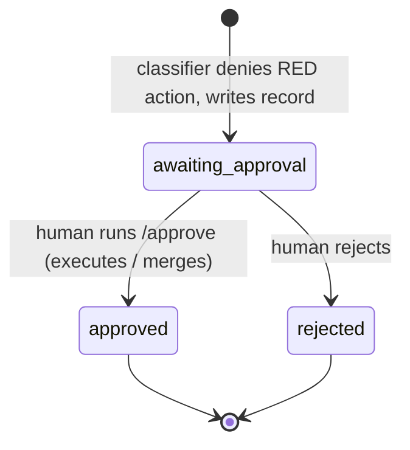

# G1: Risk-Tiered Firebreak for Unattended Autopilot Swarm ✨

## Overview

Autopilot runs today under `dangerouslySkipPermissions: true` with
`mode: "bypassPermissions"` injected into every spawned agent — a **blanket**
bypass that silences the risk-tiering already written into `CLAUDE.md`
("Forbidden Actions") and the global Safety Rule. This plan builds the missing
**enforcement engine** for that existing contract: a deterministic
**PreToolUse-hook classifier** that lets the safe majority of actions run
unattended but **defers** the binding/irreversible tail (force-push, the final
merge-to-`main`, prod-DB destructive ops, out-of-repo deletes, external sends,
deploy commands, external-MCP-writes, package removal) to an **async
human-approval queue**. The run still completes unattended; a human approves the
deferred tail later, in a batch, without re-running the build.

This is **composition, not new infrastructure** (see brainstorm): the approval
queue (`todos/`), the deferred-disposition machinery
(`PIPELINE_PASS_WITH_DEFERRED_RISK` + self-audit + HANDOFF keys), and the
"deterministic disposes / AI advises" pattern all already exist. G1 wires them
together behind a hook.

**Out of scope (separate governance items):** in-flight AI monitor (G2),
monoculture mitigation (G3), ledger hardening (G4), delegation-as-authority (G5).

---

## Spike Result — the riskiest assumption (verify-first) ✅

Per the brainstorm's Feed-Forward "least confident" item, the whole mechanism
depends on a PreToolUse hook firing **above** the permission bypass. This was
verified before any design work (full record:
`docs/spikes/2026-06-21-g1-pretooluse-hook-under-bypass-spike.md`):

| Case | Result | Source |
|------|:------:|--------|
| Main session under `--dangerously-skip-permissions` | hook **fired + blocked** | empirical (claude 2.1.173) + docs |
| Task-spawned subagent under bypass | hook **fired + blocked** | empirical |
| **Worktree-isolated subagent** (the autopilot worker path) | **unproven** | docs silent; → **Step 0** |

**Verdict: GREEN — the mechanism is viable.** The brainstorm's fallbacks
(agent-brief contract, tool wrapper) are **not** needed for the proven cases. The
single residual is a *placement* question (where the hook is defined so every
worktree subagent's tool calls are governed), which Step 0 gates.

---

## Deepening Review — Findings & v1 Revisions (2026-06-21)

Five adversarial reviewers (security, architecture, simplicity, data-integrity,
performance) pressure-tested the first draft. Several findings **converged**
across independent agents — the strongest signal — and **change the design**. The
sections below this summary reflect the *first draft*; **where they conflict with
a revision here, the revision wins.** Net effect: v1 gets **thinner and more
honest**, and two P0 data-integrity hazards are removed by deletion rather than
patching.

### Convergent, design-changing revisions

| # | Revision | Why (which reviewers) | Supersedes |
|---|----------|------------------------|------------|
| **R1** | **Hook placement → GLOBAL `~/.claude/settings.json` is the DEFAULT** (project-tracked was wrong). Add a **positive-control probe**: at run start the autopilot feeds the classifier one known-RED command and **aborts the run if it isn't denied** — so "firebreak silently absent" can't masquerade as success. | A project hook (a) leaks into every manual session in the repo and (b) is the option *most likely to fail* for worktree subagents, which root on `origin/master`, not the feature branch where the hook was added (FC51). The sentinel is a fail-*open* gate guarding a fail-*closed* mechanism — the probe closes that. (architecture P0; security P1-3) | §2 placement default; Step 0 |
| **R2** | **CUT the graceful deferred-merge wiring (old Phase 3 / §6) from v1.** The swarm-runner's `git merge --no-ff` lands on `original_branch` **locally** (verified swarm-runner.md:176) and **autopilot never pushes** (no `git push` exists). A local feature-branch merge is reversible — not the irreversible "merge-to-main" the draft over-defended. v1: the merge RED rule fires **only when the target is `master`/`main`/a shared branch**, and even then it simply **defers + writes one plain HANDOFF line** (no tail-fork, no pointer commit, no self-audit WARN reconciliation). | Three independent agents said cut it; architecture found the reason (local, not a push); data-integrity proved the **pointer commit reproduces FC51 base-drift** and the self-audit "either/or" marker risks a **silent false-`PIPELINE_PASS` with code stranded on an orphan branch.** Deleting the machinery removes both P0s outright. (architecture P0+P1; simplicity #1/#2; data-integrity P0-1, P0-2, P1-1, P2) | old §6, old Phase 3, the "Merge-to-main" framing |
| **R3** | **Threat model restated honestly.** v1 firebreak = **"guards honest-agent mistakes + bounds blast radius on the genuinely-irreversible outward categories"** — it is **NOT** adversarial-worker-proof. Adopt the high-value evasion hardening anyway (R4). | The denylist is evadable today: `git -C <path>` (the repo's *own mandated* git form) bypasses every git pattern; `Write deploy.sh` then `bash deploy.sh` defeats string matching; "default-deny" outward is really a curl/wget denylist missing `gh api`, `npm publish`, `nc`, `ssh`. The "must not be evadable" claim was overclaimed. (security P0-1/2/3) | Plan Quality Gate Q4 "accepted residual" framing |
| **R4** | **Evasion hardening for the outward (genuinely-irreversible) tier:** (a) the classifier **normalizes git** (`-C`/`--git-dir`/`--work-tree`/`-c`) before matching; (b) **indirection commands** (`bash <file>`, `sh`, `eval`, `source`/`.`, `npm run`, `make`, `base64 -d \| sh`) **defer** unless the target is a vetted in-repo script; (c) outward egress becomes a **real allowlist-deny** — add `gh api`/`gh release`/`gh pr`, `npm publish`, `nc`, `ssh`, `scp`, `rsync` as explicit RED; (d) `mcp__*` becomes **allowlist of read-only tools → everything else defers** (verb-substring matching misses `apply_migration`, `deploy_to_vercel`, `respond_to_event`, etc.). | Same security findings; these are the cheap, high-value subset that meaningfully bounds blast radius without trying to make local Bash adversarial-proof (impossible at the string layer). (security P0-1/2/3, P2-3) | denylist table detection notes |
| **R5** | **Approvals queue hardened.** (a) **gitignore `todos/approvals/`** (currently `todos/` is *tracked* → RED payloads with secrets would be committed) **and `.claude/firebreak-active.json`** (claimed gitignored, isn't). (b) **Collision-free atomic filenames** `RED-<run_id>-<category>-<uuid>.md`, written via temp-file + `os.rename()` — drop the global `NNN` sequence (it **races across 31 workers → a lost approval record = a silent unguarded RED action**, and partial writes truncate YAML). (c) Record the **assembly tip + base SHAs** so any future approve validates against branch drift/clobber. | performance P1 (race = safety failure); data-integrity P1-1 (clobber), P2-1 (tracked); security P2-1 | §3 filename scheme; §2 sentinel gitignore claim |
| **R6** | **Performance fast-path.** Add a **token-grep entry gate** (single `exec`, no chaining) so the python classifier only cold-starts on the ~1–5% of Bash calls carrying a RED token; GREEN calls short-circuit to `exit 0`. **Step 0 gains a sub-test** proving the new hook-command shape survives the bypass security heuristics. | ~30–80ms python cold-start × thousands of Bash calls × 31 agents ≈ **7–12 min/run** pure interpreter tax on the critical path. (performance P0) | §1 "one command `python3 ...`"; Step 0 scope |
| **R7** | **GREEN learnings carve-out gated on the known tail invocation, not path-parsing.** Allow the specific `/update-learnings-noninteractive` command shapes the tail actually emits; do **not** attempt to extract/realpath arbitrary write paths out of Bash strings (brittle both ways — a too-narrow matcher *defers the mandatory learnings writes* and breaks Required-Artifacts; a too-loose one is a write-anywhere escape via `..`/symlink/`$HOME`). | architecture P1; security P1-2 | §1 carve-out (path-prefix) |
| **R8** | **`/approve` skill deferred to v2.** v1 = the human reads the self-describing approval record and runs the one recorded command. The safety-critical **`resolve-todos` guard + non-recursive-glob isolation stay** (they are what keep approval human-only). | A faithful-replay skill is a *new code path that executes RED actions* (the surface we're shrinking) and could replay worker-tampered record bodies; not worth it until manual approval proves annoying. (simplicity #3; security P1-5; data-integrity P1-2 idempotency) | §4 `/approve`; old Phase 2 |

### What this leaves for v1 (the thinned, safety-complete core)

`classifier (R4-hardened) + global hook (R1) + sentinel (R5 gitignored, R1 probe)
+ token-grep fast-path (R6) + todos/approvals/ (R5 atomic, gitignored) +
resolve-todos guard + learnings carve-out (R7)`. The merge case (R2) defers like
any other RED action with a one-line HANDOFF note — no special tail wiring.

**Deferred to v2 (documented, not built):** graceful deferred-merge disposition
(`PIPELINE_PASS_WITH_DEFERRED_RISK` reconciliation, self-audit WARN, tail
retargeting) — only earns its complexity *if* autopilot ever starts auto-pushing
or auto-merging to a shared `master`; the `/approve` skill; the Phase 2 AI
advisory pass.

**RESOLVED (user, 2026-06-21): fully cut — no status-mapping sliver in v1.** A
deferred `master`-target merge reports its natural non-clean/WARN status, which is
the honest outcome (the merge genuinely did not land). This is correct as long as
a non-clean run status does not hard-block the next autopilot run; re-add the
status-mapping sliver only if that ever bites. For feature-branch runs (the common
case) the merge is GREEN and this never arises.

---

## Plan Quality Gate (4 questions)

**1. What exactly is changing?**
- A new **sentinel-gated PreToolUse hook** added to the *tracked* project
  `.claude/settings.json` (currently has no `hooks` key — greenfield). It invokes
  a deterministic classifier script (`.claude/hooks/firebreak-classify.py`).
- A new **`todos/approvals/` queue** for deferred RED actions (glob-isolated from
  `resolve-todos`).
- A new **human-only `/approve` skill** that executes a deferred action (or lands
  a deferred merge) without re-running the build.
- A small **`resolve-todos` guard** so the unattended resolver never touches the
  approvals queue.
- **Deferred-merge wiring**: the swarm-runner recognizes a firebreak denial of its
  `git merge --no-ff`, records `MERGE_STATUS: DEFERRED_FOR_APPROVAL`, and the
  run rides the existing `PIPELINE_PASS_WITH_DEFERRED_RISK` rail.
- A per-run **sentinel** (`.claude/firebreak-active.json`) the autopilot writes at
  run start / removes at run end, which both **activates** the firebreak (so
  manual sessions are untouched) and **supplies run metadata** to the classifier.

**2. What must NOT change?**
- The `resolve-todos` queue structure and behavior (reuse, don't redesign).
- The Required-Artifacts contract (BUILD_TRACKING, solution doc, learnings,
  HANDOFF, self-audit) — all still produced.
- The **sanctioned learnings-propagation out-of-repo writes** — these are
  GREEN-listed (carve-out); the firebreak must never defer them.
- GREEN throughput: **zero added prompts/deferrals** for local worktree work
  (file writes, local commits, tests, reads).
- Manual-session behavior: with no sentinel, the hook is a **no-op**.
- The assembly/tail flow — unchanged except one minimal conditional: when the
  merge is deferred, the tail targets the assembly branch (v1 does **not** redesign
  assembly; see brainstorm scope guardrail).

**3. How will we know it worked?**
See `## Acceptance Tests` (EARS) below + the Step 0 spike. In short: RED actions
land in `todos/approvals/` and never execute; GREEN actions and learnings writes
run untouched; the run completes with all artifacts and a clean DEFERRED
disposition; `/approve` lands the merge later without a rebuild.

**4. What is the most likely way this plan is wrong?**
- **(Primary) The worktree-subagent hook-firing / placement assumption.** Hooks
  load at the session level from the main-repo settings; an existing worktree
  snapshot did not materialize `settings.json`. → **Step 0 gates the build**, with
  ordered fallbacks (global `~/.claude/settings.json` placement → agent-brief
  contract → tool wrapper).
- **(Secondary) A denylist blind spot** for a novel RED Bash command (denylists
  default-allow). Mitigated by: outward-facing categories use **default-deny**
  (allowlist posture), Phase 2 AI advisory flags novel actions, and a code-build
  swarm has no legitimate reason to emit those commands. Accepted residual for
  local Bash in v1.
- **(Tertiary) The self-audit doesn't collect the deferred-merge** as a WARN
  because it isn't in a scanned source. Mitigated: the firebreak writes a marker
  into a self-audit-scanned source (BUILD_TRACKING FAILURES / `docs/reports/<run-id>/`).

---

## Architecture

### Component map

```
                          ┌─────────────────────────────────────────┐
   autopilot run start →  │  write .claude/firebreak-active.json     │  (sentinel: run-id,
                          │  (gitignored, absolute-path readable)    │   original_branch,
                          └─────────────────────────────────────────┘   assembly_branch)
                                          │ activates
                                          ▼
   worker / swarm-runner      ┌──────────────────────────────────────┐
   attempts a tool call  →    │  PreToolUse hook (project settings)   │
   (Bash / mcp__*)            │  → python3 .claude/hooks/             │
                              │      firebreak-classify.py            │
                              └──────────────────────────────────────┘
                                  │ reads stdin (tool + input) + sentinel
                  ┌───────────────┴────────────────┐
            GREEN │                             RED │
                  ▼                                 ▼
            exit 0 (allow)            write todos/approvals/NNN-RED-*.md
                                      + deny (permissionDecision:deny,
                                        reason contains FIREBREAK_DEFERRED)
                                                    │
                                                    ▼
                              swarm-runner sees deny → MERGE_STATUS:
                              DEFERRED_FOR_APPROVAL (no retry, no abort)
                                                    │
                                                    ▼
                       tail: PIPELINE_PASS_WITH_DEFERRED_RISK + self-audit
                       WARN [<run-id>-W<N>] DEFERRED + HANDOFF key + queue entry
                                                    │
                              (later, human-initiated)
                                                    ▼
                              /approve  →  executes deferred action /
                              git merge --no-ff assembly → original_branch
```

### 1. The classifier (deterministic, category-specific)

A single Python script, `.claude/hooks/firebreak-classify.py`, invoked by the
hook as **one** command (`python3 .claude/hooks/firebreak-classify.py`) — never
`python3 -c`, no `&&`/`;` chaining (P0: compound bash trips security heuristics
*above* the bypass and the firebreak would block itself —
`docs/solutions/2026-04-09-compound-bash-instruction-refactor.md`). It reads the
PreToolUse JSON from stdin (tool name + tool input), reads the sentinel for run
context, and disposes:

- **No sentinel present → exit 0 (allow-all no-op).** Manual sessions untouched.
- **Tool is not RED-bearing** (Read/Edit/Write/Glob/Grep, etc.) → exit 0.
- **`Bash`** → classify the command string. The disposition is **category-specific**
  (this resolves the brainstorm's "fail-closed" tension):
  - *Local/build categories (denylist, default-allow):* deny only on the RED
    git/data/package/delete patterns below; otherwise allow. (Local test runs,
    local git ops, builds stay unattended.)
  - *Outward-facing categories (allowlist, default-DENY):* external sends
    (curl/wget/email/webhook to a non-localhost host) and deploy/promote commands
    default to **defer** unless explicitly localhost/known-safe. Errs toward defer,
    never toward run.
- **`mcp__*` write-shaped tools → default-DENY (defer).** Conservative v1 posture;
  Phase 2 advisory refines the read/write split.
- **GREEN carve-out (must-fix):** writes/appends to the sanctioned learnings paths
  are **always allowed**, even though they are out-of-repo:
  `~/.claude/docs/agent-pitfalls.md`, `~/Documents/dev-notes/` (LESSONS_LEARNED +
  `YYYY-MM-DD.md` journal), `~/.claude/projects/[key]/memory/`. A **delete**
  targeting these is still RED.
- **Fail-closed on its own errors:** if the classifier cannot decide or cannot
  write an approval record, it **denies** the RED-bearing action and emits a loud
  failure marker (never silently allows).

Output to deny: emit
`{"hookSpecificOutput":{"hookEventName":"PreToolUse","permissionDecision":"deny","permissionDecisionReason":"FIREBREAK_DEFERRED: <action> deferred to todos/approvals/<file>. Do not retry."}}`.
(The empirical spike confirmed `exit 2` also blocks; the JSON form is preferred for
the structured reason.)

#### The denylist (RED tier) — finalized for v1 (from brainstorm)

| Category | Detection | RED patterns |
|----------|-----------|--------------|
| Git history/force | tight cmd patterns | `git push --force`/`-f`/`--force-with-lease`; push to `main`/`master`/shared; amend/rebase/`filter-repo`/`filter-branch` of pushed commits |
| **Merge-to-main** | cmd shape | `git merge --no-ff <assembly>` onto `original_branch` (the swarm-runner Step 7 action, `swarm-runner.md:176`) |
| Data | path + cmd | DROP/DELETE/`rm` against a real `*.db` outside `/tmp` |
| Out-of-repo deletes | path check | delete (`rm`/`rm -rf`/unlink) targeting any path **outside the repo worktree** and not `/tmp` (e.g. `~/Data`, home, other projects) — **except** a delete is never auto-allowed even for learnings paths |
| External sends | host check | curl/wget/email/webhook to a **non-localhost** host |
| Deploy | cmd patterns | `vercel` / `railway` / `fly` / `netlify` deploy/promote |
| External-MCP-writes | namespace + verb (default-deny) | any `mcp__*` send/create/publish/update/delete to a non-local service |
| Packages | cmd patterns | `pip uninstall` / `npm uninstall` / `npm remove` |

**GREEN (auto-run, unchanged):** file writes inside the worktree; local commits;
tests; reads; local-only git ops; the sanctioned learnings-propagation writes.

> Rationale (brainstorm): in a swarm run, workers overwhelmingly do GREEN
> (local writes + local commits). The irreversible actions cluster into the RED
> list, which makes a deterministic denylist tractable, and a code-build swarm has
> **no legitimate reason** to deploy / send email / delete outside its worktree —
> so default-deny on those costs almost no false positives.

### 2. The hook + sentinel

> **SUPERSEDED by R1.** Placement default is now **global `~/.claude/settings.json`**
> (the project-tracked option leaks into manual sessions and fails for
> worktree subagents that root on `origin/master`). The sentinel gains a
> **positive-control probe** (abort the run if the firebreak isn't actually live)
> and is **gitignored** (R5). The paragraph below is the first-draft reasoning.

- **Placement (decided by Step 0):** default to the **tracked project
  `.claude/settings.json`** `hooks.PreToolUse` block (greenfield; git-tracked, so it
  travels with checkouts; scoped to sandbox). Fallback to **global
  `~/.claude/settings.json`** if Step 0 shows worktree subagents don't honor the
  project hook. `settings.local.json` is **not** an option (gitignored → won't
  propagate).
- **Sentinel** `.claude/firebreak-active.json` (gitignored, read by the classifier
  via **absolute path** so worktree cwd is irrelevant): contains `run_id`,
  `original_branch`, `assembly_branch`, `repo_root`. Written by the autopilot skill
  at run start, removed at run end. Its presence is what activates the firebreak —
  so manual sessions (no sentinel) are unaffected even though the hook is always
  defined.

### 3. The approvals queue (`todos/approvals/`)

- New directory `todos/approvals/`. The `resolve-todos` glob `todos/*-pending-*.md`
  is **non-recursive** (confirmed) so it will not pick these up; as defense-in-depth
  the filenames **avoid the `-pending-` token**.
- Filename: ~~`NNN-RED-<action-slug>.md`~~ → **`RED-<run_id>-<category>-<uuid>.md`
  (R5)** — the global `NNN` sequence races across concurrent workers (lost record =
  silent unguarded RED action). Written **atomically** (temp-file + `os.rename()`);
  `todos/approvals/` is **gitignored** (R5; `todos/` is otherwise tracked).
  Frontmatter (now also records `assembly_sha` + `base_sha` for drift validation):

```yaml
---
status: awaiting-approval        # awaiting-approval | approved | rejected
kind: approval                   # distinguishes from review todos
run_id: "<run-id>"
red_category: merge-to-main      # or external-send | deploy | out-of-repo-delete | ...
tool: Bash                       # or mcp__<server>__<verb>
created: 2026-06-21
---
```

Body records the **exact replayable payload**: the full command (or MCP
params), `cwd`, and for a merge: `assembly_branch`, `original_branch`, `run_id`.
The classifier (the deterministic authority) is the **only** writer of approval
records — consistent with "deterministic disposes."

### 4. The `/approve` skill (human-only)

A new `.claude/skills/approve/SKILL.md`, **invoked manually by a human only**
(never auto-invoked by autopilot — see Resolved Q1). It:
1. Lists `todos/approvals/*.md` with `status: awaiting-approval`, shows the human
   the exact deferred action + context.
2. On confirmation, **executes** the recorded action faithfully (replays the
   command / params). For a deferred merge it performs
   `git merge --no-ff <assembly_branch>` onto `original_branch` (lands code +
   artifacts together) — **without re-running the build**.
3. Marks the record `status: approved` (or `rejected`) and updates the matching
   HANDOFF entry.

### 5. `resolve-todos` guard

Add an explicit guard to `resolve-todos`: skip anything under `todos/approvals/`
and any `kind: approval` todo. **Why this matters (safety-critical):**
`resolve-todos` runs *unattended* inside autopilot; if it could resolve approvals,
an unattended pass would auto-execute RED actions and reintroduce exactly the
autonomy the firebreak removes.

### 6. Deferred-merge wiring (resolves Open Q2)

> **CUT FROM v1 by R2** (defers a boundary autopilot doesn't cross; the pointer
> commit reproduced FC51 base-drift; the self-audit marker risked a false-PASS).
> v1 instead: the merge RED rule fires only on a `master`/`main`/shared target and
> simply defers + writes one HANDOFF line. The wiring below is retained as the
> **v2** design for if autopilot ever auto-pushes/auto-merges to shared `master`.

- **swarm-runner** (`.claude/agents/swarm-runner.md`, Step 7): when its
  `git merge --no-ff` is denied with a reason containing `FIREBREAK_DEFERRED`, it
  **must recognize this specific denial** — record `MERGE_STATUS:
  DEFERRED_FOR_APPROVAL`, do **not** retry, do **not** abort, return cleanly.
- **Self-audit collection:** the classifier (or swarm-runner) writes a deferred-merge
  marker into a self-audit-scanned source (BUILD_TRACKING FAILURES or
  `docs/reports/<run-id>/`), so the **self-audit-reviewer** collects it as a WARN,
  assigns key `[<run-id>-W<N>]`, disposes it `DEFERRED`, and sets run status
  **`PIPELINE_PASS_WITH_DEFERRED_RISK`** (already a PASS — SKILL.md:980-981),
  populating the required "Unresolved Risk" section.
- **HANDOFF key (Gate 3):** the tail writes a HANDOFF.md entry containing the exact
  WARN key string, so `verify-self-audit` Gate 3 passes (DEFERRED is "disposed"
  iff HANDOFF contains the key).
- **Tail branch conditional (minimal):** when the merge is deferred, the
  orchestrator passes `merge_deferred: true` + `assembly_branch` to the
  **tail-runner**, which targets the **assembly branch** (where the build content
  lives) so the solution doc/HANDOFF/self-audit travel with the eventual merge.
  Additionally, the classifier writes the approval record + a HANDOFF "AWAITING
  APPROVAL" pointer as a **local commit on `original_branch`** (GREEN: a local
  commit, not a push) so the human sees the pending state on resume.

---

## System-Wide Impact & Edge Cases

- **Interaction graph:** worker/swarm-runner tool call → PreToolUse hook →
  classifier → (allow | deny+record) → swarm-runner status → tail
  (self-audit/HANDOFF) → later `/approve` → merge. The new control point is the
  hook; everything downstream reuses existing contracts.
- **Multiple RED deferrals in one run:** each gets its own `NNN-RED-*.md` and its
  own self-audit WARN/key. No special-casing.
- **A worker (not the merge) hits a RED action mid-build:** the hook defers it and
  denies; the worker records the deferred action in its phase report and continues
  remaining GREEN work. If the RED action was essential to that blueprint, the
  blueprint is partial and is flagged by the existing cross-worker structural scan.
  v1 accepts this (rare by design — workers overwhelmingly do GREEN).
- **Approval-record write failure:** fail-closed — deny anyway + loud FAILURE
  marker (block-without-record beats allow).
- **Never approved:** the approval record + assembly branch persist; backlog item,
  no auto-expiry in v1.
- **Error propagation:** a `FIREBREAK_DEFERRED` denial is a *sanctioned* outcome,
  not a build failure — the swarm-runner and self-audit must treat it as DEFERRED,
  not FAIL (explicit contract change in Phase 3).
- **State lifecycle:** the deferred merge leaves code on the assembly branch and a
  pointer on `original_branch`; `/approve` is the only path that lands it — no
  partial-merge window.

---

## Implementation Phases

> **REVISED by the Deepening Review (R1, R2, R6, R8).** v1 is now Step 0 →
> Phase 1 → Phase 2 only. The old "Phase 3 deferred-merge wiring" is **deleted from
> v1** (R2) and recorded under "v2 (deferred)".

### Step 0 — GATING SPIKE (must pass before Phase 1) 🚧

Confirm the **worktree-subagent** case, **lock GLOBAL placement (R1)**, and prove
the **fast-path hook-command shape survives the bypass heuristics (R6)**. Do NOT
build the classifier until this is green.

- Define a throwaway PreToolUse hook (deny `Bash` matching a sentinel marker) in
  **global `~/.claude/settings.json`** (the default per R1).
- Run a minimal autopilot-path spawn: an Agent with `isolation: "worktree"` +
  `mode: "bypassPermissions"` that attempts a denylisted command.
- **Pass criteria:** the worktree subagent's command is **blocked**.
- **Sub-test (R6):** the two-stage entry (token-grep `exec` → python) is a single
  command that also blocks, and does **not** itself trip the bypass security
  heuristics. If a non-python fast-path can't pass the heuristics, the fast-path is
  void (eat the full latency tax or rethink).
- If global placement fails to govern worktree subagents → the mechanism moves to
  the **agent-brief contract** or a **tool wrapper**; re-plan around that.
- **Deliverable:** result appended to
  `docs/spikes/2026-06-21-g1-pretooluse-hook-under-bypass-spike.md` + locked
  placement.

### Phase 1 — Classifier + hook + sentinel + fast-path (foundation)

- `.claude/hooks/firebreak-classify.py` — deterministic classifier: git
  normalization (R4a), indirection-defer (R4b), outward allowlist-deny incl.
  `gh api`/`npm publish`/`nc`/`ssh` (R4c), `mcp__*` read-only allowlist (R4d),
  GREEN learnings carve-out gated on the known tail invocation (R7), fail-closed.
  Pure stdlib, one file. Deny via `exit 2` + stderr line.
- `.claude/hooks/firebreak-gate.sh` (or equiv) — token-grep entry that
  short-circuits GREEN to `exit 0` and `exec`s the classifier only on RED tokens
  (R6).
- `hooks.PreToolUse` block in **global settings** (R1), matcher `Bash` + `mcp__*`.
- Sentinel `.claude/firebreak-active.json` (gitignored — R5): autopilot writes at
  run start with `run_id` + `repo_root`, removes at end; classifier no-ops without
  it. **Positive-control probe (R1):** autopilot feeds one known-RED command and
  **aborts the run if not denied.**
- **Unit-test the classifier** for every RED pattern (incl. `git -C` force-push,
  write-then-`bash file`, `gh api POST`, `rm ~/Data`), each GREEN case, the
  learnings invocation, and the no-sentinel no-op.

### Phase 2 — Approvals queue + resolve-todos guard

- `todos/approvals/` (gitignored — R5) + record schema with assembly/base SHAs;
  classifier is the sole writer, **atomic temp-file + `os.rename()`**,
  collision-free filename `RED-<run_id>-<category>-<uuid>.md` (R5).
- `resolve-todos` guard (skip `todos/approvals/` + `kind: approval`) — safety-critical.
- v1 approval = the human reads the record and runs the recorded command (R8).

### Deferred to v2 (documented, not built)

- **Graceful deferred-merge disposition** (only if autopilot ever auto-pushes /
  auto-merges to a shared `master`): `MERGE_STATUS` recognition,
  `PIPELINE_PASS_WITH_DEFERRED_RISK` reconciliation, self-audit WARN + HANDOFF key,
  tail-runner retargeting. **Do not build now (R2)** — it defends a boundary the
  current pipeline doesn't cross and reproduced FC51 base-drift.
- **`/approve` skill** (R8) — build when manual approval proves annoying.
- **AI advisory pass** — read-only flagging of novel/unlisted actions; **never
  decides** (spec-eval ~0%-precision judge demotion precedent,
  `docs/solutions/2026-06-07-autopilot-orchestration-hardening.md`).

A **read-only** AI pass that flags novel/unlisted actions for a human to add to the
denylist — **never decides**. Documented here so a future implementer does not
mistake it for an authority layer (precedent: the spec-eval AI judge hit ~0% field
precision and was demoted to advisory —
`docs/solutions/2026-06-07-autopilot-orchestration-hardening.md`).

---

## Resolved Open Questions (from brainstorm)

### Q1 — How does approval resolve? → **Dedicated human-only `/approve` skill + separate `todos/approvals/` queue; approval EXECUTES the action.**

Rejected: extending `resolve-todos`. **Why:** `resolve-todos` runs *unattended*
inside autopilot; folding approval into it would let an unattended pass
auto-execute RED actions — defeating the firebreak. A separate human-only skill
keeps the human as the controller. The queue is glob-isolated (non-recursive
glob + no `-pending-` token). For a deferred **merge**, approval **executes** the
merge (lands code + artifacts) without re-running the build (per the brainstorm
success criterion "approve → the merge lands").

### Q2 — Deferred-merge × Required-Artifacts ordering. → **Reuse `PIPELINE_PASS_WITH_DEFERRED_RISK`; no new status.**

The status already exists and is treated as a PASS (SKILL.md:980-981); the
`DEFERRED`-disposition + exact-HANDOFF-key contract (verify-self-audit Gate 3) is
the rail. The run produces **all** tail artifacts on the assembly branch, reports
`PIPELINE_PASS_WITH_DEFERRED_RISK`, disposes the merge as a DEFERRED WARN with a
matching HANDOFF key, and writes the approval record + a pointer commit on
`original_branch`. The merge is the **only** deferred step; everything up to it
stays unattended. This trips no gate because a disposed DEFERRED is not an
undisposed risk.

---

## Acceptance Tests (EARS)

### Happy path

- WHEN a swarm worker performs a GREEN action (file write in its worktree, local
  commit, test run) THE SYSTEM SHALL allow it with no deferral and no prompt.
  - Verify: run a build; confirm worker commits land on `worktree-agent-*`
    branches and the firebreak log records `ALLOW`.
- WHEN the compound tail writes to a sanctioned learnings path THE SYSTEM SHALL
  allow the write (carve-out holds).
  - Verify: after a run, `~/.claude/docs/agent-pitfalls.md` Update Log has today's
    entry; the firebreak log shows `ALLOW (learnings carve-out)`.
- WHEN the swarm-runner attempts the final `git merge --no-ff <assembly>` onto
  `original_branch` THE SYSTEM SHALL defer it: write `todos/approvals/NNN-RED-merge-*.md`,
  deny with a `FIREBREAK_DEFERRED` reason, and the swarm-runner SHALL record
  `MERGE_STATUS: DEFERRED_FOR_APPROVAL`.
  - Verify: `ls todos/approvals/ | grep merge` returns a file; the swarm-runner
    report contains `DEFERRED_FOR_APPROVAL`; the assembly branch is **not** merged.
- WHEN a run completes with the merge deferred THE SYSTEM SHALL produce all
  Required Artifacts, report `PIPELINE_PASS_WITH_DEFERRED_RISK`, and write a
  HANDOFF.md entry containing the deferred-merge WARN key.
  - Verify: `verify-self-audit <run-id> docs/reports/<run-id>/` passes; Gate 3
    finds the key in HANDOFF.md.
- WHEN a human runs `/approve` on a pending merge approval THE SYSTEM SHALL merge
  the assembly branch into `original_branch` and mark the record `approved`,
  without re-running the build.
  - Verify: `git log --oneline original_branch` shows the `--no-ff` merge; the
    approval record `status: approved`.

### Error / edge cases

- WHEN a worker attempts a RED action (curl to a non-localhost host, `rm` outside
  its worktree, a deploy command, `pip/npm uninstall`, an external-MCP-write) THE
  SYSTEM SHALL deny it and write an approval record; the action SHALL NOT execute.
  - Verify: in the Step-0 rig, attempt each pattern; confirm the side-effect did
    not occur and an approval record exists.
- WHEN an outward-facing action is not explicitly GREEN-listed (ambiguous external
  send / unknown `mcp__*` write) THE SYSTEM SHALL default-deny (defer), never run.
  - Verify: feed the classifier a synthetic `mcp__unknown__publish` → output is
    `deny`.
- WHEN no firebreak sentinel is present (manual session / no active run) THE SYSTEM
  SHALL be a no-op and defer nothing.
  - Verify: with no `.claude/firebreak-active.json`, a denylisted command is
    classified `ALLOW`.
- WHEN the approval-record write fails THE SYSTEM SHALL still deny the RED action
  (fail-closed) and emit a failure marker.
  - Verify: point the classifier at an unwritable approvals dir → output is `deny`
    + a `FIREBREAK_WRITE_FAILED` marker.
- WHEN `resolve-todos` runs THE SYSTEM SHALL NOT process any file under
  `todos/approvals/` or any `kind: approval` todo.
  - Verify: place an approval record, run `resolve-todos`; the record is untouched.
- WHEN the hook invokes its classifier THE SYSTEM SHALL use a single script-file
  invocation (no `&&`/`;`/`python3 -c`) so security heuristics do not fire above
  the bypass.
  - Verify: the `hooks.PreToolUse.command` is exactly
    `python3 .claude/hooks/firebreak-classify.py`.

### Additional EARS (from Deepening Review)

- WHEN a worker emits a normalized-evasion of a RED action (`git -C <path> push
  --force`, `git -C <path>` config overrides, `gh api --method POST ...`,
  `npm publish`, `nc`/`ssh`/`scp` egress) THE SYSTEM SHALL defer it (R4a/R4c).
  - Verify: feed each shape to the classifier → `deny`.
- WHEN a worker uses indirection (`bash deploy.sh`, `sh -c`, `eval`, `source x`,
  `npm run <script>`, `make deploy`) whose target is not a vetted in-repo script
  THE SYSTEM SHALL defer (R4b).
  - Verify: `echo '{"tool_name":"Bash","tool_input":{"command":"bash deploy.sh"}}' | python3 .claude/hooks/firebreak-classify.py` → `deny`.
- WHEN an `mcp__*` tool not on the read-only allowlist is called (e.g.
  `mcp__*__apply_migration`, `deploy_to_vercel`, `respond_to_event`) THE SYSTEM
  SHALL defer (R4d).
- WHEN the firebreak is configured but not actually live at run start THE SYSTEM
  SHALL fail the positive-control probe and ABORT the run (R1).
  - Verify: with a broken hook, the probe's known-RED command is NOT denied → run aborts.
- WHEN two workers defer RED actions concurrently THE SYSTEM SHALL persist both
  approval records with no collision or truncation (R5).
  - Verify: filenames are `RED-<run_id>-<category>-<uuid>.md`; both files parse as
    valid YAML.
- WHEN a GREEN Bash command carries no RED token THE SYSTEM SHALL short-circuit at
  the token-grep gate without invoking python (R6).
  - Verify: the gate `exit 0`s on `pytest -q` without a python process spawn.

### Verification commands

```bash
# classifier unit behavior (crafted stdin → disposition)
echo '{"tool_name":"Bash","tool_input":{"command":"git merge --no-ff swarm-x-assembly"}}' | python3 .claude/hooks/firebreak-classify.py; echo "exit=$?"
echo '{"tool_name":"Bash","tool_input":{"command":"pytest -q"}}' | python3 .claude/hooks/firebreak-classify.py; echo "exit=$?"
echo '{"tool_name":"Bash","tool_input":{"command":"curl https://example.com -d x"}}' | python3 .claude/hooks/firebreak-classify.py; echo "exit=$?"
# no-op without sentinel
rm -f .claude/firebreak-active.json; echo '{"tool_name":"Bash","tool_input":{"command":"vercel deploy"}}' | python3 .claude/hooks/firebreak-classify.py; echo "exit=$? (expect allow)"
# queue isolation
ls todos/approvals/ 2>/dev/null
# self-audit gate on a deferred-merge run
# (run autopilot, then:)  python3 -m ... verify-self-audit <run-id> docs/reports/<run-id>/
```

---

## Dependencies & Risks

- **Step 0 must pass** (worktree-subagent hook firing). Ordered fallbacks defined.
- **Bash Command Rules are binding on the hook itself** (P0): one command, script
  file only. (`docs/solutions/2026-04-09-compound-bash-instruction-refactor.md`)
- **Self-audit collection scope**: the deferred-merge marker must land in a scanned
  source (BUILD_TRACKING FAILURES / `docs/reports/<run-id>/`) or the WARN is missed.
- **Denylist completeness** for local Bash is a known residual (default-allow);
  outward categories are default-deny to bound blast radius. Phase 2 advisory is
  the long-term mitigation.
- **Deterministic-only authority** (P0): no LLM in the dispose path
  (`project_deterministic-pre-filters`; spec-eval judge demotion precedent).

## Mermaid — approval lifecycle



---

## Feed-Forward

- **Hardest decision:** Where to place the hook (project-tracked vs global
  settings) given that hook loading is session-level and a worktree snapshot did
  not materialize `settings.json`. Resolved by gating the build on a Step-0
  empirical test rather than guessing.
- **Rejected alternatives:** extending `resolve-todos` for approvals (would let an
  unattended pass auto-execute RED actions); a new run status for deferred merges
  (the existing `PIPELINE_PASS_WITH_DEFERRED_RISK` already fits); an LLM classifier
  (refuted by the spec-eval ~0%-precision judge demotion).
- **Least confident:** worktree-subagent hook firing + the exact set of
  self-audit-scanned sources the deferred-merge marker must hit to be collected as
  a WARN. Both are Step-0 / Phase-3 verification targets, not assumptions.

---

## Codex Handoff Prompt (for the external Plan Review — reviews the REVISED v1)

```
Review this plan as an adversarial second reader (fresh context):
docs/plans/2026-06-21-feat-g1-risk-tiered-firebreak-plan.md

IMPORTANT: read the "Deepening Review — Findings & v1 Revisions" table FIRST. The
plan was substantially revised (R1–R8): hook placement flipped to GLOBAL, the
deferred-merge wiring (old Phase 3) was CUT from v1, the threat model was
restated as "guards honest mistakes + bounds outward blast radius, NOT
adversarial-proof," and the queue/perf were hardened. Review the REVISED v1
(Step 0 → Phase 1 → Phase 2), not the superseded first-draft sections.

Context: a deterministic PreToolUse-hook firebreak that DEFERS genuinely-irreversible
"RED" actions (external sends, deploy, out-of-repo deletes, package removal,
external-MCP-writes; the local merge only when it targets shared master/main) to a
gitignored approval queue during unattended autopilot swarm runs. Hook-fires-above-
bypass is verified GREEN for main session + Task-subagents (docs/spikes/2026-06-21-);
worktree-subagent firing + global placement is gated by Step 0.

Scrutinize specifically:
1. EVASION COMPLETENESS (R4): is the hardened set (git -C/--git-dir/-c
   normalization; indirection-defer for bash<file>/sh/eval/source/npm run/make;
   outward allowlist incl. gh api/npm publish/nc/ssh; mcp__* read-only allowlist)
   actually sufficient to bound the OUTWARD/irreversible blast radius, or is there
   still an egress/exec path that reaches the network or master without deferring?
2. R2 CUT CORRECTNESS: is it truly safe to drop the merge-deferral machinery —
   i.e., does any autopilot path actually push or merge to a SHARED master (a real
   remote), making the cut unsafe? (Plan claims no `git push` exists in
   swarm-runner.) If you find one, R2 is wrong.
3. R1 PLACEMENT + PROBE: is global ~/.claude/settings.json the right home given it
   governs ALL projects (mitigated by the sentinel no-op + positive-control probe)?
   Any residual fail-open where the firebreak is silently absent and the probe
   wouldn't catch it?
4. QUEUE INTEGRITY (R5): approval records live on a gitignored dir but are written
   by a hook and read by a human; can a worker forge/tamper a record (Write/Edit
   are GREEN) to manufacture an approval or hide a deferral? Is the atomic
   uuid-filename scheme race-free under 31 concurrent writers?
5. CARVE-OUT (R7): does gating the GREEN learnings carve-out on the known
   /update-learnings-noninteractive invocation risk DEFERRING a legitimate
   mandatory learnings write (breaking Required-Artifacts) if the tail's command
   shape differs at runtime?
Return findings as P0/P1/P2 with the exact plan section (and R-number) to change.
```

---

## Sources & References

### Origin
- **Brainstorm:** docs/brainstorms/2026-06-21-g1-risk-tiered-firebreak-brainstorm.md
  — carried forward: defer-and-continue escalation; deterministic-denylist-then-advisory
  classifier; merge-to-main = RED; the RED/GREEN taxonomy + learnings carve-out.
- **Governance:** docs/governance/2026-06-21-autopilot-vs-three-layers-agent-security.md (G1).
- **Spike (verify-first):** docs/spikes/2026-06-21-g1-pretooluse-hook-under-bypass-spike.md (GREEN).

### Internal references (file:line)
- `.claude/agents/swarm-runner.md:174-177` — the RED `git merge --no-ff` (Step 7).
- `.claude/skills/autopilot/SKILL.md:739-746` — worktree worker spawn (`isolation:"worktree"`, `bypassPermissions`).
- `.claude/skills/autopilot/SKILL.md:30-38, 422-425` — bypass mandate; "security heuristics fire above bypass".
- `.claude/skills/autopilot/SKILL.md:980-981` — `PIPELINE_PASS_WITH_DEFERRED_RISK` is a PASS.
- `.claude/skills/resolve-todos/SKILL.md:16` — glob `todos/*-pending-*.md` (non-recursive; approvals safe).
- `.claude/agents/self-audit-reviewer.md:39-58, 106-111` — WARN scan scope + DEFERRED disposition.
- `.claude/skills/verify-self-audit/SKILL.md:72-81, 114-128, 220-234` — Gate 3 (HANDOFF key), Gate 6, Gate 7f.
- `.claude/settings.json` — tracked, no `hooks` key (greenfield); `settings.local.json` (gitignored) holds the bypass.
- `CLAUDE.md` — Forbidden Actions; learnings-propagation carve-out; Required Artifacts; Bash Command Rules.

### Prior lessons (institutional)
- `docs/solutions/2026-06-07-autopilot-orchestration-hardening.md` — AI-judge demotion (deterministic stays dispositive).
- `docs/solutions/2026-04-09-compound-bash-instruction-refactor.md` — hook command must obey Bash Command Rules.
- `docs/solutions/2026-06-21-unattended-swarm-autopilot-master-extraction.md` — deterministic exit-code gates, fail-closed.
- `project_deterministic-pre-filters` (memory) — "facts in code can't hallucinate"; AI advises, code disposes.
```
