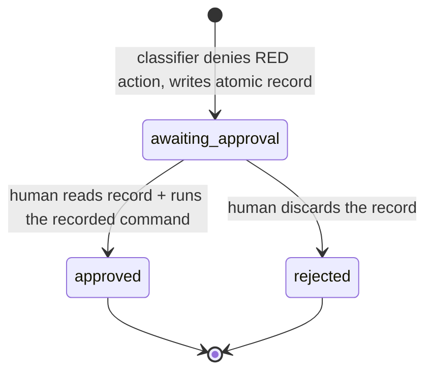

# G1: Risk-Tiered Firebreak for Unattended Autopilot Swarm ✨

## Overview

Autopilot runs today under `dangerouslySkipPermissions: true` with
`mode: "bypassPermissions"` injected into every spawned agent — a **blanket**
bypass that silences the risk-tiering already written into `CLAUDE.md`
("Forbidden Actions") and the global Safety Rule. This plan builds the missing
**enforcement engine** for that contract: a deterministic **PreToolUse-hook
classifier** that lets the safe majority of actions run unattended but **defers**
the genuinely-irreversible / outward tail (external sends, deploy, out-of-repo
deletes, package removal, external-MCP-writes, force-push / `git push` to a
shared `master`) to an **async human-approval queue**. The run completes
unattended; a human handles the deferred queue later, in a batch.

**v1 is deliberately thin and honest** (see Deepening Review): it reuses the
existing `todos/` queue and the `resolve-todos` guard, classifies deterministically
(no LLM in the dispose path), and bounds the **outward / irreversible** blast
radius. It is **not** an adversarial-worker sandbox (see Threat Model). Graceful
deferred-merge disposition and a `/approve` skill are explicitly **v2** (see the
"v2 — Deferred" appendix).

**Out of scope (separate governance items):** in-flight AI monitor (G2),
monoculture mitigation (G3), ledger hardening (G4), delegation-as-authority (G5).

---

## Threat Model (what v1 does and does not promise)

- **In scope (v1 enforces) — for DIRECT worker tool calls:** bound the blast radius
  of **outward / irreversible** actions a swarm worker could emit as a tool call —
  external network sends, deploys, out-of-repo deletes, package removal,
  external-MCP writes, and force-push / `git push` to a shared `master` (a **local**
  merge to `master` with no push is GREEN — F5). Also: **protect the firebreak's own
  control plane** from workers' **direct** Write/Edit/Bash tool calls (F1) — see the
  F6 bound immediately below.
- **Scope boundary in time (F10):** the firebreak is **active whenever the sentinel
  is present** — written **after** the pre-spawn provenance gate and **before** worker
  spawn, removed at run end (active = **sentinel-write → run-end**). Within that, the
  brief **sentinel-write → worker-spawn** slice is a **setup/probe interval** (the hook
  is live so the positive-control probe can validate it; no governed worker runs yet);
  the **governed worker window is worker-spawn → run-end**. Autopilot's only
  shared-remote push — the pre-spawn spec-provenance gate *conditionally* pushing a
  spec-only commit to `origin/<default-branch>` (only when origin is behind after a
  spec repair; SKILL.md Step 9w.9.5) — runs **before the sentinel exists → firebreak
  inactive → not classified** (orchestrator-controlled, spec-only, human-blessed via
  the spec-convergence loop). v1 does **not** claim "autopilot never pushes"; it scopes
  that push out by ordering. Gating it is a v2 candidate.
- **Guards honest-agent mistakes + bounded blast radius — NOT adversarial-proof.**
  A worker that is actively trying to evade a deterministic string-level classifier
  can still do so. v1 covers the common indirection vectors and **declares** the
  residuals rather than overclaiming "unevadable."
- **Explicit, prominent residuals — every v1 guarantee holds for DIRECT worker tool
  calls, and even there with THREE named gaps (F6/F11/F13).** v1 does **not** sandbox
  test execution (real isolation needs OS/network-layer egress control — out of scope).
  The three declared gaps:
  - **(1) Allowlisted-interpreter escape (F2/F6 / 2nd-review P1-2).** An allowlisted
    runner (`pytest`, `python -m pytest`) **collects and executes worker-authored
    files** (a worker writing `tests/test_x.py` is GREEN), run by the swarm-runner (a
    trusted identity). That test body does raw file I/O / `subprocess` — **not tool
    calls** — so the hook never sees it. It can perform any outward action (egress,
    deploy, force-push) **and** overwrite the firebreak's own control plane
    (`~/.claude/settings.json`, the sentinel, `todos/approvals/`). F12's recognized-
    framework allowlist only stops a plan from *promoting an arbitrary runner* to a
    "test" — it makes **no** safety claim about what an allowlisted framework runs.
  - **(2) A NON-statically-resolvable `$VAR` target/redirect to a control-plane path
    (F9/F11; narrowed by F14 + F15).** Every **statically-resolvable same-command**
    assignment is now resolved and checked: bare `D=…`, `export`/`declare`/`typeset`/
    `local` (incl. with flags: `declare -g D=…`, `local -r D=…`, `export -- D=…`),
    the here-string `read [opts] VAR <<< .claude/hooks`, `printf -v VAR` (literal or
    `%s`-arg), chained `A=.claude; B=$A/hooks; rm -rf $B`, the in-place default
    `rm -rf ${D:=.claude/hooks}` / `${D:-…}` / `${D=…}`, and a redirect through any
    of these (`echo x > ${F:=$HOME/.claude/settings.json}`) all **defer** — the value
    lives in this same Bash command, so the target is statically resolvable. What
    stays GREEN is a target whose value is **NOT statically resolvable**, which is
    exactly two epistemically-identical cases:
      - a **truly inherited** `$VAR` — set in a **prior, separate Bash tool call or
        the process environment**, with **no assignment in this command** (`rm -rf
        $D` with no `D=…` here; `echo x > $INHERITED_CP_VAR`); and
      - an **opaque same-command RHS** — assigned in this command but from a
        command-substitution/backtick (`D=$(echo .claude/hooks); rm -rf $D`). This
        is **NOT inherited** (the 7th-pass mislabel), but it is **equally opaque to a
        static classifier** — and is the **same already-accepted residual** as the
        direct form `rm -rf $(echo .claude/hooks)`, which is GREEN today. Resolving
        the variable form while leaving the direct form GREEN would be inconsistent;
        both are residual. (A determined worker with the residual-#1 interpreter
        escape can disable the control plane regardless, so closing only the
        command-substitution path here buys nothing.)
    Narrow, but a direct-call gap, so the direct-call control-plane claim is
    **"complete except these non-resolvable-value cases, the interpreter escape, and
    the F13 set-enumeration leak,"** not absolute. **Do not conflate resolvable with
    non-resolvable:** a statically-resolvable same-command `$VAR` is checked; only a
    non-resolvable value (inherited, or opaque-RHS) stays GREEN. Remaining
    not-yet-resolved same-command forms (multi-var `read A B <<<`, `mapfile`/
    `readarray`, rich `printf` `%`-formats, alternate `${VAR:+word}`/`${VAR#…}`
    operators) are likewise opaque-by-treatment and fall in this residual.
  - **(3) Unlisted-dispatcher / exec-wrapper opaque execution (F13 residual).** F13
    **substantially reduces** the opaque-command-word escape — it fail-closes/defers
    when `argv[0]` or a **recognized** dispatcher's verb is opaque, recursing **listed**
    exec-wrappers — **but set enumeration is fundamentally leaky.** A worker can still
    pass a literal `argv[0]` that is a wrapper/dispatcher **omitted from the maintained
    set** — an outward dispatcher NOT on the dispatcher list (`doctl`, `pulumi`,
    `ansible`, or any newly-released deploy/cloud CLI performing its own outward action
    under a literal or opaque verb), or an exec-wrapper NOT on the recursion list
    (`op run -- "$CMD"`, `entr <script>`) that hides an opaque/unlisted inner command F13
    never recurses into. F13 raises the bar — the worker must reach for something off the
    maintained lists, which already name the obvious offenders (wrappers
    `sudo`/`flock`/`xargs`/…; dispatchers `aws`/`gcloud`/`kubectl`/`terraform`/…, all of
    which **are** listed and therefore deferred) — but does **not CLOSE** the class —
    same honest-agent-guard class as #1/#2. The fix is to keep the lists current
    (Phase-1 tests enumerate them; new outward tools are added as discovered).
    **Narrowed by F16 (red-team backstop) + F16b (dispatcher-skip fix):** the
    CONTROL-PLANE half of this leak is now CLOSED for both verb classes. (a)
    **Unrecognized verbs:** the catch-all backstop fails closed when an UNRECOGNIZED
    verb names a control-plane path (positional/flag-value/`name=value`), regardless
    of any list — a future/unlisted WRITE binary can't mutate the firebreak. (b)
    **LISTED dispatchers** (exempt from (a) so benign positionals like `git add
    .claude/hooks` stay GREEN) get a **dispatcher local-write backstop**: after the
    dispatcher-specific allow/deny handling, any control-plane path delivered through
    a conventional **local-output flag** (`-o`/`--output`/`--output-dir`/`-O`/`-d`/
    `--dest`/`--pack-destination`/… in `DISPATCHER_OUTPUT_FLAGS`) or a known
    **positional-write subcommand** (`git bundle create`, `docker|podman|nerdctl cp`
    in `DISPATCHER_POSITIONAL_WRITES`) fails closed for a worker — so `go build -o
    .claude/hooks/firebreak-classify.py`, `git archive --output=…`, `npm pack
    --pack-destination .claude/hooks`, `pip download -d .claude/hooks`, `docker cp …
    .claude/hooks/…` all defer. What remains residual is purely OUTWARD: an unlisted
    network/exfil binary with a literal `argv0` sending a NON-control-plane file out.
    **Watch-item:** the dispatcher local-write backstop covers the conventional
    output-flag + enumerated positional-write surface — a LISTED dispatcher writing
    the control plane through an UNCONVENTIONAL output flag not in
    `DISPATCHER_OUTPUT_FLAGS` (nor a modeled positional-write subcommand) would still
    slip. **Known un-enumerated examples (declared residual / red-team seed):**
    `cargo install --root .claude/…`, `pip wheel -w`/`--wheel-dir .claude/hooks`,
    `terraform plan -out=.claude/…`, `npm install --prefix .claude` — each reaches a
    path inside `.claude/` through a dispatcher-specific flag this fix does not yet
    enumerate. So adding a binary to `DISPATCHERS` no longer silently removes CP
    coverage for its conventional local-output writes, but keep
    `DISPATCHER_OUTPUT_FLAGS` / `DISPATCHER_POSITIONAL_WRITES` current and re-run the
    red-team after any `DISPATCHERS` change.
- **Deterministic-only authority.** No LLM in the dispose path (precedent: the
  spec-eval AI judge hit ~0% field precision and was demoted to advisory).

---

## Spike Result — the riskiest assumption (verify-first) ✅

The mechanism depends on a PreToolUse hook firing **above** the permission bypass.
Verified before any design work (`docs/spikes/2026-06-21-g1-pretooluse-hook-under-bypass-spike.md`):

| Case | Result | Source |
|------|:------:|--------|
| Main session under `--dangerously-skip-permissions` | hook **fired + blocked** | empirical (claude 2.1.173) + docs |
| Task-spawned subagent under bypass | hook **fired + blocked** | empirical |
| **Worktree-isolated subagent** (the real autopilot worker path) | **unproven** | docs silent; → **Step 0 + the F1 real-spawn probe** |

**Verdict: GREEN — viable.** The residual (worktree-subagent firing + hook
placement) is gated by Step 0, whose probe now spawns a **real**
`isolation:"worktree"` + `bypassPermissions` agent (F1), not just a main-session test.

---

## Deepening Review — Changelog (2026-06-21)

Five adversarial reviewers (security, architecture, simplicity, data-integrity,
performance) plus two further review passes shaped v1. The **body below is the current
v1 design** (no longer "first draft"); this table is the decision trail.

### First pass — R1–R8

| # | Revision | Why (reviewers) |
|---|----------|------------------|
| **R1** | Hook placement → **GLOBAL `~/.claude/settings.json`** is the default + a **positive-control probe** (abort the run if the firebreak isn't actually live). | Project-tracked hook leaks into manual sessions and is *most likely to fail* for worktree subagents (root on `origin/master`, not the feature branch). Sentinel was a fail-open gate; probe closes it. (architecture P0; security P1-3) |
| **R2** | **CUT graceful deferred-merge wiring from v1.** The swarm-runner's terminal `git merge --no-ff` lands on `original_branch` **locally with no push** (verified: swarm-runner.md has no `git push`) — reversible, so the BUILD merge is GREEN and the graceful disposition machinery isn't needed. **Correction (4th review): autopilot is NOT push-free** — the **pre-spawn spec-provenance gate** (SKILL.md Step 9w.9.5) commits a spec-only change to the default branch and, **only when origin is behind the local default branch after a spec repair, pushes it to `origin/<default-branch>`** (on the clean `PROVENANCE_OK` path it pushes nothing). That push is the **orchestrator** (trusted), **spec-only** (docs/plans), has its own abort/cleanup contract, and runs **before the firebreak's active window** (see F10) — so v1 deliberately scopes it out, but the plan no longer claims "never pushes." | 3 agents converged; data-integrity proved the pointer commit reproduces FC51 base-drift and the self-audit marker risks a silent false-`PIPELINE_PASS`. (architecture P0/P1; simplicity #1/#2; data-integrity P0-1/P0-2/P1-1/P2; 4th-review factual) |
| **R3** | **Threat model restated honestly** (guards honest mistakes + bounds outward blast radius; not adversarial-proof). | `git -C <path>` (repo's own mandated form) bypassed every git pattern; `Write deploy.sh` then `bash deploy.sh` defeats string matching. (security P0-1/2/3) |
| **R4** | **Evasion hardening (outward tier):** git normalization (`-C`/`--git-dir`/`--work-tree`/`-c`); indirection-defer; outward **allowlist-deny** incl. `gh api`/`npm publish`/`nc`/`ssh`/`scp`/`rsync`; `mcp__*` **read-only allowlist** → everything else defers. | Same security findings. (security P0-1/2/3, P2-3) |
| **R5** | **Approvals queue hardened:** gitignore `todos/approvals/` + `.claude/firebreak-active.json`; collision-free **atomic** filenames `RED-<run_id>-<category>-<uuid>.md`; record assembly/base SHAs. | `todos/` is tracked (secrets would commit); `NNN` sequence **races across 31 workers → lost record = silent unguarded RED action.** (performance P1; data-integrity P1-1/P2-1; security P2-1) |
| **R6** | **Token-grep fast-path** entry so python only cold-starts on RED-bearing calls; Step 0 sub-test proves the entry shape survives the bypass heuristics. | ~30–80ms python cold-start × thousands of Bash calls × 31 agents ≈ 7–12 min/run. (performance P0) |
| **R7** | *(rewritten by F3 below)* GREEN learnings carve-out. | architecture P1; security P1-2 |
| **R8** | **`/approve` skill deferred to v2.** v1 = the human reads the self-describing record and runs the recorded command; the **`resolve-todos` guard + glob isolation stay**. | A faithful-replay skill is a new RED-executing code path that could replay worker-tampered records. (simplicity #3; security P1-5; data-integrity P1-2) |

### Second pass — F1–F5 (control-plane, indirection, carve-out, v2 isolation, identity root-fix)

| # | Fix | What changed |
|---|-----|--------------|
| **F1** | **Protect the firebreak control plane from the workers it governs.** During an active run, Write/Edit/Delete (incl. Bash `rm`/`mv`/`tee`/`>`/`sed -i`) targeting `~/.claude/settings.json`, the hook scripts (`.claude/hooks/firebreak-*.{py,sh}`), the sentinel `.claude/firebreak-active.json`, or `todos/approvals/` is **RED when the actor is an untrusted worker** (originally framed as "any subagent / `agent_id` present" — **corrected by F5** to a trusted-identity allowlist, since swarm-runner/tail-runner are also subagents). No worker ever has a legitimate reason to write the control plane. The matcher now also covers `Write`/`Edit`; the **positive-control probe spawns a REAL `isolation:"worktree"` + `bypassPermissions` agent** and asserts both a denylisted command AND a control-plane write are denied — proving the hook governs the actual worker path. (closes security P1-5 fully) |
| **F2** | **Cover interpreter / direct-script indirection — or declare the residual.** Add `python`/`python3`/`.venv/bin/*`/`node`/`ruby`/`perl` and **direct executable script paths** (`./x.sh`, `/abs/script`, `path/to/script`) to the indirection-defer set: **defer unless the (interpreter + target) is on the run's vetted test/build allowlist.** Threat model narrowed: a RED action hidden inside an **allowlisted** runner still executes (declared residual). EARS added. |
| **F3** | **Rewrite R7: carve-out keyed to actual write TARGETS + caller CONTEXT, not command shape.** Allow a learnings write IFF (a) the target **realpath-resolves into the exact sanctioned set** — `~/.claude/docs/agent-pitfalls.md`, `~/Documents/dev-notes/**`, `~/.claude/projects/<this-run-key>/memory/**` — with **no `..`/symlink escape** and the project key **pinned to the current run** (from the sentinel), **and** (b) the **caller is the tail/orchestrator context** (not a worker subagent), and (c) the op is write/append, not delete. Robust both ways: doesn't break when the command shape varies, doesn't become a write-anywhere hole. |
| **F4** | **All v2 merge-defer content isolated.** `/approve`, pointer commits, and `PIPELINE_PASS_WITH_DEFERRED_RISK` no longer appear anywhere in the v1 body (Plan Quality Gate, Resolved Questions, Acceptance Tests, verification text). They live only in the "v2 — Deferred" appendix. |
| **F5 (2nd-review root fix)** | **Key authority on a TRUSTED-IDENTITY allowlist, not `agent_id` presence.** The 2nd review found the `agent_id`-presence rule inverted: the legitimate control-plane/learnings writers (`swarm-runner`, `tail-runner`) ARE subagents with `agent_id`. Fixes: (a) **F1** control-plane writable only by **trusted identities** {orchestrator (no `agent_id`), `swarm-runner`, `tail-runner`} — denied for **workers** (`swarm-<run>-<role>`); (b) **F3** carve-out granted to {orchestrator, `tail-runner`} by `agent_type`, not "no `agent_id`"/`phase`; (c) **shared-main RED row: strike "merge"** — a LOCAL `git merge --no-ff` onto `master` with **no push** is GREEN (that is the swarm-runner's normal terminal action); only **push / force-push** to a remote-tracked shared branch is RED; (d) **Step 0 must assert** the worktree-subagent PreToolUse JSON actually carries a non-empty `agent_id`/`agent_type` distinct from the orchestrator — else the identity model is fail-OPEN and falls back to blanket control-plane deny during an active run; (e) honest restatement of the F2 interpreter residual (see Threat Model). (2nd review P0-1/P0-2/P0-3, P1-1/P1-2/P1-3, P2-1) |

> **Trusted vs untrusted actor (F5).** "Trusted identity" = the top-level
> **orchestrator** (PreToolUse JSON has **no** `agent_id`) plus the named
> orchestration subagents **`swarm-runner`** and **`tail-runner`** (by
> `agent_type`/agent name). "Untrusted" = a **worker** subagent
> (`swarm-<run-id>-<role>`). Control-plane writes and the learnings carve-out are
> for trusted identities only; everything a worker does is classified normally.
> This depends on `agent_id`/`agent_type` being harness-supplied and unforgeable —
> **gated by a Step 0 assertion** (if it fails, control-plane writes are
> blanket-denied during an active run regardless of actor).

### Third pass — F6–F9 (claim honesty, allowlist hardening, identity gating, env-indirection)

| # | Fix | What changed |
|---|-----|--------------|
| **F6** | **Honest, unified bound — every v1 guarantee holds for DIRECT worker tool calls only.** The firebreak is a **PreToolUse hook**; it sees *tool calls*, not raw file I/O inside a process. So code executing under an **allowlisted interpreter** (e.g. a worker-authored `test_*.py` collected by `pytest`, which the swarm-runner runs as a trusted identity) does `open(...,'w')` / `subprocess` directly — **the hook never fires.** That path can break **not only the outward bound but also control-plane integrity** (it can overwrite `~/.claude/settings.json`, the sentinel, or `todos/approvals/`). v1's control-plane *and* outward guarantees are therefore **bounded to direct worker tool calls** — and even there with **three named gaps** (the allowlisted-interpreter escape; the inherited-`$VAR` redirect of F11; the F13 unlisted-dispatcher/exec-wrapper leak). Stated plainly in the Threat Model — the F1 "protects the control plane" claim is **narrowed** accordingly. |
| **F7** | **`test_allowlist` is a hardcoded recognized-framework allowlist, NOT arbitrary plan text** (a plan-text-injection control — see F12 for the explicit non-safety caveat). The live swarm-runner derives the test command from the plan, so a bad plan could name `python3 deploy.py` / `node release.js` as the "test command." The classifier ships a **hardcoded `KNOWN_TEST_FRAMEWORKS`** structural matcher — direct framework invocations only: `pytest [args]`, `python -m pytest`, `python -m unittest`, `go test …`, `cargo test`, `rspec`, `jest`, `vitest` (no shell metacharacters, no arbitrary `<script>.py`/`./script` target, **`npm run`/`make` excluded** — those stay in the indirection-defer set). The sentinel's `test_allowlist` can only **select among** these recognized shapes; a plan-supplied runner that doesn't structurally match defers. A bad plan can no longer promote a deploy/exfil command to a "test" — but an allowlisted framework still runs arbitrary project code (the F6 residual). |
| **F8** | **Step 0 validates hook metadata for ALL trusted roles, and is framed as a harness-contract check — not a proof of unforgeability.** Observing "present + distinct" `agent_id`/`agent_type` on **one** worker is insufficient. Step 0 must observe and record the metadata for **all four** actors — **orchestrator** (no `agent_id`), **`swarm-runner`**, **`tail-runner`**, and a **worker** — and confirm each presents the expected, distinct, stable `agent_type`. The plan states explicitly: **this is an empirical check of a harness-contract assumption** (the harness sets `agent_type` honestly and a worker cannot alter its own hook metadata), **NOT** cryptographic unforgeability. If the contract can't be confirmed for all roles → fall back to blanket control-plane deny during an active run. |
| **F9** | **Close the env-indirected control-plane write hole — scoped to avoid GREEN over-defer.** Realpath + `~`/`$HOME` expansion does **not** cover a destination hidden behind an env var (`DEST=~/.claude/settings.json cp evil "$DEST"`) or command substitution. Rule: a **control-plane-capable write verb** defers for workers when its destination, after best-effort expansion, is **(a)** a control-plane path, **(b)** absolute/`~`/`$HOME`-rooted/`..`-escaping and not provably in-worktree, or **(c)** fully opaque (`$(…)`/inherited `$VAR`) for the arbitrary-destination verbs (`cp`/`install`/`ln`/`dd`/`mv`/`sed -i`/`truncate`). **Plain worktree-relative destinations (incl. `> "$out"`) stay GREEN** — so this does not regress throughput (3rd-review P1). Declared residual: an inherited-`$VAR` redirection to a control-plane path isn't caught at the redirect layer. |

### Fourth pass — F10–F12 (push factuality, residual honesty, allowlist wording)

| # | Fix | What changed |
|---|-----|--------------|
| **F10** | **Autopilot CAN push to a shared remote — name it, scope it, define the firebreak window.** The pre-spawn **spec-provenance gate** (SKILL.md Step 9w.9.5) commits a spec-only change to the default branch and **`git push`es it to `origin/<default-branch>` _conditionally_** — only when the local default branch is ahead of origin after a spec repair (SKILL.md:620, 670); on the clean `PROVENANCE_OK` path it pushes nothing. When it does fire it is a real unattended shared-remote push. **Invariant:** the firebreak is **active while the sentinel is present (sentinel-write → run-end)**; the orchestrator writes the **sentinel AFTER the provenance gate and just before the parallel worker spawn**, so the provenance push happens **before the sentinel exists → firebreak inactive → not classified**. (The sentinel-write → worker-spawn slice is a setup/probe interval — hook live for validation; the **governed worker window** is worker-spawn → run-end.) v1 therefore **scopes the provenance push out by ordering** (orchestrator-controlled, spec-only docs, human-blessed via the spec-convergence loop, with its own abort/cleanup contract) — it does **not** claim autopilot never pushes. **v2 candidate:** gate/audit the provenance push itself. |
| **F11** | **F6's "single residual" was wrong — there are multiple declared direct-call residuals** (this pass named the second; F13 later named the third). (1) the **allowlisted-interpreter escape** (in-process file I/O the hook never sees — breaks outward AND control-plane); (2) the **inherited-`$VAR` redirection to a control-plane path** (F9's scoped rule allows opaque *relative* redirects, so a redirect through a var set to a control-plane path in an earlier GREEN call is a *direct* Bash call the redirect-layer static check can't resolve). The Threat Model now enumerates all three; the "direct-call protection" claim is narrowed to "direct worker tool calls **except** the named gaps." (The opaque command-word/verb escape is **substantially reduced by F13** but **not closed** — set enumeration is leaky — so it is **residual #3**, see F13.) |
| **F12** | **`KNOWN_TEST_FRAMEWORKS` is a recognized-framework allowlist (plan-text-injection control), NOT a "safe-set."** Frameworks like `pytest`/`jest` execute arbitrary project/test code **by design** — that *is* the F6 residual. The allowlist's only job is to stop a plan from **promoting an arbitrary runner** (`python3 deploy.py`) to "test" status; it makes **no** safety claim about what an allowlisted framework then runs. All "safe-set" language reworded accordingly. |

### Red-team convergence — F16 (6-round parallel adversarial sweep → structural backstop)

| # | Fix | What changed |
|---|-----|--------------|
| **F16** | **Multi-round adversarial red-team (rounds 1–6; ~15 subagents executing real probes; see `docs/reviews/2026-06-24-g1-phase1-redteam-convergence.md`).** New-bypass rate per round: **21→15→12→9→1→0** (final round dry, ~90% confidence). Fixed at the CLASS level, all test-locked: (a) **path normalization** — decode ANSI-C `$'\xNN'`/octal, strip escapes/quotes, **case-insensitive** `.claude` (macOS FS); (b) **concrete-prefix fail-closed** — every unresolved var/array `${a[0]}`/indirect `${!n}`/substring `${x:2}`/pattern-sub/`$(...)`/dot-glob in a delete/mutation target defers unless a safe concrete worktree prefix bounds it; (c) **wrapper verb-eating** — `nice/ionice/stdbuf/watch/parallel` no longer eat the verb, per-wrapper value-flags skipped, `time -p`/`env -S` handled, `xargs` CP/outward; (d) **git working-tree destruction** — rm/clean/checkout/restore/switch/reset --hard/stash -u/mv/worktree/read-tree/checkout-index/config core.hooksPath/apply/am; (e) **write-dest flags** — `dd of=`/`sort -o`/`tar -C`/`unzip -d` (glued), `rsync DEST` (always), `ditto/cpio/pax`, **curl/wget `-o`/`-O` output** (CP + worktree-escape); (f) **redirect ops** `>|`/`>&`/fd-numbered; (g) **command-carrying contexts** `trap '<cmd>'`/`PROMPT_COMMAND=`; (h) **alias-to-hook** `ln`/`cp --link` CP source; (i) **outward/deploy/package** — integer-IP hosts (+nc/loopback carve-outs), socat/dig/host/nslookup/rclone/mc/s3cmd/mail/glab, docker/podman push + run--mount, helm/pulumi/serverless/cdk/ansible/nomad/argocd/skaffold/flux/doctl, uv/pipx/cargo/gem/brew/apt uninstall, yarn-workspace publish, extended MCP mutating tokens; (j) **STRUCTURAL BACKSTOP** — any UNRECOGNIZED verb (not a known reader/write/dispatcher/wrapper/interpreter, `READ_ONLY_VERBS` allowlist) naming a control-plane path as positional/flag-value/`name=value` fails closed — ends the enumerate-every-binary game (`busybox`/`vim -es`/`patch`/`sponge`/future tools). FPs fixed (cp/ln read-sources, loopback IP decode, filtered `find -delete`, `eslint .`, `pytest $F`). Totals: classifier 203/203, gate 26/26, superset 274/0-gaps, soundness 270 RED + 94 GREEN. |
| **F16b** | **Dispatcher-skip fix (post-convergence follow-up; closes the F16 watch-item's CP half).** The F16 structural backstop (j) **EXEMPTS** listed `DISPATCHERS` (so benign positionals like `git add .claude/hooks` — staging, not a write — stay GREEN), which left a hole: a listed dispatcher could still WRITE the control plane through a **local-output flag/subcommand** that is neither outward (push/deploy, caught by `bash_outward`) nor a `CP_WRITE` verb — `go build -o .claude/hooks/firebreak-classify.py`, `git archive --output=.claude/hooks/x`, `git bundle create .claude/hooks/x`, `docker cp … .claude/hooks/x`, `npm pack --pack-destination .claude/hooks`, `pip download -d .claude/hooks` (8/10 probed vectors ALLOWED pre-fix). **Fix:** a **dispatcher local-write backstop** runs in `bash_control_plane` AFTER the dispatcher-specific handling (git working-tree destruction) — for a worker, any control-plane path delivered through a conventional output flag (`DISPATCHER_OUTPUT_FLAGS`: `-o`/`--output`/`--output-dir`/`-O`/`-d`/`--dest`/`--pack-destination`/…, incl. glued `-o<path>` and `--flag=`) or a known positional-write subcommand (`DISPATCHER_POSITIONAL_WRITES`: `git bundle create`, `docker|podman|nerdctl cp`) fails closed. Reuses `cp_normalize`+`expand_assigns`+`_cp_path_protected`+`worker_cp_obfuscation_risk`, so ANSI-C/case-fold/`${VAR:=default}`/`git -C`-normalized variants also defer. Over-defer guards: worktree outputs (`go build -o build/app`) and dispatcher READ positionals (`git add`/`git log`/`git diff` of a `.claude` path) stay GREEN; trusted identities (F5) unaffected. Test-locked across all four corpora. Totals: classifier 216/216, gate 26/26, superset 280/0-gaps, soundness 284 RED + 103 GREEN. |

### Ninth review — F15 (same-command assignment-mechanism sweep: read/printf-v/${VAR:=default}/flagged-keyword; opaque-RHS residual decided)

### Sixth pass — F14 (implementation hardening: control-plane verb/dir coverage, runner recursion, MCP veto, same-command vars)

| # | Fix | What changed |
|---|-----|--------------|
| **F15** | **Same-command assignment-mechanism sweep (Phase-1 ninth review; Codex re-review #2).** F14 resolved only `VAR=`/`export`/`declare`-bare assignments, so other same-command mechanisms that produce a statically-visible value still hid a control-plane target. Now resolved & checked (all test-locked): the here-string `read [opts] VAR <<< .claude/hooks`, `printf -v VAR` (literal format or `%s`-arg), the in-place default expansions `rm -rf ${D:=.claude/hooks}` / `${D:-…}` / `${D=…}` (incl. `$HOME`-rooted redirect `echo x > ${F:=$HOME/.claude/settings.json}`), and keyword assignments **with flags** (`declare -g`, `local -r`, `export --`). **Opaque same-command RHS decided & documented:** `D=$(echo .claude/hooks); rm -rf $D` is **not statically resolvable** and stays GREEN as the **same already-accepted residual #2** as the direct `rm -rf $(echo .claude/hooks)` form — explicitly **NOT** relabelled "inherited" (the 7th-pass error). Residual #2 reworded as "a NON-statically-resolvable value (truly-inherited OR opaque-RHS)"; #1/#3 unchanged. |
| **F14** | **Implementation false-negative sweep (Phase-1 reviews 5–8; Codex NO-GO resolved).** A sequence of adversarial reviews hardened the *classifier* against control-plane and runner evasions, all test-locked (classifier/soundness/superset/gate corpora): (a) **runner recursion** — `npx --call`/`-c` command strings, two-token runner value-flags + global dispatcher flags (`pnpm --filter app exec X`), the `npm exec`/`npm x`/`pnpm exec`/`yarn exec`/`bun x` family, `corepack`/`pnpx` shims; (b) **control-plane metadata/creation verbs** — `chmod`/`chown`/`chgrp`/`touch`/`mkdir`/`chflags`/`setfacl`/`xattr`/`link`/`mkfifo`/`mknod` and the delete verbs `rmdir`/`unlink`/`shred` (were `DELETE_VERBS`-only, bypassing the control-plane check); (c) **MCP read-only allowlist veto** — a compound verb pairing a read prefix with a mutating token (`get_or_create`/`getOrCreate`) defers (split on `_`/`-` AND camelCase, exact-token match); (d) **directory-level control-plane mutation** — `is_control_plane_dir` denies a worker mutating a `.claude`/`.claude/hooks` dir or an **ancestor** of a protected anchor (`rm -rf .claude/hooks`, `mv .claude .bak`, parent-dir `rm -rf .`/`rm -rf ~`), plus a `cd <CP-dir> && <mutate>` fail-closed guard; (e) **same-command variable targets** — `D=.claude/hooks; rm -rf $D` (and `chmod/rmdir/unlink/shred/touch $D`, `export`/`declare`, chained `A=.claude; B=$A/hooks`, `$HOME`-rooted, same-command redirects) are **resolved** via `collect_assignments`/`expand_assigns` and checked. **Residual #2 narrowed accordingly:** only a **genuinely-inherited** `$VAR` (set in a prior separate command / the environment, with no assignment in this command) stays opaque — same-command `$VAR` is no longer a residual. Residuals #1 (interpreter escape) and #3 (unlisted dispatcher/wrapper) unchanged. |

### Fifth pass — F13 (opaque command-word / verb execution)

| # | Fix | What changed |
|---|-----|--------------|
| **F13** | **Fail-closed on opaque command-word / outward-critical verb slots (addresses the 5th-review P0 — substantially REDUCES, does not close; residual #3 declared).** The classifier matched literal tokens, so a worker could hide the command/verb behind shell expansion and evade every outward/RED pattern as a **plain Bash tool call** (not an interpreter escape, not the redirect residual): `$(printf curl) https://x`, `$(printf git) push origin master`, `git $(printf push) origin master`, or an inherited `$VAR`/`${...}` in `argv[0]`. **New rule:** for a worker, **defer** any Bash command where (a) the shell-tokenized **`argv[0]` still CONTAINS** a command-substitution (`$(…)`/backtick) or unresolved `$VAR`/`${…}` (incl. *partial* opacity `cur$(printf l)`); or (b) for a **recognized dispatcher** the **verb token is opaque**. Dispatcher set: `git`/`gh`/`npm`/`pnpm`/`yarn`/`pip`/`pipx`/`docker`/`cargo`/`go` **+ `aws`/`gcloud`/`kubectl`/`heroku`/`flyctl`/`wrangler`/`terraform`/`rsync`**. **Recurse through exec-wrappers**: `env`/`nice`/`nohup`/`timeout`/`xargs`/`command`/`exec`/`setsid`/`stdbuf`/`time` **+ `sudo`/`doas`/`chroot`/`unshare`/`flock`/`script`/`setarch`/`watch`/`parallel`**. The classifier resolves trivial inline `VAR=…` assignments + sentinel-provided runner paths; otherwise fail-closed. **Scoped to avoid over-defer:** opacity in a *non-critical argument* stays **GREEN** (`git commit -m "$(date)"`, `pytest "$F"`). The entry gate forwards to python whenever the **first token** or a **dispatcher's verb token** contains `$(`/backtick/`$`/`${` **or a brace `{`/backslash-escape** (so brace/backslash command-word obfuscation `c{u,}rl`/`\cu\rl` can't auto-allow). **HONEST BOUND (5th-review must-fix):** set enumeration is leaky — this **substantially reduces** the opaque-execution escape but does **not CLOSE** it; an **unlisted** dispatcher/wrapper with a literal `argv[0]` (e.g. a tool not on either list) remains **residual #3** (F11). The two prior F11 residuals are unchanged. |

**RESOLVED (user, 2026-06-21): fully cut — no status-mapping sliver in v1.** A
deferred shared-`master` merge reports its natural non-clean status (honest: the
merge did not land). Re-add a status sliver only if a non-clean status ever
hard-blocks the next run. Feature-branch merges are GREEN, so this rarely arises.

---

## Plan Quality Gate (4 questions) — v1

**1. What exactly is changing?**
- A **PreToolUse hook** in **global `~/.claude/settings.json`** (R1) invoking a
  deterministic classifier `.claude/hooks/firebreak-classify.py`, fronted by a
  cheap entry gate `.claude/hooks/firebreak-gate.sh` (R6). Matcher: `Bash`,
  `mcp__*`, `Write`, `Edit` (F1).
- A **sentinel** `.claude/firebreak-active.json` (gitignored — R5) that the
  autopilot orchestrator writes (with `run_id`, `repo_root`, `project_key`, `phase`,
  and the **vetted framework allowlist**) **after the pre-spawn spec-provenance gate
  and just before worker spawn** (F10 — so the provenance push to `origin` is before
  the sentinel exists, hence not classified), and removes at run end. **Its presence
  = firebreak active (sentinel-write → run-end);** the brief sentinel-write →
  worker-spawn slice is a setup/probe interval, and the **governed worker window** is
  worker-spawn → run-end (manual sessions: no-op). A **positive-control probe** spawns
  a real worktree subagent and **aborts the run** if the firebreak isn't live (R1, F1).
- A gitignored **`todos/approvals/` queue** of deferred RED actions, atomic
  collision-free filenames, classifier as the **intended sole writer**
  (direct-call-bounded — see §3 / F6 residual).
- A **`resolve-todos` guard** so the unattended resolver never touches the queue.
- **Control-plane protection** (F1): worker subagents cannot Write/Edit/Delete the
  hook config, hook scripts, sentinel, or approvals queue **via a direct tool call**
  (the allowlisted-interpreter path is the declared F6 residual).

**2. What must NOT change?**
- The `resolve-todos` queue structure/behavior (reuse).
- The Required-Artifacts contract (BUILD_TRACKING, solution doc, learnings,
  HANDOFF, self-audit) — all still produced.
- The **learnings-propagation writes** must never be deferred — but note the two
  distinct paths: the **out-of-repo** targets (`~/.claude/docs/agent-pitfalls.md`,
  `~/Documents/dev-notes/**`, `~/.claude/projects/<key>/memory/**`) are GREEN **only
  via the F3 carve-out** (the carve-out exists for these out-of-repo targets and
  nothing else); the **in-repo** learnings writes (`docs/solutions/*`, project-root
  `compound-engineering.local.md`) are GREEN as **ordinary worktree writes**, not via
  the carve-out.
- GREEN throughput: **zero added deferrals** for local worktree work (file writes,
  local commits, tests, reads) — the fast-path keeps python off that path (R6). **One
  narrow exception (F9):** a control-plane-capable write verb aimed at a
  non-worktree / opaque destination defers; ordinary worktree-relative writes
  (incl. `> "$out"`) stay GREEN (see F9 scoping).
- Manual-session behavior: no sentinel → no-op.
- The assembly/tail flow — **unchanged** (v1 does not touch the merge wiring; the
  swarm-runner's local merge to `master` stays GREEN — only a hypothetical
  shared-remote `git push` would defer, and autopilot's only push is the pre-spawn,
  out-of-window provenance push of F10).

**3. How will we know it worked?**
See `## Acceptance Tests (EARS)`. In short: outward/irreversible RED actions land
in `todos/approvals/` and never execute; GREEN actions and learnings writes run
untouched; worker subagents cannot tamper with the control plane **via a direct
tool call** (F6 residual aside); the Step 0 real-spawn probe proves the hook governs
the worker path.

**4. What is the most likely way this plan is wrong?**
- **(Primary) The real worker path.** The hook must fire for
  `isolation:"worktree"` + `bypassPermissions` subagents, not just the main
  session. → **Step 0's F1 real-spawn probe gates the build**; ordered fallbacks:
  global placement → agent-brief contract → tool wrapper.
- **(Secondary, declared) Interpreter/allowlisted-runner residual (F2).** A RED
  action inside an allowlisted test/build script executes. This is a *declared*
  bound of the threat model, not a silent hole.
- **(Tertiary) Carve-out context detection (F3).** If the classifier can't tell the
  tail/orchestrator context from a worker, it either defers a mandatory learnings
  write (breaks Required-Artifacts) or over-allows. Mitigated by agent-context +
  the sentinel `phase` field + realpath target check; verified in Phase 1 tests.

---

## Architecture (v1)

### Component map

```
  orchestrator (main session) — firebreak NOT yet active (no sentinel)
     │  pre-spawn spec-provenance gate (SKILL.md 9w.9.5)
     │     └─ MAY conditionally `git push` a spec-only commit to origin
     │        (BEFORE the sentinel exists → firebreak inactive → not classified — F10)
     ▼
  ══ write .claude/firebreak-active.json → FIREBREAK ACTIVE (sentinel present) ══
     │  {run_id, repo_root, project_key, phase, test_allowlist}   (gitignored)
     │  [setup/probe interval — hook live for validation; NO governed worker yet]
     │  positive-control probe → spawn REAL worktree subagent that
     │     attempts a known-RED cmd + a control-plane write
     │       └─ both DENIED?  no → ABORT RUN     yes → proceed
     ▼
  ── governed worker window begins (worker-spawn → run-end) ──────────────
  worker / tail subagent attempts a tool call (Bash | mcp__* | Write | Edit)
     │
     ▼
  .claude/hooks/firebreak-gate.sh   (cheap entry — single exec, no chaining)
     │  Bash:  RED-token grep?            ── no ─▶ exit 0 (allow)
     │  Write/Edit: control-plane path?   ── no ─▶ exit 0 (allow)
     └─ hit ─▶ exec python3 .claude/hooks/firebreak-classify.py
                 │ reads stdin (tool, input, agent_id) + sentinel
        ┌────────┴─────────┐
   GREEN│              RED  │
        ▼                   ▼
   exit 0 (allow)   write todos/approvals/RED-<run_id>-<cat>-<uuid>.md (atomic)
                    + deny (FIREBREAK_DEFERRED; "do not retry")
                                  │
                                  ▼
              run continues unattended; deferral noted in BUILD_TRACKING.
              At run end: one HANDOFF line lists pending approvals.
              Human reads each record and runs the recorded command (v1).
```

### 1. The classifier (deterministic, category-specific)

`.claude/hooks/firebreak-classify.py`, invoked as **one** command — never
`python3 -c`, no `&&`/`;` chaining (P0: compound bash trips security heuristics
*above* the bypass and the firebreak would block itself —
`docs/solutions/2026-04-09-compound-bash-instruction-refactor.md`). Reads the
PreToolUse JSON from stdin (`tool_name`, `tool_input`, `agent_id`/`agent_type`
when inside a subagent) and the sentinel for run context. Disposition:

- **No sentinel → exit 0 (no-op).** Manual sessions untouched.
- **Control-plane protection (F1 + F5):** for `Write`/`Edit` (or Bash write verbs
  `rm`/`mv`/`cp`/`install`/`ln -sf`/`dd`/`truncate`/`tee`/`sed -i`/`>`/`>>`/heredoc)
  whose target **realpath** is the hook config, a hook script, the sentinel, or
  under `todos/approvals/` — **DENY unless the actor is a trusted identity**
  (orchestrator / `swarm-runner` / `tail-runner`); workers are denied. Realpath +
  `~`/`$HOME` expansion defeats symlink/traversal/`$HOME` obfuscation; the entry
  gate forwards to the classifier on any control-plane substring **or** any
  `~`/`$HOME`/`..`/symlink-suspect token — it never auto-allows an obfuscated form.
  **Env-indirection (F9, narrowed by F14 + F15 — scoped to avoid GREEN over-defer):** a
  control-plane-capable write/delete/metadata verb defers for workers when its
  destination, after **best-effort expansion** (**same-command assignments — bare
  `VAR=…`, `export`/`declare`/`typeset`/`local` incl. with flags, `read … <<<`,
  `printf -v`, chaining, and the in-place default `${VAR:=word}`** — plus
  `~`/`$HOME`), is **(a)** a control-plane path, **(b)** absolute / `~`/`$HOME`-rooted
  / `..`-escaping and **not provably inside the worktree**, or **(c)** **fully
  opaque** (`$(…)`/backticks/a genuinely-inherited `$VAR`) for the
  **arbitrary-destination verbs** (`cp`/`install`/`ln`/`dd`/`mv`/`sed -i`/`truncate`).
  A destination that resolves to a **plain worktree-relative path** — including
  `> "$out"` where `$out` is a relative artifact path — is **NOT** deferred, so
  ordinary computed-path writes stay GREEN. *Declared residual (F14/F15-narrowed): a
  value that is **NOT statically resolvable** — a **genuinely-inherited** `$VAR`
  (set in a prior separate command / the environment, **no assignment in this
  command**) OR an **opaque same-command RHS** (`D=$(echo .claude/hooks); rm -rf $D`,
  the same residual as the direct `rm -rf $(echo .claude/hooks)`) — redirection
  (`>`/`>>`) or target to a control-plane path is not caught. **Statically-resolvable
  same-command** `$VAR` targets/redirects ARE resolved + denied
  (`D=.claude/hooks; rm -rf $D`, `D=$HOME/.claude/settings.json; echo x > $D`) — do
  not conflate the two.* **F6 caveat:** this protects against a worker's *direct* tool calls only —
  a write performed by code inside an allowlisted interpreter is invisible to the hook
  (see Threat Model).
- **`Bash`** → classify the command string. Category-specific:
  - *Opaque command-word / verb — check FIRST, fail-closed (F13):* **shell-tokenize**
    the command (split + strip quotes + unescape + brace-expand) FIRST, then before any
    pattern matching, **defer** (for a worker) if the resolved **`argv[0]` still
    CONTAINS** a command-substitution (`$(…)`/backtick) or an unresolved `$VAR`/`${…}` —
    including *partial* opacity like `cur$(printf l)` or `${X}curl` — **or** a
    **recognized dispatcher** has a verb token that still contains such an expansion.
    **Dispatcher set:** `git`/`gh`/`npm`/`pnpm`/`yarn`/`pip`/`pipx`/`docker`/`cargo`/`go`
    **+ `aws`/`gcloud`/`kubectl`/`heroku`/`flyctl`/`wrangler`/`terraform`/`rsync`**.
    **Recurse through exec-wrappers:** `env`/`nice`/`nohup`/`timeout`/`xargs`/`command`/
    `exec`/`setsid`/`stdbuf`/`time` **+ `sudo`/`doas`/`chroot`/`unshare`/`flock`/`script`/
    `setarch`/`watch`/`parallel`** to the real command word. **Over-defer guard:**
    resolve `argv[0]` to GREEN when it matches (a) a sentinel-provided interpreter/runner
    path, (b) `$(which <literal-interpreter>)`, or (c) `python$VAR`-version with a
    `KNOWN_TEST_FRAMEWORKS` verb (`-m pytest`/`-m unittest`); otherwise fail-closed.
    Opacity in a **non-critical argument** (literal `argv[0]` + literal dispatcher verb —
    `git commit -m "$(date)"`, `pytest "$F"`) is **GREEN**. **Precedence:** an F13 defer
    **short-circuits before** F9/F2/outward matching, so an opaque command word never
    falls through into a GREEN branch. **Residual #3 (honest):** an **unlisted**
    dispatcher/exec-wrapper with a literal `argv[0]` still evades — F13 reduces, does not
    close, the class (see Threat Model / F11).
  - *Outward / irreversible (allowlist-deny, default-DEFER):* external sends
    (curl/wget to a non-localhost host; `nc`/`ssh`/`scp`/`rsync`; `gh api`/`gh
    release`/`gh pr`); deploy (`vercel`/`railway`/`fly`/`netlify`); package removal
    (`pip uninstall`, `npm uninstall`/`remove`); `npm publish`; **`git push` /
    force-push** to a remote-tracked shared branch. (A **local** `git merge --no-ff`
    onto `original_branch` with no push is **GREEN** — F5; that is the
    swarm-runner's normal terminal action.) Errs toward defer.
  - *Indirection (default-DEFER unless allowlisted — F2 + F7):* `bash <file>`, `sh`,
    `eval`, `source`/`.`, `npm run`, `make`, `base64 -d | sh`, **interpreters**
    (`python`/`python3`/`.venv/bin/*`, `node`, `ruby`, `perl`), and **direct script
    execution** (`./x.sh`, `/abs/script`, `path/to/script`). **Allow** only when the
    command **structurally matches the hardcoded `KNOWN_TEST_FRAMEWORKS`**
    recognized-framework allowlist (F7 — a plan-text-injection control, **not** a
    safety claim: the framework still runs arbitrary code = the F6 residual) —
    direct framework invocations only: `pytest [args]`, `python -m pytest`,
    `python -m unittest`, `go test …`, `cargo test`, `rspec`, `jest`, `vitest`; no
    shell metacharacters, no arbitrary `<script>.py`/`./script` target;
    **`npm run`/`make` are NOT auto-allowed.** The sentinel's `test_allowlist` only
    **selects among** these recognized shapes — it can never inject an arbitrary
    plan-supplied runner string (so a bad plan cannot whitelist `python3 deploy.py`).
    *Declared residual (F6): a RED action inside an allowlisted framework still
    executes — see Threat Model.*
  - *Local / build (default-allow):* everything else local in the worktree (tests
    via the allowlist, local commits, local-only git, reads).
  - *Git normalization (R4a):* strip/resolve `git -C`/`--git-dir`/`--work-tree`/`-c`
    before matching, so `git -C <path> push --force` is caught.
- **`mcp__*` → read-only allowlist (R4d).** Any `mcp__*` tool **not** on a short
  read-only allowlist **defers** (verb-substring matching misses `apply_migration`,
  `deploy_to_vercel`, `respond_to_event`, …).
- **GREEN learnings carve-out (F3 + F5):** **allow** a write IFF — (a) the target
  realpath ∈ {`~/.claude/docs/agent-pitfalls.md`, `~/Documents/dev-notes/**`,
  `~/.claude/projects/<sentinel.project_key>/memory/**`} with **no `..`/symlink
  escape** and the project key **pinned to the run**, **and** (b) the caller is a
  **learnings-writer identity** — the **orchestrator** or **`tail-runner`** (by
  `agent_type`; NOT "no `agent_id`", because the tail-runner is itself a subagent —
  this was the P0-2 break). **Note the carve-out set ⊂ the control-plane trusted set
  on purpose:** `swarm-runner` is trusted for control-plane writes (assembly access)
  but is **deliberately NOT** a learnings-writer (it does assembly, not learnings —
  learnings live in the tail-runner). Do not widen the carve-out to swarm-runner.
  `sentinel.phase` (set to `tail` before the tail-runner
  spawns) is a defense-in-depth secondary signal, not the primary gate. **And**
  (c) the op is write/append (a **delete** is still RED). On any failing condition
  the classifier logs WHICH failed (target / identity / op) so a missed mandatory
  write is **loud, never silent**.
- **Fail-closed:** if the classifier cannot decide, or cannot write an approval
  record, it **denies** the RED-bearing action and emits a loud failure marker.

Deny output: `exit 2` + a stderr line, or the JSON form
`{"hookSpecificOutput":{"hookEventName":"PreToolUse","permissionDecision":"deny","permissionDecisionReason":"FIREBREAK_DEFERRED: <action> → todos/approvals/<file>. Do not retry."}}`.

#### The RED tier — v1

| Category | Detection | RED patterns |
|----------|-----------|--------------|
| **Opaque command-word / verb (F13)** | argv[0] / dispatcher-verb opacity → defer (checked first; short-circuits) | shell-tokenized `argv[0]` still contains `$(…)`/backtick/`$VAR`/`${…}` (incl. partial `cur$(printf l)`); or a dispatcher (`git`/`gh`/`npm`/`pip`/`docker`/`cargo`/`go` + `aws`/`gcloud`/`kubectl`/`heroku`/`flyctl`/`wrangler`/`terraform`/`rsync`) with an opaque verb — e.g. `$(printf curl) https://x`, `git $(printf push) origin master`. Recurse exec-wrappers (`env`/`xargs`/`timeout`/`sudo`/`doas`/`flock`/`script`/`watch`/`parallel`/…). **GREEN:** non-critical-arg opacity (`git commit -m "$(date)"`, `pytest "$F"`). **Residual #3:** unlisted dispatcher/wrapper with literal argv[0] (set enumeration is leaky — reduces, not closes). |
| **Control-plane writes (F1+F5+F9)** | target realpath + untrusted identity; **non-worktree/opaque dest → defer** | Write/Edit/`rm`/`mv`/`cp`/`install`/`ln -sf`/`dd`/`truncate`/`tee`/`sed -i`/`>`/`>>`/heredoc to `~/.claude/settings.json`, `.claude/hooks/firebreak-*.{py,sh}`, `.claude/firebreak-active.json`, `todos/approvals/**` — **from a worker**; **also any such verb whose destination is control-plane / absolute / `..`-escaping / opaque** (F9 scoped — plain worktree-relative dests incl. `> "$out"` stay GREEN). Trusted (orchestrator/swarm-runner/tail-runner) = allowed. *Direct tool calls only — F6.* |
| **Dispatcher local-write (F16b)** | listed dispatcher + local-output flag/subcommand → CP-path backstop | a **listed `DISPATCHERS`** binary writing the control plane through a conventional output flag (`DISPATCHER_OUTPUT_FLAGS`: `-o`/`--output`/`--output-dir`/`-O`/`-d`/`--dest`/`--pack-destination`/…) or a known positional-write subcommand (`git bundle create`, `docker`/`podman`/`nerdctl cp`) — e.g. `go build -o .claude/hooks/firebreak-classify.py`, `git archive --output=.claude/hooks/x`, `npm pack --pack-destination .claude/hooks`, `pip download -d .claude/hooks`, `docker cp … .claude/hooks/…`. Runs AFTER the dispatcher-specific (git working-tree) handling; **from a worker**. **GREEN:** worktree outputs (`go build -o build/app`) and dispatcher READ positionals (`git add`/`git log`/`git diff` of a `.claude` path). Trusted = allowed. **Residual (watch-item):** an UNCONVENTIONAL output flag not in `DISPATCHER_OUTPUT_FLAGS`. |
| External sends | host + allowlist | curl/wget to non-localhost; `nc`/`ssh`/`scp`/`rsync`; `gh api`/`gh release`/`gh pr`; `aws`/`gcloud`/`kubectl`/`heroku` (any verb); email/webhook |
| Deploy | cmd patterns | `vercel`/`railway`/`fly`/`flyctl`/`netlify`/`wrangler`/`terraform apply`/`kubectl apply` deploy/promote |
| Packages | cmd patterns | `pip uninstall`; `npm uninstall`/`remove`; `npm publish` |
| **Indirection (F2+F7)** | recognized-framework allowlist | `bash <file>`/`sh`/`eval`/`source`/`.`; `npm run`/`make`; `python`/`python3`/`.venv/bin/*`/`node`/`ruby`/`perl` on a non-framework target; `./script`/`/abs/script` exec — **defer unless it structurally matches `KNOWN_TEST_FRAMEWORKS`** (pytest / `python -m pytest`·`unittest` / `go test` / `cargo test` / rspec / jest / vitest). `test_allowlist` only selects among these; no arbitrary plan strings (F7) — but an allowlisted framework still runs arbitrary code (F6 residual). |
| Git force / shared-push | normalized cmd | `git push --force`/`-f`/`--force-with-lease`; **`git push`** to a remote-tracked shared branch; amend/rebase/`filter-repo`/`filter-branch` of pushed commits (after `-C`/`--git-dir`/`-c` normalization). **NOT** a local `git merge --no-ff` with no push — that is **GREEN** (F5; swarm-runner's terminal merge). |
| Data | path + cmd | DROP/DELETE/`rm` against a real `*.db` outside `/tmp` |
| Out-of-repo deletes | realpath + `~`/`$HOME` expand | `rm`/`rm -rf`/`unlink`/`truncate`/`find -delete`/`mv`-as-delete/`>`-truncation targeting any path **outside the repo worktree** and not `/tmp`; deferred if the target can't be statically resolved inside the worktree |
| External-MCP-writes | read-only allowlist | any `mcp__*` not on the read-only allowlist |

**GREEN (auto-run):** file writes inside the worktree; local commits; allowlisted
tests/builds; reads; local-only git; **local** feature-branch merges; the F3
learnings carve-out.

> Rationale: a code-build swarm overwhelmingly does GREEN. The outward/irreversible
> actions cluster into the list above; a code-build worker has **no legitimate
> reason** to deploy, send email, publish a package, or delete outside its
> worktree — so allowlist-deny there costs almost no false positives.

### 2. The hook + sentinel

- **Placement: global `~/.claude/settings.json`** `hooks.PreToolUse` (R1) —
  session-level, so it governs worktree subagents regardless of their base branch;
  scoped to autopilot by the sentinel (manual sessions: no-op). Matcher: `Bash`,
  `mcp__*`, `Write`, `Edit`. Hook command = the single entry gate (R6).
- **Sentinel** `.claude/firebreak-active.json` (gitignored — R5), read by the
  classifier via **absolute path** (worktree cwd irrelevant): `run_id`,
  `repo_root`, `project_key`, `phase`, `test_allowlist`. Written by the orchestrator
  **after the pre-spawn provenance gate and just before worker spawn**, removed at run
  end (its presence = firebreak active). The orchestrator **updates `phase` → `tail`
  before spawning the tail-runner** (F5 defense-in-depth for the carve-out; the
  primary carve-out gate is the tail-runner `agent_type`, not `phase`).
  `test_allowlist` is a **set of flags selecting among the classifier's hardcoded
  `KNOWN_TEST_FRAMEWORKS`** (F7), **not** a free-form command string — the
  orchestrator cannot inject an arbitrary runner via the sentinel.
- **Firebreak active window (F10):** the firebreak is **active while the sentinel is
  present = sentinel-write → run-end.** The **sentinel-write → worker-spawn** slice is
  a **setup/probe interval** (hook live so the probe can validate it; no governed
  worker yet); the **governed worker window** is **worker-spawn → run-end.** The
  orchestrator writes the sentinel **after** the pre-spawn spec-provenance gate
  (SKILL.md Step 9w.9.5, which **conditionally** `git push`es a spec-only commit to
  `origin/<default-branch>` only when origin is behind after a repair) and just
  **before** the parallel worker spawn. So the provenance push — a real but
  orchestrator-controlled, spec-only, human-blessed shared-remote push — happens
  **before the sentinel exists → firebreak inactive → not classified** (scoped out by
  ordering; v2 may gate it). Ordering:
  *provenance gate (may push origin) → write sentinel → positive-control probe →
  spawn workers → … → remove sentinel.*
- **Positive-control probe (R1 + F1):** at run start, after writing the hook +
  sentinel, the orchestrator **spawns a real `isolation:"worktree"` +
  `mode:"bypassPermissions"` agent** that attempts (a) a known denylisted command
  and (b) a control-plane write. If **either** is not denied → **ABORT the run**
  (the firebreak is not actually live; do not proceed silently).
- **Blanket-deny fallback invariant (F8 / 3rd-review P1).** If the Step-0 identity
  contract can't be confirmed, the firebreak **blanket-denies control-plane writes
  for ALL actors while the sentinel is present**. This is consistent with the
  sentinel lifecycle precisely because: (i) the orchestrator's **sentinel-CREATE**
  write happens **before** the sentinel exists → the firebreak is not yet active →
  the create is never denied; (ii) the **sentinel-REMOVE** at run end is the single
  carved exception — the **orchestrator identity** writing **only** the sentinel path
  is permitted even under blanket-deny, so run teardown can deactivate the firebreak.
  No other control-plane write is allowed in fallback mode. (Without this invariant
  the fallback would either deadlock teardown or be fail-open on the sentinel.)

### 3. The approvals queue (`todos/approvals/`)

- New **gitignored** dir (R5). `resolve-todos`'s glob `todos/*-pending-*.md` is
  non-recursive (confirmed) so it never reaches a subdir; filenames also avoid the
  `-pending-` token (defense-in-depth).
- Filename **`RED-<run_id>-<category>-<uuid>.md`** (R5) — collision-free across
  concurrent workers; written **atomically** (temp-file + `os.rename()`). The
  classifier is the **intended sole** writer: F1 denies a **worker's direct tool
  call** that would Write/Edit/Delete under `todos/approvals/`. This is **bounded to
  direct tool calls** — a worker routing through an allowlisted interpreter can still
  write the dir in-process (declared F6/F11 residual #1), so "sole writer" is a
  direct-call invariant, not an absolute one.
- Frontmatter + body record the **replayable payload** and SHAs:

```yaml
---
status: awaiting-approval        # awaiting-approval | approved | rejected
kind: approval
run_id: "<run-id>"
red_category: external-send      # deploy | out-of-repo-delete | shared-push | mcp-write | control-plane | ...
tool: Bash                       # or mcp__<server>__<verb> | Write | Edit
created: 2026-06-21
assembly_sha: "<sha>"            # when relevant (drift validation)
base_sha: "<sha>"
---
```

Body: the exact command (or MCP params) + `cwd`. **v1 approval = a human reads the
record and runs the recorded command** (R8); no skill executes it.

### 4. `resolve-todos` guard

Add a guard to `resolve-todos`: skip anything under `todos/approvals/` and any
`kind: approval` todo. **Safety-critical:** `resolve-todos` runs *unattended*
inside autopilot; without the guard an unattended pass would auto-execute queued
RED actions and reintroduce exactly the autonomy the firebreak removes. (F1 adds
defense-in-depth by denying a **worker's direct tool-call** write under
`todos/approvals/` — but note this is **not** blanket subagent-write protection: F5
permits trusted subagents, and a worker routing through an allowlisted interpreter
can still write the dir in-process — declared F6/F11 residual #1. The
`resolve-todos` guard is the independent, unconditional half.)

---

## System-Wide Impact & Edge Cases (v1)

- **Interaction graph:** tool call → entry gate → (allow | classifier) →
  (allow | deny + atomic record) → run continues → BUILD_TRACKING note → one
  HANDOFF line at run end. No new downstream contracts; the merge wiring is untouched.
- **Multiple RED deferrals:** each gets its own uuid record. No special-casing.
- **A worker hits a RED action mid-build:** deferred + denied; the worker records
  it in its phase report and continues GREEN work. If essential to its blueprint,
  the blueprint is partial and the existing cross-worker structural scan flags it.
- **Control-plane write attempt by a worker (F1+F9):** a **direct tool call**
  (Write/Edit/Bash write verb, incl. env-indirected/non-resolvable destinations) is
  denied + recorded as a tamper signal. **F6 bound:** a write performed by code
  inside an allowlisted interpreter is **not** seen by the hook — that residual is
  declared in the Threat Model, not closed in v1.
- **Approval-record write failure:** fail-closed — deny anyway + loud
  `FIREBREAK_WRITE_FAILED` marker.
- **Merge / push to `master`:** a **local** `git merge --no-ff` onto `master` (or any
  branch) with **no push** is **GREEN** — that is the swarm-runner's normal terminal
  action and is never deferred (F5). Only a **shared-remote `git push` / force-push**
  is RED; if one ever occurred inside the governed window it would defer like any
  other RED action (one HANDOFF line; never approved → backlog item, no auto-expiry).
  Autopilot's only push today is the pre-spawn provenance push, which is out of the
  window (F10).
- **Carve-out misfire risk (F3):** a learnings write from the wrong context defers;
  the classifier logs which condition failed (target / context / op) so a Phase-1
  test or a real run surfaces it loudly rather than silently dropping a mandatory write.

---

## Implementation Phases (v1)

### Step 0 — GATING SPIKE (must pass before Phase 1) 🚧

Prove the hook governs the **real worker path** and the fast-path shape is legal.
Do NOT build the classifier until green.

- Define a throwaway PreToolUse hook (deny a sentinel-marked command) in **global
  `~/.claude/settings.json`**.
- **Real-spawn probe (F1):** spawn an Agent with `isolation:"worktree"` +
  `mode:"bypassPermissions"` that attempts (a) the denylisted command and (b) a
  write to a control-plane path. **Pass = both denied.**
- **Identity assertion — ALL trusted roles (F5+F8 / 2nd-review P1-3):** observe and
  record the PreToolUse hook metadata for **all four** actors — the **orchestrator**
  (no `agent_id`), **`swarm-runner`**, **`tail-runner`**, and a **worker**
  (`swarm-<run>-<role>`) — and confirm each presents the **expected, distinct, stable
  `agent_type`**, and that a worker cannot cause its calls to arrive **without**
  `agent_id` or **with** a trusted `agent_type`. **This is an empirical check of a
  HARNESS-CONTRACT ASSUMPTION (the harness sets `agent_type` honestly and a worker
  cannot alter its own hook metadata) — NOT a proof of cryptographic
  unforgeability.** If the contract cannot be confirmed for all roles, the
  trusted-identity model is **fail-OPEN** → fall back to **blanket control-plane deny
  during an active run** (orchestrator manages the sentinel only outside the active
  window). This assertion gates F1/F3/F5/F9. **How to elicit each role's event:** the
  orchestrator's own metadata is observed directly; the worker's via the real-spawn
  probe; **swarm-runner and tail-runner must each be spawned by `subagent_type` and
  made to emit one classified Bash call** so their PreToolUse `agent_type` is observed
  (the worker-shaped `isolation:"worktree"` probe does not cover them — swarm-runner
  has no Agent tool, tail-runner runs without worktree isolation).
- **Fast-path sub-test (R6):** the entry gate (token/path grep → `exec` python) is
  a single command that blocks and does **not** itself trip the bypass heuristics.
- If global placement fails to govern the worktree subagent → fall back to
  agent-brief contract or tool wrapper; re-plan.
- **Deliverable:** result appended to
  `docs/spikes/2026-06-21-g1-pretooluse-hook-under-bypass-spike.md` + locked placement.

### Phase 1 — Classifier + hook + sentinel + fast-path + control-plane (foundation)

- `.claude/hooks/firebreak-classify.py` — **opaque command-word/verb fail-closed
  defer (F13, checked first)**, git normalization (R4a), indirection-defer incl.
  interpreters/direct-scripts vs the `test_allowlist` (F2), outward allowlist-deny
  incl. `gh api`/`npm publish`/`nc`/`ssh`/`scp`/`rsync` (R4c), `mcp__*` read-only
  allowlist (R4d), **control-plane protection keyed on the trusted-identity
  allowlist** (F1+F5), **learnings carve-out keyed on realpath-target +
  learnings-writer identity** (F3+F5), fail-closed. Pure stdlib, one file.
- `.claude/hooks/firebreak-gate.sh` — cheap entry: RED-token grep for `Bash`,
  control-plane-path grep for `Write`/`Edit`; **also forwards to python on any Bash
  write verb (`cp`/`install`/`ln`/`dd`/`tee`/`sed -i`/`truncate`/redirection/heredoc)
  or any `~`/`$HOME`/`..`/symlink-suspect token** (2nd-review P1-1) **and whenever the
  first token, or a recognized dispatcher's verb token, contains `$(`/backtick/`$`/`${`
  OR a brace `{` / backslash-escape / quote-split** (F13 — opaque or obfuscated
  command-word/verb, incl. `c{u,}rl`/`\cu\rl`), so neither an obfuscated control-plane
  write nor an opaque/obfuscated command word can slip past the cheap grep; `exec`s
  python only on a hit (R6, F1, F13).
- `hooks.PreToolUse` in **global settings** (R1), matcher `Bash`+`mcp__*`+`Write`+`Edit`.
- Sentinel `.claude/firebreak-active.json` (gitignored — R5) with `run_id`,
  `repo_root`, `project_key`, `phase`, `test_allowlist`; orchestrator writes/removes
  and **sets `phase` → `tail` before the tail-runner spawn** (F5); **positive-control
  real-spawn probe + identity assertion** abort the run if not live (R1, F1, F5/P1-3).
- **Unit-test the classifier** for: every RED pattern (incl. `git -C` force-push,
  `git push --force origin master`, `python3 deploy.py`, `./deploy.sh`,
  `node release.js`, `.venv/bin/python ship.py`, `gh api POST`, `rm ~/Data`,
  obfuscated control-plane write via `cp`/`ln -sf`/`$HOME`); a **worker** (untrusted)
  control-plane write → deny vs a **trusted identity** (orchestrator / swarm-runner /
  tail-runner) → allow; a **swarm-runner local `git merge --no-ff` onto master** →
  allow; the carve-out allow (**tail-runner identity** + sanctioned target) vs deny
  (worker identity, or `..`/symlink/wrong-project-key target); allowlisted runners
  (`pytest`, `python3 -m pytest`) → allow; a **Write to a non-control-plane worktree
  file** → gate exits with no python spawn (P2-1); the no-sentinel no-op.

### Phase 2 — Approvals queue + resolve-todos guard

- `todos/approvals/` (gitignored — R5) + record schema with SHAs; classifier sole
  writer, **atomic temp-file + `os.rename()`**, filename `RED-<run_id>-<category>-<uuid>.md`.
- `.gitignore`: add `todos/approvals/` and `.claude/firebreak-active.json`.
- `resolve-todos` guard (skip `todos/approvals/` + `kind: approval`).
- v1 approval = the human reads the record and runs the recorded command (R8).

---

## Resolved Open Questions (from brainstorm) — v1

### Q1 — How does approval resolve? → **A glob-isolated, gitignored `todos/approvals/` queue; the human reads each record and runs the recorded command. No `/approve` skill in v1.**

Rejected: extending `resolve-todos` (it runs unattended; folding approval in would
let it auto-execute RED actions). The human-only property is held by **two
unconditional mechanisms** — the non-recursive glob and the `resolve-todos` guard —
**plus F1 control-plane protection, which holds for direct worker tool calls only**
(the allowlisted-interpreter path can still overwrite the queue — declared F6
residual). A `/approve` skill is **v2** (R8) — a faithful-replay executor is a new
RED-executing surface and isn't worth it until manual approval proves annoying.

### Q2 — Deferred-merge × Required-Artifacts ordering. → **Not a v1 problem.**

v1 does **not** touch the merge/tail wiring (R2). The swarm-runner's terminal
`git merge --no-ff` onto `original_branch` is a **local merge with no push**
(verified: swarm-runner.md has no `git push`), so it is reversible — **GREEN, even
when `original_branch` is `master`** (F5; this is the swarm-runner's normal terminal
action and must not defer). A **`git push` / force-push** to a remote-tracked shared
branch IS RED.

**Autopilot can push to a shared remote (F10), but outside the v1 firebreak
window.** The pre-spawn spec-provenance gate (SKILL.md Step 9w.9.5) **conditionally**
`git push`es a spec-only commit to `origin/<default-branch>` (only when origin is
behind the local default branch after a spec repair; SKILL.md:620, 670 — the clean
path pushes nothing). v1 **scopes this out by ordering** — the sentinel (which
activates the firebreak) is
written **after** the provenance gate and just **before** worker spawn, so this push
is never classified. It is orchestrator-controlled, spec-only, human-blessed (the
spec-convergence loop), and has its own abort/cleanup contract. Gating/auditing the
provenance push is a **v2 candidate**, not a v1 gap. (If a future autopilot change
moved a shared-remote push **inside** the active window, the graceful disposition
machinery — `PIPELINE_PASS_WITH_DEFERRED_RISK`, self-audit WARN, tail retargeting —
would become v1; that machinery stays v2 today.)

---

## Acceptance Tests (EARS) — v1

### Happy path

- WHEN a swarm worker performs a GREEN action (file write in its worktree, local
  commit, an allowlisted test run) THE SYSTEM SHALL allow it with no deferral.
  - Verify: run a build; worker commits land on `worktree-agent-*`; firebreak log = `ALLOW`.
- WHEN the **`tail-runner`** (a subagent with `agent_type: tail-runner`) or the
  orchestrator writes to a sanctioned learnings target THE SYSTEM SHALL allow it
  (F3+F5 carve-out — keyed on identity, not `agent_id` absence).
  - Verify: classifier input `{"tool_name":"Write","tool_input":{"file_path":"~/.claude/docs/agent-pitfalls.md"},"agent_id":"t1","agent_type":"tail-runner"}` → `allow`;
    after a run, `~/.claude/docs/agent-pitfalls.md` Update Log has today's entry.
- WHEN the swarm-runner performs a **local** `git merge --no-ff <assembly>` onto
  `original_branch` (incl. `master`) with no push THE SYSTEM SHALL allow it (F5 —
  must not defer the normal terminal merge).
  - Verify: `{"tool_name":"Bash","tool_input":{"command":"git merge --no-ff swarm-072-assembly"},"agent_type":"swarm-runner"}` → `allow`.
- WHEN a GREEN Bash command carries no RED token THE SYSTEM SHALL short-circuit at
  the entry gate without invoking python (R6).
  - Verify: the gate `exit 0`s on `pytest -q` with no python process spawned.
- WHEN the positive-control real-spawn probe runs at run start THE SYSTEM SHALL
  confirm a worktree subagent's denylisted command AND control-plane write are both
  denied, else ABORT the run (R1, F1).
  - Verify: with a broken hook, the probe's RED command is not denied → run aborts.

### Error / edge cases

- WHEN a worker attempts an outward/irreversible RED action (curl to a non-localhost
  host, `nc`/`ssh`/`scp`, `gh api POST`, a deploy command, `npm publish`,
  `pip/npm uninstall`, an external-MCP write, `git push --force`/`git push` to a
  shared `master`) THE SYSTEM SHALL deny it and write an approval record; the action
  SHALL NOT execute.
  - Verify: feed each shape to the classifier → `deny` + a record exists. In
    particular `git push --force origin master` → `deny`.
- WHEN a worker emits a normalized git evasion (`git -C <path> push --force`,
  `git --git-dir=… push`, `git -c … push`) THE SYSTEM SHALL normalize and defer it (R4a).
  - Verify: feed each → `deny`.
- WHEN a worker hides the command word or an outward verb behind shell expansion or
  obfuscation — `$(printf curl) https://x`, `$(printf git) push origin master`,
  `git $(printf push) origin master`, `` `printf curl` https://x ``, an inherited
  `$VAR` in `argv[0]`, a **listed exec-wrapper** wrapping it (`sudo $(printf curl) …`,
  `flock /tmp/x curl …`), or **brace/backslash** forms (`c{u,}rl https://x`,
  `\cu\rl https://x`) — THE SYSTEM SHALL defer it (F13, fail-closed), even with no
  literal RED token.
  - Verify: feed each → `deny` (e.g. `$(printf curl) https://x`,
    `git $(printf push) origin master`, `sudo $(printf curl) https://x`,
    `c{u,}rl https://x` → `deny`).
- WHEN a worker uses an **unlisted** dispatcher/exec-wrapper with a **literal** `argv[0]`
  (e.g. a tool on neither F13 set) THE SYSTEM **MAY NOT** defer it — this is **declared
  residual #3** (set-enumeration leak), a stated bound of the honest-agent threat model,
  not a guarantee. Newly-discovered outward tools are added to the sets.
- WHEN opacity is confined to a **non-critical argument** (literal `argv[0]` + literal
  dispatcher verb) — `git commit -m "$(date)"`, `pytest "$F"`, `echo "$HOME"` — THE
  SYSTEM SHALL allow it (F13 — no GREEN over-defer).
  - Verify: `git commit -m "$(date)"` → `allow`; `pytest "$F"` → `allow`.
- WHEN a worker uses interpreter/direct-script indirection on a NON-allowlisted
  target (`python3 deploy.py`, `.venv/bin/python ship.py`, `node release.js`,
  `ruby task.rb`, `./deploy.sh`, `bash deploy.sh`, `eval "$(cat cmd)"`) THE SYSTEM
  SHALL defer (F2).
  - Verify: `echo '{"tool_name":"Bash","tool_input":{"command":"python3 deploy.py"},"agent_id":"w1"}' | python3 .claude/hooks/firebreak-classify.py` → `deny`.
- WHEN an interpreter command structurally matches `KNOWN_TEST_FRAMEWORKS`
  (`pytest -q`, `python -m pytest`, `go test ./...`) THE SYSTEM SHALL allow it; WHEN
  the plan names a **non-framework** runner as its "test command" (`python3 deploy.py`,
  `node release.js`, `npm run ship`) THE SYSTEM SHALL still **defer** it — the
  `test_allowlist` cannot whitelist an arbitrary plan-supplied runner (F7).
  - Verify: `pytest -q` → `allow`; `python3 deploy.py` (even if plan-named "test") → `deny`.
- WHEN a **worker** (untrusted identity) attempts to Write/Edit/Delete a
  control-plane path (`~/.claude/settings.json`, `.claude/hooks/firebreak-*.{py,sh}`,
  `.claude/firebreak-active.json`, `todos/approvals/**`) — including obfuscated
  forms (`cp`/`ln -sf`/`$HOME`/`..`) — THE SYSTEM SHALL deny it (F1+F5); WHEN a
  **trusted identity** (orchestrator / swarm-runner / tail-runner) does so THE
  SYSTEM SHALL allow it.
  - Verify: input with a worker `agent_type` + a control-plane `file_path` (or
    `cp evil ~/.claude/settings.json`) → `deny`; same with `agent_type: tail-runner`
    or no `agent_id` → `allow`.
- WHEN a worker uses an **env-indirected or non-statically-resolvable** destination
  for a control-plane-capable write verb (`DEST=$HOME/.claude/settings.json cp evil
  "$DEST"`, `tee "$(cat path)"`) THE SYSTEM SHALL defer it (F9, fail-closed — it
  cannot prove the target is outside the control plane).
  - Verify: `{"tool_name":"Bash","tool_input":{"command":"DEST=$HOME/.claude/settings.json cp evil \"$DEST\""},"agent_type":"swarm-072-api"}` → `deny`.
- WHEN a worker uses a **listed dispatcher** to write the control plane through a
  **local-output flag/subcommand** (`go build -o .claude/hooks/firebreak-classify.py`,
  `git archive --output=.claude/hooks/x HEAD`, `git bundle create .claude/hooks/x HEAD`,
  `docker cp src .claude/hooks/firebreak-classify.py`, `npm pack --pack-destination
  .claude/hooks`, `pip download -d .claude/hooks pkg`) THE SYSTEM SHALL defer it
  (F16b — dispatcher local-write backstop, after the dispatcher-specific handling);
  WHEN the same dispatcher writes its output to a **worktree** path
  (`go build -o build/app`) or merely names a `.claude` path in a **read** positional
  (`git add .claude/hooks`) THE SYSTEM SHALL allow it (no over-defer).
  - Verify: `echo '{"tool_name":"Bash","tool_input":{"command":"go build -o .claude/hooks/firebreak-classify.py ./cmd"},"agent_type":"swarm-072-api"}' | python3 .claude/hooks/firebreak-classify.py` → `deny`;
    `git add .claude/hooks` and `go build -o build/app ./cmd` → `allow`.
- WHEN a worker Writes/Edits a **non-control-plane** worktree file THE SYSTEM SHALL
  exit at the entry gate with **no python process spawned** (R6 fast-path preserved
  despite the Write/Edit matcher — 2nd-review P2-1).
  - Verify: the gate returns `exit 0` on a normal worktree `Write` without exec'ing python.
- WHEN Step 0 runs THE SYSTEM SHALL observe and record the PreToolUse metadata for
  **all four actors** (orchestrator, swarm-runner, tail-runner, worker), confirm each
  presents the expected, distinct, stable `agent_type`, and treat this as a
  **harness-contract check, NOT proof of unforgeability** — if it cannot be confirmed
  for all roles, the build falls back to blanket control-plane deny (F8/F5/P1-3).
  - Verify: the Step-0 report logs the four observed `agent_type` values; the worker's
    is present, ≠ swarm-runner/tail-runner, and the orchestrator's `agent_id` is absent.
- WHEN the Step-0 identity contract cannot be confirmed THE SYSTEM SHALL enter
  fallback mode: **blanket-deny control-plane writes for ALL actors while the sentinel
  is present**, WHILE still permitting the **orchestrator** to write **only** the
  sentinel path (so run teardown can remove it) — F8/3rd-review-P1 invariant.
  - Verify: in fallback mode, a control-plane write from any non-orchestrator identity
    → `deny`; the orchestrator writing/removing only `.claude/firebreak-active.json`
    → `allow`; an orchestrator write to `~/.claude/settings.json` → `deny`.
- WHEN a learnings-path write comes from a worker subagent, or targets a
  `..`/symlink-escaped or wrong-project-key path THE SYSTEM SHALL NOT apply the
  carve-out (defer/deny), and SHALL log which condition failed (F3).
  - Verify: feed a worker-context write to `~/Documents/dev-notes/../.ssh/x` → not allowed.
- WHEN an `mcp__*` tool not on the read-only allowlist is called (e.g.
  `…apply_migration`, `deploy_to_vercel`, `respond_to_event`, `…__publish`) THE
  SYSTEM SHALL defer (R4d).
- WHEN no firebreak sentinel is present (manual session) THE SYSTEM SHALL be a no-op.
  - Verify: with no `.claude/firebreak-active.json`, a denylisted command → `ALLOW`.
- WHEN the approval-record write fails THE SYSTEM SHALL still deny the RED action
  (fail-closed) and emit `FIREBREAK_WRITE_FAILED`.
  - Verify: point the classifier at an unwritable approvals dir → `deny` + marker.
- WHEN two workers defer RED actions concurrently THE SYSTEM SHALL persist both
  records with no collision/truncation (R5).
  - Verify: filenames are `RED-<run_id>-<category>-<uuid>.md`; both parse as valid YAML.
- WHEN `resolve-todos` runs THE SYSTEM SHALL NOT process any file under
  `todos/approvals/` or any `kind: approval` todo.
  - Verify: place a record, run `resolve-todos`; it is untouched.
- WHEN the hook invokes its classifier THE SYSTEM SHALL use a single
  command/`exec` (no `&&`/`;`/`python3 -c`) so security heuristics don't fire above
  the bypass.
  - Verify: the `hooks.PreToolUse.command` is the single entry gate; it `exec`s python.

### Verification commands

```bash
# RED: outward + normalized-git + indirection (agent_id present = worker)
echo '{"tool_name":"Bash","tool_input":{"command":"git -C /repo push --force origin master"},"agent_id":"w1"}' | python3 .claude/hooks/firebreak-classify.py; echo "exit=$?"
echo '{"tool_name":"Bash","tool_input":{"command":"python3 deploy.py"},"agent_id":"w1"}' | python3 .claude/hooks/firebreak-classify.py; echo "exit=$?"
echo '{"tool_name":"Bash","tool_input":{"command":"gh api --method POST /repos/x"},"agent_id":"w1"}' | python3 .claude/hooks/firebreak-classify.py; echo "exit=$?"
# RED: opaque command-word / verb (F13) — no literal RED token present
echo '{"tool_name":"Bash","tool_input":{"command":"$(printf curl) https://x"},"agent_type":"swarm-072-api"}' | python3 .claude/hooks/firebreak-classify.py; echo "exit=$? (expect deny)"
echo '{"tool_name":"Bash","tool_input":{"command":"$(printf git) push origin master"},"agent_type":"swarm-072-api"}' | python3 .claude/hooks/firebreak-classify.py; echo "exit=$? (expect deny)"
echo '{"tool_name":"Bash","tool_input":{"command":"git $(printf push) origin master"},"agent_type":"swarm-072-api"}' | python3 .claude/hooks/firebreak-classify.py; echo "exit=$? (expect deny)"
# GREEN: non-critical-arg opacity (F13 no over-defer); allowlisted runner; trusted local merge
echo '{"tool_name":"Bash","tool_input":{"command":"git commit -m \"$(date)\""},"agent_type":"swarm-072-api"}' | python3 .claude/hooks/firebreak-classify.py; echo "exit=$? (expect allow)"
echo '{"tool_name":"Bash","tool_input":{"command":"pytest -q"},"agent_id":"w1","agent_type":"swarm-072-api"}' | python3 .claude/hooks/firebreak-classify.py; echo "exit=$? (expect allow)"
echo '{"tool_name":"Bash","tool_input":{"command":"git merge --no-ff swarm-072-assembly"},"agent_type":"swarm-runner"}' | python3 .claude/hooks/firebreak-classify.py; echo "exit=$? (expect allow)"
# RED: push-force to shared master
echo '{"tool_name":"Bash","tool_input":{"command":"git push --force origin master"},"agent_type":"swarm-072-api"}' | python3 .claude/hooks/firebreak-classify.py; echo "exit=$? (expect deny)"
# F1 control-plane: worker denied (incl. obfuscated), trusted identity allowed
echo '{"tool_name":"Write","tool_input":{"file_path":".claude/firebreak-active.json"},"agent_id":"w1","agent_type":"swarm-072-api"}' | python3 .claude/hooks/firebreak-classify.py; echo "exit=$? (expect deny)"
echo '{"tool_name":"Bash","tool_input":{"command":"cp evil $HOME/.claude/settings.json"},"agent_id":"w1","agent_type":"swarm-072-api"}' | python3 .claude/hooks/firebreak-classify.py; echo "exit=$? (expect deny)"
echo '{"tool_name":"Write","tool_input":{"file_path":".claude/firebreak-active.json"},"agent_type":"tail-runner"}' | python3 .claude/hooks/firebreak-classify.py; echo "exit=$? (expect allow)"
# F9 env-indirected control-plane dest (non-resolvable) → defer
echo '{"tool_name":"Bash","tool_input":{"command":"DEST=$HOME/.claude/settings.json cp evil \"$DEST\""},"agent_type":"swarm-072-api"}' | python3 .claude/hooks/firebreak-classify.py; echo "exit=$? (expect deny)"
# F7 plan-named non-framework "test" → defer (allowlist can't inject it)
echo '{"tool_name":"Bash","tool_input":{"command":"python3 deploy.py"},"agent_type":"swarm-072-api"}' | python3 .claude/hooks/firebreak-classify.py; echo "exit=$? (expect deny)"
# no-op without sentinel
rm -f .claude/firebreak-active.json; echo '{"tool_name":"Bash","tool_input":{"command":"vercel deploy"},"agent_id":"w1"}' | python3 .claude/hooks/firebreak-classify.py; echo "exit=$? (expect allow)"
# queue isolation
ls todos/approvals/ 2>/dev/null
```

---

## Dependencies & Risks (v1)

- **Step 0 must pass** — the F1 real-spawn probe (worktree subagent governed) **and
  the F8 all-roles identity assertion** (orchestrator / swarm-runner / tail-runner /
  worker each present the expected, distinct, stable `agent_type`). If the harness
  contract can't be confirmed, fall back to blanket control-plane deny during an
  active run. Ordered fallbacks defined.
- **Trusted-identity is a HARNESS-CONTRACT ASSUMPTION (F5+F8), not unforgeability:**
  the entire control-plane + carve-out authority rests on the harness setting
  `agent_type` honestly and workers being unable to alter their own hook metadata.
  v1 **empirically checks** this in Step 0; it is **not** cryptographically proven.
  If a worker could forge `agent_type`, the model fails — the explicit fallback is
  blanket control-plane deny.
- **F6 — every guarantee is bounded to DIRECT worker tool calls:** the PreToolUse
  hook cannot see raw file I/O inside a process, so an allowlisted interpreter
  running worker-authored code can break **both** the outward bound **and**
  control-plane integrity. v1 does **not** sandbox test execution (real isolation
  needs OS/network egress control — out of scope).
- **F7/F12 — `test_allowlist` is a hardcoded recognized-framework allowlist**, not a
  "safe-set" and not arbitrary plan text: only direct `KNOWN_TEST_FRAMEWORKS`
  invocations are allowlistable, so a bad plan cannot promote `python3 deploy.py` to
  a "test." This closes the **plan-text injection** vector only; it makes **no**
  safety claim about an allowlisted framework, which still runs arbitrary code (the
  **F6 interpreter** residual). Keep the framework set minimal.
- **F9 — env-indirected control-plane writes (scoped):** a control-plane-capable
  write verb defers only when its destination is control-plane / absolute / `..`-
  escaping / opaque — **plain worktree-relative computed writes stay GREEN**, so no
  throughput regression (3rd-review P1). **F14 (8th review)** + **F15 (9th review)**
  resolve **statically-visible same-command** assignments — bare `VAR=…`,
  `export`/`declare`/`typeset`/`local` (incl. with flags), `read … <<<`, `printf -v`,
  chaining, `$HOME`-rooted, and the in-place default `${VAR:=word}` — for
  write/delete/metadata targets and redirects, so `D=.claude/hooks; rm -rf $D` and
  `rm -rf ${D:=.claude/hooks}` defer. The realpath check still can't see through a
  value that is **NOT statically resolvable** — a **genuinely-inherited** `$VAR` (no
  assignment in this command) OR an **opaque same-command RHS**
  (`D=$(echo .claude/hooks); rm -rf $D`, the same residual as the direct
  `rm -rf $(echo .claude/hooks)`) — that, and only that, is declared residual #2.
- **Bash Command Rules bind the hook itself** (P0): single command / `exec`, no
  chaining, no `python3 -c`. (`docs/solutions/2026-04-09-compound-bash-instruction-refactor.md`)
- **F13 — opaque command-word/verb (substantially reduces 5th-review P0; residual #3):**
  the classifier fail-closes/defers when the tokenized `argv[0]` or a recognized
  dispatcher's verb still contains an expansion, recursing through the listed
  exec-wrappers (incl. `sudo`/`doas`/`flock`/`script`/…) and dispatchers (incl.
  `aws`/`gcloud`/`kubectl`/…). Non-critical-arg opacity stays GREEN. **Set enumeration
  is fundamentally leaky** — an **unlisted** dispatcher/wrapper with a literal `argv[0]`
  still evades, so this is **residual #3**, NOT a closed gap (same honest-agent-guard
  class as the interpreter escape / inherited-var redirect). The dispatcher/wrapper
  sets and the gate's forward-on-suspicion charset (incl. brace/backslash) must be kept
  current — Phase-1 tests enumerate them; new outward tools are added as discovered.
- **Gate coverage (2nd-review P1-1 + F13):** the cheap entry gate must
  forward-on-suspicion (all write verbs + `~`/`$HOME`/`..`/symlink + env-indirection
  tokens, **and any `$(`/backtick/`$`/`${` in the first or dispatcher-verb token**) or
  the R6 fast-path becomes an auto-allow hole for obfuscated control-plane writes or
  opaque command words.
- **Deterministic-only authority** (P0): no LLM in the dispose path
  (`project_deterministic-pre-filters`; spec-eval judge demotion precedent).

## Mermaid — approval lifecycle (v1)



---

## Feed-Forward

- **Hardest decision:** Cutting the graceful deferred-merge machinery (R2) — it
  *looked* load-bearing but defended a boundary the pipeline doesn't cross and
  reproduced FC51 base-drift. The reframe (local merge = GREEN; only shared-`master`
  is RED) collapsed a third of the plan.
- **Rejected alternatives:** project-tracked hook (R1); extending `resolve-todos`
  for approvals (R8); a `/approve` executor in v1 (R8); command-shape matching for
  the learnings carve-out (F3); an LLM classifier (spec-eval ~0% precedent).
- **Least confident:** (1) that the **harness-contract assumption** holds — that
  `agent_type` is honestly set for all four roles and a worker cannot forge it (F5+F8).
  Step 0 checks it empirically across all roles, but it is **not** cryptographically
  proven; if it fails, fall back to blanket control-plane deny.
  (2) That the **three declared direct-call residuals** — the allowlisted-interpreter
  escape (F6), the inherited-`$VAR` redirect (F11), and the **F13 set-enumeration leak**
  (an unlisted dispatcher/exec-wrapper with a literal `argv[0]`) — are acceptable
  **declared** bounds for the intended honest-agent threat model. Resisting an
  adversarial worker would need network-layer egress control (out of scope). All three
  are stated bounds, not silent assumptions.

---

## v2 — Deferred (NOT part of v1)

Documented so a future implementer has the design; **do not build in v1.**

### v2.1 — Graceful deferred-merge disposition

Only earns its complexity **if autopilot ever starts auto-pushing or auto-merging
to a shared `master`** (it doesn't today). The original design: the swarm-runner
recognizes a `FIREBREAK_DEFERRED` denial of its merge and records `MERGE_STATUS:
DEFERRED_FOR_APPROVAL` (no retry/abort); a deferred-merge marker lands in a
self-audit-scanned source so the self-audit-reviewer collects it as a WARN keyed
`[<run-id>-W<N>]`, disposes it `DEFERRED`, and sets status
`PIPELINE_PASS_WITH_DEFERRED_RISK`; the tail writes a matching HANDOFF key
(verify-self-audit Gate 3). **Data-integrity hazards to avoid if ever built:** the
`original_branch` pointer commit breaks the assembly→`original_branch` ancestry
(reproduces FC51 base-drift → conflicting merge); the WARN-source "either/or" can
read as resolved and be dropped (silent false-`PIPELINE_PASS`); a later run can
clobber the orphan assembly branch (pin assembly/base SHAs, tag the tip, skip
Step-8 cleanup on the deferred path).

### v2.2 — `/approve` skill

A human-only skill that lists `awaiting-approval` records and, on confirmation,
executes the recorded action / lands the merge — with an **idempotency contract**
(flip `status: approving` before executing; refuse non-`awaiting-approval`; verify
the recorded SHA still matches; `git merge-base --is-ancestor` short-circuit).
Build only when manual approval (v1) proves annoying.

### v2.3 — AI advisory pass

A **read-only** pass that flags novel/unlisted actions for a human to add to the
denylist — **never decides** (spec-eval AI judge hit ~0% field precision and was
demoted to advisory: `docs/solutions/2026-06-07-autopilot-orchestration-hardening.md`).

---

## Codex Handoff Prompt (external Plan Review — reviews the REVISED v1)

```
Review this plan as an adversarial second reader (fresh context):
docs/plans/2026-06-21-feat-g1-risk-tiered-firebreak-plan.md

Read the "Deepening Review — Changelog" (R1–R8, F1–F13) and the "Threat Model"
FIRST. v1 = Step 0 → Phase 1 → Phase 2. All /approve / pointer-commit /
PIPELINE_PASS_WITH_DEFERRED_RISK content is v2 (appendix), NOT v1. F5 = trusted-
identity allowlist (not agent_id presence); F6 = every guarantee bounds to DIRECT
tool calls (allowlisted-interpreter escape breaks outward AND control-plane); F7/F12
= test_allowlist is a recognized-framework allowlist (plan-text-injection control,
NOT a safety claim); F8 = Step 0 checks all four roles as a harness-contract
assumption; F9 = env-indirected control-plane dest defers; F10 = autopilot DOES push
to origin in the pre-spawn provenance gate, scoped out by the firebreak active
window; F11 = TWO named direct-call residuals (interpreter escape + inherited-var
redirect); F13 = fail-closed defer on opaque command-word/verb (`$(printf curl)`,
`git $(printf push)`) — substantially reduces but does NOT close it (set enumeration
is leaky → residual #3 = unlisted dispatcher/exec-wrapper with a literal argv[0]).

Scrutinize:
1. CONTROL-PLANE (F1+F5+F9): authority keyed on a TRUSTED-IDENTITY allowlist
   (orchestrator / swarm-runner / tail-runner by agent_type). Can a worker still
   reach the hook config/scripts/sentinel/todos-approvals via a vector the gate's
   forward-on-suspicion grep / realpath / env-indirection defer misses (symlink,
   $HOME, `$(…)`, redirection, `cp`/`install`/`ln`, heredoc, declared-var)? Can a
   worker FORGE agent_type? Is the F8 all-roles Step-0 check a sufficient
   harness-contract assurance (the plan explicitly does NOT claim unforgeability)?
2. F6 BOUND HONESTY: is it now correctly stated that an allowlisted interpreter
   (pytest running worker-authored test files under swarm-runner) can break BOTH the
   outward bound AND control-plane integrity — and is anything in the body still
   overclaiming protection beyond direct tool calls?
3. F7 ALLOWLIST: is KNOWN_TEST_FRAMEWORKS (pytest / python -m pytest·unittest /
   go test / cargo test / rspec / jest / vitest; npm run & make excluded) tight
   enough that a plan-supplied runner can't be promoted to a "test"? Any framework in
   the set that itself runs arbitrary worker code as a feature (so F6 still bites)?
4. CARVE-OUT (F3): can the target-realpath + tail-runner-identity gate either (a)
   silently DEFER a mandatory learnings write (breaking Required-Artifacts) or (b)
   be abused as write-anywhere?
5. R2/F10 PUSH SCOPE: autopilot's pre-spawn provenance gate pushes a spec-only commit
   to origin/<default-branch> (SKILL.md Step 9w.9.5). The plan scopes it out by
   ordering (sentinel written AFTER the provenance gate). Verify that invariant
   actually holds in SKILL.md, and that NO other shared-remote push happens once the
   firebreak is active (sentinel-write → run-end). If one does, v2.1 must become v1.
6. R1 PLACEMENT + PROBE: global ~/.claude/settings.json governs all projects
   (mitigated by sentinel no-op + real-spawn probe). Any residual fail-open the
   probe wouldn't catch (e.g., a swarm launched without writing the sentinel)?
Return findings as P0/P1/P2 with the exact section (and R/F number) to change.
```

---

## Sources & References

### Origin
- **Brainstorm:** docs/brainstorms/2026-06-21-g1-risk-tiered-firebreak-brainstorm.md
- **Governance:** docs/governance/2026-06-21-autopilot-vs-three-layers-agent-security.md (G1)
- **Spike (verify-first):** docs/spikes/2026-06-21-g1-pretooluse-hook-under-bypass-spike.md (GREEN)

### Internal references (file:line)
- `.claude/agents/swarm-runner.md:174-177` — the local `git merge --no-ff` (Step 7); no `git push` in swarm-runner.
- `.claude/skills/autopilot/SKILL.md:618-625, 644-670` — the pre-spawn spec-provenance gate that **conditionally `git push`es a spec-only commit to `origin/<default-branch>`** (only when origin is behind the local default branch after a repair — SKILL.md:620, 670; the real autopilot shared-remote push — F10; outside the firebreak window).
- `.claude/skills/autopilot/SKILL.md:739-746` — worktree worker spawn (`isolation:"worktree"`, `bypassPermissions`).
- `.claude/skills/autopilot/SKILL.md:30-38, 422-425` — bypass mandate; "security heuristics fire above bypass".
- `.claude/skills/resolve-todos/SKILL.md:16` — glob `todos/*-pending-*.md` (non-recursive; approvals safe).
- `.claude/settings.json` — tracked, no `hooks` key; `~/.claude/settings.json` is the global hook home (v1 placement).
- `.gitignore` — `todos/` tracked, `.claude/settings.local.json` ignored; add `todos/approvals/` + `.claude/firebreak-active.json`.
- `CLAUDE.md` — Forbidden Actions; learnings-propagation carve-out; Required Artifacts; Bash Command Rules; Control Surface Scope.

### Prior lessons (institutional)
- `docs/solutions/2026-06-07-autopilot-orchestration-hardening.md` — AI-judge demotion (deterministic stays dispositive).
- `docs/solutions/2026-04-09-compound-bash-instruction-refactor.md` — hook command must obey Bash Command Rules.
- `docs/solutions/2026-06-21-unattended-swarm-autopilot-master-extraction.md` — deterministic exit-code gates, fail-closed.
- `project_deterministic-pre-filters` (memory) — "facts in code can't hallucinate"; AI advises, code disposes.
```
