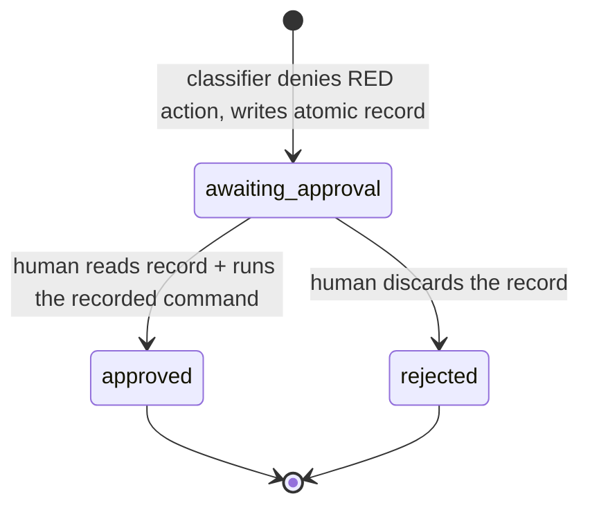

# G1: Risk-Tiered Firebreak for Unattended Autopilot Swarm ✨

## Overview

Autopilot runs today under `dangerouslySkipPermissions: true` with
`mode: "bypassPermissions"` injected into every spawned agent — a **blanket**
bypass that silences the risk-tiering already written into `CLAUDE.md`
("Forbidden Actions") and the global Safety Rule. This plan builds the missing
**enforcement engine** for that contract: a deterministic **PreToolUse-hook
classifier** that lets the safe majority of actions run unattended but **defers**
the genuinely-irreversible / outward tail (external sends, deploy, out-of-repo
deletes, package removal, external-MCP-writes, force-push / `git push` to a
shared `master`) to an **async human-approval queue**. The run completes
unattended; a human handles the deferred queue later, in a batch.

**v1 is deliberately thin and honest** (see Deepening Review): it reuses the
existing `todos/` queue and the `resolve-todos` guard, classifies deterministically
(no LLM in the dispose path), and bounds the **outward / irreversible** blast
radius. It is **not** an adversarial-worker sandbox (see Threat Model). Graceful
deferred-merge disposition and a `/approve` skill are explicitly **v2** (see the
"v2 — Deferred" appendix).

**Out of scope (separate governance items):** in-flight AI monitor (G2),
monoculture mitigation (G3), ledger hardening (G4), delegation-as-authority (G5).

---

## Threat Model (what v1 does and does not promise)

- **In scope (v1 enforces):** bound the blast radius of **outward / irreversible**
  actions a swarm worker could emit — external network sends, deploys,
  out-of-repo deletes, package removal, external-MCP writes, and force-push /
  `git push` to a shared `master` (a **local** merge to `master` with no push is
  GREEN — F5). Also: **protect the firebreak's own control
  plane** from the workers it governs (F1).
- **Guards honest-agent mistakes + bounded blast radius — NOT adversarial-proof.**
  A worker that is actively trying to evade a deterministic string-level classifier
  can still do so. v1 covers the common indirection vectors and **declares** the
  residual rather than overclaiming "unevadable."
- **Explicit, prominent residual — the allowlisted interpreter is an unbounded
  escape (F2 / 2nd-review P1-2).** An allowlisted runner (`pytest`,
  `python3 -m pytest`, the run's test command) **collects and executes
  worker-authored files** (a worker writing `tests/test_x.py` is GREEN). That test
  body can perform any outward action (egress, deploy, force-push) — so the outward
  bound holds for **direct** worker calls only, **not** for code routed through an
  allowlisted interpreter. v1 does **not** sandbox test execution (that needs
  OS/network-layer egress control — out of scope). This is stated as prominently as
  the in-scope claim so the bound is not overclaimed.
- **Deterministic-only authority.** No LLM in the dispose path (precedent: the
  spec-eval AI judge hit ~0% field precision and was demoted to advisory).

---

## Spike Result — the riskiest assumption (verify-first) ✅

The mechanism depends on a PreToolUse hook firing **above** the permission bypass.
Verified before any design work (`docs/spikes/2026-06-21-g1-pretooluse-hook-under-bypass-spike.md`):

| Case | Result | Source |
|------|:------:|--------|
| Main session under `--dangerously-skip-permissions` | hook **fired + blocked** | empirical (claude 2.1.173) + docs |
| Task-spawned subagent under bypass | hook **fired + blocked** | empirical |
| **Worktree-isolated subagent** (the real autopilot worker path) | **unproven** | docs silent; → **Step 0 + the F1 real-spawn probe** |

**Verdict: GREEN — viable.** The residual (worktree-subagent firing + hook
placement) is gated by Step 0, whose probe now spawns a **real**
`isolation:"worktree"` + `bypassPermissions` agent (F1), not just a main-session test.

---

## Deepening Review — Changelog (2026-06-21)

Five adversarial reviewers (security, architecture, simplicity, data-integrity,
performance) plus a second review pass shaped v1. The **body below is the current
v1 design** (no longer "first draft"); this table is the decision trail.

### First pass — R1–R8

| # | Revision | Why (reviewers) |
|---|----------|------------------|
| **R1** | Hook placement → **GLOBAL `~/.claude/settings.json`** is the default + a **positive-control probe** (abort the run if the firebreak isn't actually live). | Project-tracked hook leaks into manual sessions and is *most likely to fail* for worktree subagents (root on `origin/master`, not the feature branch). Sentinel was a fail-open gate; probe closes it. (architecture P0; security P1-3) |
| **R2** | **CUT graceful deferred-merge wiring from v1.** The swarm-runner `git merge --no-ff` lands on `original_branch` **locally** and **autopilot never pushes** — reversible, not irreversible. v1 merge-RED fires **only on a shared `master`/`main` target** and just defers. | 3 agents converged; data-integrity proved the pointer commit reproduces FC51 base-drift and the self-audit marker risks a silent false-`PIPELINE_PASS`. (architecture P0/P1; simplicity #1/#2; data-integrity P0-1/P0-2/P1-1/P2) |
| **R3** | **Threat model restated honestly** (guards honest mistakes + bounds outward blast radius; not adversarial-proof). | `git -C <path>` (repo's own mandated form) bypassed every git pattern; `Write deploy.sh` then `bash deploy.sh` defeats string matching. (security P0-1/2/3) |
| **R4** | **Evasion hardening (outward tier):** git normalization (`-C`/`--git-dir`/`--work-tree`/`-c`); indirection-defer; outward **allowlist-deny** incl. `gh api`/`npm publish`/`nc`/`ssh`/`scp`/`rsync`; `mcp__*` **read-only allowlist** → everything else defers. | Same security findings. (security P0-1/2/3, P2-3) |
| **R5** | **Approvals queue hardened:** gitignore `todos/approvals/` + `.claude/firebreak-active.json`; collision-free **atomic** filenames `RED-<run_id>-<category>-<uuid>.md`; record assembly/base SHAs. | `todos/` is tracked (secrets would commit); `NNN` sequence **races across 31 workers → lost record = silent unguarded RED action.** (performance P1; data-integrity P1-1/P2-1; security P2-1) |
| **R6** | **Token-grep fast-path** entry so python only cold-starts on RED-bearing calls; Step 0 sub-test proves the entry shape survives the bypass heuristics. | ~30–80ms python cold-start × thousands of Bash calls × 31 agents ≈ 7–12 min/run. (performance P0) |
| **R7** | *(rewritten by F3 below)* GREEN learnings carve-out. | architecture P1; security P1-2 |
| **R8** | **`/approve` skill deferred to v2.** v1 = the human reads the self-describing record and runs the recorded command; the **`resolve-todos` guard + glob isolation stay**. | A faithful-replay skill is a new RED-executing code path that could replay worker-tampered records. (simplicity #3; security P1-5; data-integrity P1-2) |

### Second pass — F1–F4 (control-plane, indirection, carve-out, v2 isolation)

| # | Fix | What changed |
|---|-----|--------------|
| **F1** | **Protect the firebreak control plane from the workers it governs.** During an active run, Write/Edit/Delete (incl. Bash `rm`/`mv`/`tee`/`>`/`sed -i`) targeting `~/.claude/settings.json`, the hook scripts (`.claude/hooks/firebreak-*.{py,sh}`), the sentinel `.claude/firebreak-active.json`, or `todos/approvals/` is **RED when the actor is an untrusted worker** (originally framed as "any subagent / `agent_id` present" — **corrected by F5** to a trusted-identity allowlist, since swarm-runner/tail-runner are also subagents). No worker ever has a legitimate reason to write the control plane. The matcher now also covers `Write`/`Edit`; the **positive-control probe spawns a REAL `isolation:"worktree"` + `bypassPermissions` agent** and asserts both a denylisted command AND a control-plane write are denied — proving the hook governs the actual worker path. (closes security P1-5 fully) |
| **F2** | **Cover interpreter / direct-script indirection — or declare the residual.** Add `python`/`python3`/`.venv/bin/*`/`node`/`ruby`/`perl` and **direct executable script paths** (`./x.sh`, `/abs/script`, `path/to/script`) to the indirection-defer set: **defer unless the (interpreter + target) is on the run's vetted test/build allowlist.** Threat model narrowed: a RED action hidden inside an **allowlisted** runner still executes (declared residual). EARS added. |
| **F3** | **Rewrite R7: carve-out keyed to actual write TARGETS + caller CONTEXT, not command shape.** Allow a learnings write IFF (a) the target **realpath-resolves into the exact sanctioned set** — `~/.claude/docs/agent-pitfalls.md`, `~/Documents/dev-notes/**`, `~/.claude/projects/<this-run-key>/memory/**` — with **no `..`/symlink escape** and the project key **pinned to the current run** (from the sentinel), **and** (b) the **caller is the tail/orchestrator context** (not a worker subagent), and (c) the op is write/append, not delete. Robust both ways: doesn't break when the command shape varies, doesn't become a write-anywhere hole. |
| **F4** | **All v2 merge-defer content isolated.** `/approve`, pointer commits, and `PIPELINE_PASS_WITH_DEFERRED_RISK` no longer appear anywhere in the v1 body (Plan Quality Gate, Resolved Questions, Acceptance Tests, verification text). They live only in the "v2 — Deferred" appendix. |
| **F5 (2nd-review root fix)** | **Key authority on a TRUSTED-IDENTITY allowlist, not `agent_id` presence.** The 2nd review found the `agent_id`-presence rule inverted: the legitimate control-plane/learnings writers (`swarm-runner`, `tail-runner`) ARE subagents with `agent_id`. Fixes: (a) **F1** control-plane writable only by **trusted identities** {orchestrator (no `agent_id`), `swarm-runner`, `tail-runner`} — denied for **workers** (`swarm-<run>-<role>`); (b) **F3** carve-out granted to {orchestrator, `tail-runner`} by `agent_type`, not "no `agent_id`"/`phase`; (c) **shared-main RED row: strike "merge"** — a LOCAL `git merge --no-ff` onto `master` with **no push** is GREEN (that is the swarm-runner's normal terminal action); only **push / force-push** to a remote-tracked shared branch is RED; (d) **Step 0 must assert** the worktree-subagent PreToolUse JSON actually carries a non-empty `agent_id`/`agent_type` distinct from the orchestrator — else the identity model is fail-OPEN and falls back to blanket control-plane deny during an active run; (e) honest restatement of the F2 interpreter residual (see Threat Model). (2nd review P0-1/P0-2/P0-3, P1-1/P1-2/P1-3, P2-1) |

> **Trusted vs untrusted actor (F5).** "Trusted identity" = the top-level
> **orchestrator** (PreToolUse JSON has **no** `agent_id`) plus the named
> orchestration subagents **`swarm-runner`** and **`tail-runner`** (by
> `agent_type`/agent name). "Untrusted" = a **worker** subagent
> (`swarm-<run-id>-<role>`). Control-plane writes and the learnings carve-out are
> for trusted identities only; everything a worker does is classified normally.
> This depends on `agent_id`/`agent_type` being harness-supplied and unforgeable —
> **gated by a Step 0 assertion** (if it fails, control-plane writes are
> blanket-denied during an active run regardless of actor).

**RESOLVED (user, 2026-06-21): fully cut — no status-mapping sliver in v1.** A
deferred shared-`master` merge reports its natural non-clean status (honest: the
merge did not land). Re-add a status sliver only if a non-clean status ever
hard-blocks the next run. Feature-branch merges are GREEN, so this rarely arises.

---

## Plan Quality Gate (4 questions) — v1

**1. What exactly is changing?**
- A **PreToolUse hook** in **global `~/.claude/settings.json`** (R1) invoking a
  deterministic classifier `.claude/hooks/firebreak-classify.py`, fronted by a
  cheap entry gate `.claude/hooks/firebreak-gate.sh` (R6). Matcher: `Bash`,
  `mcp__*`, `Write`, `Edit` (F1).
- A **sentinel** `.claude/firebreak-active.json` (gitignored — R5) that the
  autopilot orchestrator writes at run start (with `run_id`, `repo_root`,
  `project_key`, `phase`, and the **vetted test/build allowlist**) and removes at
  run end. Its presence activates the firebreak (manual sessions: no-op). A
  **positive-control probe** spawns a real worktree subagent and **aborts the run**
  if the firebreak isn't live (R1, F1).
- A gitignored **`todos/approvals/` queue** of deferred RED actions, atomic
  collision-free filenames, classifier as sole writer (R5).
- A **`resolve-todos` guard** so the unattended resolver never touches the queue.
- **Control-plane protection** (F1): worker subagents cannot Write/Edit/Delete the
  hook config, hook scripts, sentinel, or approvals queue.

**2. What must NOT change?**
- The `resolve-todos` queue structure/behavior (reuse).
- The Required-Artifacts contract (BUILD_TRACKING, solution doc, learnings,
  HANDOFF, self-audit) — all still produced.
- The **sanctioned learnings-propagation writes** — GREEN via the F3 carve-out;
  the firebreak must never defer them.
- GREEN throughput: **zero added deferrals** for local worktree work (file writes,
  local commits, tests, reads) — the fast-path keeps python off that path (R6).
- Manual-session behavior: no sentinel → no-op.
- The assembly/tail flow — **unchanged** (v1 does not touch the merge wiring; the
  shared-`master` merge case simply defers like any other RED action).

**3. How will we know it worked?**
See `## Acceptance Tests (EARS)`. In short: outward/irreversible RED actions land
in `todos/approvals/` and never execute; GREEN actions and learnings writes run
untouched; worker subagents cannot tamper with the control plane; the Step 0
real-spawn probe proves the hook governs the worker path.

**4. What is the most likely way this plan is wrong?**
- **(Primary) The real worker path.** The hook must fire for
  `isolation:"worktree"` + `bypassPermissions` subagents, not just the main
  session. → **Step 0's F1 real-spawn probe gates the build**; ordered fallbacks:
  global placement → agent-brief contract → tool wrapper.
- **(Secondary, declared) Interpreter/allowlisted-runner residual (F2).** A RED
  action inside an allowlisted test/build script executes. This is a *declared*
  bound of the threat model, not a silent hole.
- **(Tertiary) Carve-out context detection (F3).** If the classifier can't tell the
  tail/orchestrator context from a worker, it either defers a mandatory learnings
  write (breaks Required-Artifacts) or over-allows. Mitigated by agent-context +
  the sentinel `phase` field + realpath target check; verified in Phase 1 tests.

---

## Architecture (v1)

### Component map

```
  orchestrator (main session)
     │  run start: write .claude/firebreak-active.json
     │  {run_id, repo_root, project_key, phase, test_allowlist}   (gitignored)
     │  positive-control probe → spawn REAL worktree subagent that
     │     attempts a known-RED cmd + a control-plane write
     │       └─ both DENIED?  no → ABORT RUN     yes → proceed
     ▼
  worker / tail subagent attempts a tool call (Bash | mcp__* | Write | Edit)
     │
     ▼
  .claude/hooks/firebreak-gate.sh   (cheap entry — single exec, no chaining)
     │  Bash:  RED-token grep?            ── no ─▶ exit 0 (allow)
     │  Write/Edit: control-plane path?   ── no ─▶ exit 0 (allow)
     └─ hit ─▶ exec python3 .claude/hooks/firebreak-classify.py
                 │ reads stdin (tool, input, agent_id) + sentinel
        ┌────────┴─────────┐
   GREEN│              RED  │
        ▼                   ▼
   exit 0 (allow)   write todos/approvals/RED-<run_id>-<cat>-<uuid>.md (atomic)
                    + deny (FIREBREAK_DEFERRED; "do not retry")
                                  │
                                  ▼
              run continues unattended; deferral noted in BUILD_TRACKING.
              At run end: one HANDOFF line lists pending approvals.
              Human reads each record and runs the recorded command (v1).
```

### 1. The classifier (deterministic, category-specific)

`.claude/hooks/firebreak-classify.py`, invoked as **one** command — never
`python3 -c`, no `&&`/`;` chaining (P0: compound bash trips security heuristics
*above* the bypass and the firebreak would block itself —
`docs/solutions/2026-04-09-compound-bash-instruction-refactor.md`). Reads the
PreToolUse JSON from stdin (`tool_name`, `tool_input`, `agent_id`/`agent_type`
when inside a subagent) and the sentinel for run context. Disposition:

- **No sentinel → exit 0 (no-op).** Manual sessions untouched.
- **Control-plane protection (F1 + F5):** for `Write`/`Edit` (or Bash write verbs
  `rm`/`mv`/`cp`/`install`/`ln -sf`/`dd`/`truncate`/`tee`/`sed -i`/`>`/`>>`/heredoc)
  whose target **realpath** is the hook config, a hook script, the sentinel, or
  under `todos/approvals/` — **DENY unless the actor is a trusted identity**
  (orchestrator / `swarm-runner` / `tail-runner`); workers are denied. Realpath +
  `~`/`$HOME` expansion defeats symlink/traversal/`$HOME` obfuscation; the entry
  gate forwards to the classifier on any control-plane substring **or** any
  `~`/`$HOME`/`..`/symlink-suspect token — it never auto-allows an obfuscated form.
- **`Bash`** → classify the command string. Category-specific:
  - *Outward / irreversible (allowlist-deny, default-DEFER):* external sends
    (curl/wget to a non-localhost host; `nc`/`ssh`/`scp`/`rsync`; `gh api`/`gh
    release`/`gh pr`); deploy (`vercel`/`railway`/`fly`/`netlify`); package removal
    (`pip uninstall`, `npm uninstall`/`remove`); `npm publish`; **`git push` /
    force-push** to a remote-tracked shared branch. (A **local** `git merge --no-ff`
    onto `original_branch` with no push is **GREEN** — F5; that is the
    swarm-runner's normal terminal action.) Errs toward defer.
  - *Indirection (default-DEFER unless allowlisted — F2):* `bash <file>`, `sh`,
    `eval`, `source`/`.`, `npm run`, `make`, `base64 -d | sh`, **interpreters**
    (`python`/`python3`/`.venv/bin/*`, `node`, `ruby`, `perl`), and **direct script
    execution** (`./x.sh`, `/abs/script`, `path/to/script`). **Allow** only when the
    (interpreter + target) is on the sentinel's `test_allowlist` (the run's known
    test/build commands). *Declared residual: a RED action inside an allowlisted
    runner still executes.*
  - *Local / build (default-allow):* everything else local in the worktree (tests
    via the allowlist, local commits, local-only git, reads).
  - *Git normalization (R4a):* strip/resolve `git -C`/`--git-dir`/`--work-tree`/`-c`
    before matching, so `git -C <path> push --force` is caught.
- **`mcp__*` → read-only allowlist (R4d).** Any `mcp__*` tool **not** on a short
  read-only allowlist **defers** (verb-substring matching misses `apply_migration`,
  `deploy_to_vercel`, `respond_to_event`, …).
- **GREEN learnings carve-out (F3 + F5):** **allow** a write IFF — (a) the target
  realpath ∈ {`~/.claude/docs/agent-pitfalls.md`, `~/Documents/dev-notes/**`,
  `~/.claude/projects/<sentinel.project_key>/memory/**`} with **no `..`/symlink
  escape** and the project key **pinned to the run**, **and** (b) the caller is a
  **learnings-writer identity** — the **orchestrator** or **`tail-runner`** (by
  `agent_type`; NOT "no `agent_id`", because the tail-runner is itself a subagent —
  this was the P0-2 break). `sentinel.phase` (set to `tail` before the tail-runner
  spawns) is a defense-in-depth secondary signal, not the primary gate. **And**
  (c) the op is write/append (a **delete** is still RED). On any failing condition
  the classifier logs WHICH failed (target / identity / op) so a missed mandatory
  write is **loud, never silent**.
- **Fail-closed:** if the classifier cannot decide, or cannot write an approval
  record, it **denies** the RED-bearing action and emits a loud failure marker.

Deny output: `exit 2` + a stderr line, or the JSON form
`{"hookSpecificOutput":{"hookEventName":"PreToolUse","permissionDecision":"deny","permissionDecisionReason":"FIREBREAK_DEFERRED: <action> → todos/approvals/<file>. Do not retry."}}`.

#### The RED tier — v1

| Category | Detection | RED patterns |
|----------|-----------|--------------|
| **Control-plane writes (F1+F5)** | target realpath + untrusted identity | Write/Edit/`rm`/`mv`/`cp`/`install`/`ln -sf`/`dd`/`truncate`/`tee`/`sed -i`/`>`/`>>`/heredoc to `~/.claude/settings.json`, `.claude/hooks/firebreak-*.{py,sh}`, `.claude/firebreak-active.json`, `todos/approvals/**` — **from a worker** (trusted: orchestrator / swarm-runner / tail-runner = allowed) |
| External sends | host + allowlist | curl/wget to non-localhost; `nc`/`ssh`/`scp`/`rsync`; `gh api`/`gh release`/`gh pr`; email/webhook |
| Deploy | cmd patterns | `vercel`/`railway`/`fly`/`netlify` deploy/promote |
| Packages | cmd patterns | `pip uninstall`; `npm uninstall`/`remove`; `npm publish` |
| **Indirection (F2)** | interpreter/script + allowlist | `bash <file>`/`sh`/`eval`/`source`/`.`; `npm run`/`make`; `python`/`python3`/`.venv/bin/*`/`node`/`ruby`/`perl` on a non-allowlisted target; `./script`/`/abs/script` exec — **defer unless on `test_allowlist`** |
| Git force / shared-push | normalized cmd | `git push --force`/`-f`/`--force-with-lease`; **`git push`** to a remote-tracked shared branch; amend/rebase/`filter-repo`/`filter-branch` of pushed commits (after `-C`/`--git-dir`/`-c` normalization). **NOT** a local `git merge --no-ff` with no push — that is **GREEN** (F5; swarm-runner's terminal merge). |
| Data | path + cmd | DROP/DELETE/`rm` against a real `*.db` outside `/tmp` |
| Out-of-repo deletes | realpath + `~`/`$HOME` expand | `rm`/`rm -rf`/`unlink`/`truncate`/`find -delete`/`mv`-as-delete/`>`-truncation targeting any path **outside the repo worktree** and not `/tmp`; deferred if the target can't be statically resolved inside the worktree |
| External-MCP-writes | read-only allowlist | any `mcp__*` not on the read-only allowlist |

**GREEN (auto-run):** file writes inside the worktree; local commits; allowlisted
tests/builds; reads; local-only git; **local** feature-branch merges; the F3
learnings carve-out.

> Rationale: a code-build swarm overwhelmingly does GREEN. The outward/irreversible
> actions cluster into the list above; a code-build worker has **no legitimate
> reason** to deploy, send email, publish a package, or delete outside its
> worktree — so allowlist-deny there costs almost no false positives.

### 2. The hook + sentinel

- **Placement: global `~/.claude/settings.json`** `hooks.PreToolUse` (R1) —
  session-level, so it governs worktree subagents regardless of their base branch;
  scoped to autopilot by the sentinel (manual sessions: no-op). Matcher: `Bash`,
  `mcp__*`, `Write`, `Edit`. Hook command = the single entry gate (R6).
- **Sentinel** `.claude/firebreak-active.json` (gitignored — R5), read by the
  classifier via **absolute path** (worktree cwd irrelevant): `run_id`,
  `repo_root`, `project_key`, `phase`, `test_allowlist`. Written by the orchestrator
  at run start, removed at run end. The orchestrator **updates `phase` → `tail`
  before spawning the tail-runner** (F5 defense-in-depth for the carve-out; the
  primary carve-out gate is the tail-runner `agent_type`, not `phase`).
- **Positive-control probe (R1 + F1):** at run start, after writing the hook +
  sentinel, the orchestrator **spawns a real `isolation:"worktree"` +
  `mode:"bypassPermissions"` agent** that attempts (a) a known denylisted command
  and (b) a control-plane write. If **either** is not denied → **ABORT the run**
  (the firebreak is not actually live; do not proceed silently).

### 3. The approvals queue (`todos/approvals/`)

- New **gitignored** dir (R5). `resolve-todos`'s glob `todos/*-pending-*.md` is
  non-recursive (confirmed) so it never reaches a subdir; filenames also avoid the
  `-pending-` token (defense-in-depth).
- Filename **`RED-<run_id>-<category>-<uuid>.md`** (R5) — collision-free across
  concurrent workers; written **atomically** (temp-file + `os.rename()`). The
  classifier is the **sole** writer (and F1 keeps workers from tampering with the
  dir).
- Frontmatter + body record the **replayable payload** and SHAs:

```yaml
---
status: awaiting-approval        # awaiting-approval | approved | rejected
kind: approval
run_id: "<run-id>"
red_category: external-send      # deploy | out-of-repo-delete | shared-push | mcp-write | control-plane | ...
tool: Bash                       # or mcp__<server>__<verb> | Write | Edit
created: 2026-06-21
assembly_sha: "<sha>"            # when relevant (drift validation)
base_sha: "<sha>"
---
```

Body: the exact command (or MCP params) + `cwd`. **v1 approval = a human reads the
record and runs the recorded command** (R8); no skill executes it.

### 4. `resolve-todos` guard

Add a guard to `resolve-todos`: skip anything under `todos/approvals/` and any
`kind: approval` todo. **Safety-critical:** `resolve-todos` runs *unattended*
inside autopilot; without the guard an unattended pass would auto-execute queued
RED actions and reintroduce exactly the autonomy the firebreak removes. (With F1
also blocking subagent writes to the dir, this is defense-in-depth from both sides.)

---

## System-Wide Impact & Edge Cases (v1)

- **Interaction graph:** tool call → entry gate → (allow | classifier) →
  (allow | deny + atomic record) → run continues → BUILD_TRACKING note → one
  HANDOFF line at run end. No new downstream contracts; the merge wiring is untouched.
- **Multiple RED deferrals:** each gets its own uuid record. No special-casing.
- **A worker hits a RED action mid-build:** deferred + denied; the worker records
  it in its phase report and continues GREEN work. If essential to its blueprint,
  the blueprint is partial and the existing cross-worker structural scan flags it.
- **Control-plane write attempt by a worker (F1):** denied; recorded as a RED
  deferral; surfaces as a tamper signal (a worker should never attempt this).
- **Approval-record write failure:** fail-closed — deny anyway + loud
  `FIREBREAK_WRITE_FAILED` marker.
- **Shared-`master` merge target:** deferred like any other RED action (one HANDOFF
  line). Local feature-branch merges are GREEN and untouched. Never approved →
  backlog item; no auto-expiry in v1.
- **Carve-out misfire risk (F3):** a learnings write from the wrong context defers;
  the classifier logs which condition failed (target / context / op) so a Phase-1
  test or a real run surfaces it loudly rather than silently dropping a mandatory write.

---

## Implementation Phases (v1)

### Step 0 — GATING SPIKE (must pass before Phase 1) 🚧

Prove the hook governs the **real worker path** and the fast-path shape is legal.
Do NOT build the classifier until green.

- Define a throwaway PreToolUse hook (deny a sentinel-marked command) in **global
  `~/.claude/settings.json`**.
- **Real-spawn probe (F1):** spawn an Agent with `isolation:"worktree"` +
  `mode:"bypassPermissions"` that attempts (a) the denylisted command and (b) a
  write to a control-plane path. **Pass = both denied.**
- **Identity assertion (F5 / 2nd-review P1-3):** confirm the worktree subagent's
  PreToolUse JSON actually carries a **non-empty `agent_id`/`agent_type` distinct
  from the orchestrator's**, and that a worker cannot cause its calls to arrive
  **without** `agent_id`. If `agent_id` is absent or forgeable for worktree
  subagents, the trusted-identity model is **fail-OPEN** → fall back to **blanket
  control-plane deny during an active run** (orchestrator manages the sentinel only
  outside the active window). This assertion gates F1/F3/F5.
- **Fast-path sub-test (R6):** the entry gate (token/path grep → `exec` python) is
  a single command that blocks and does **not** itself trip the bypass heuristics.
- If global placement fails to govern the worktree subagent → fall back to
  agent-brief contract or tool wrapper; re-plan.
- **Deliverable:** result appended to
  `docs/spikes/2026-06-21-g1-pretooluse-hook-under-bypass-spike.md` + locked placement.

### Phase 1 — Classifier + hook + sentinel + fast-path + control-plane (foundation)

- `.claude/hooks/firebreak-classify.py` — git normalization (R4a),
  indirection-defer incl. interpreters/direct-scripts vs the `test_allowlist` (F2),
  outward allowlist-deny incl. `gh api`/`npm publish`/`nc`/`ssh`/`scp`/`rsync`
  (R4c), `mcp__*` read-only allowlist (R4d), **control-plane protection keyed on
  the trusted-identity allowlist** (F1+F5), **learnings carve-out keyed on
  realpath-target + learnings-writer identity** (F3+F5), fail-closed. Pure stdlib,
  one file.
- `.claude/hooks/firebreak-gate.sh` — cheap entry: RED-token grep for `Bash`,
  control-plane-path grep for `Write`/`Edit`; **also forwards to python on any Bash
  write verb (`cp`/`install`/`ln`/`dd`/`tee`/`sed -i`/`truncate`/redirection/heredoc)
  or any `~`/`$HOME`/`..`/symlink-suspect token** so an obfuscated control-plane
  write can't slip past the cheap grep (2nd-review P1-1); `exec`s python only on a
  hit (R6, F1).
- `hooks.PreToolUse` in **global settings** (R1), matcher `Bash`+`mcp__*`+`Write`+`Edit`.
- Sentinel `.claude/firebreak-active.json` (gitignored — R5) with `run_id`,
  `repo_root`, `project_key`, `phase`, `test_allowlist`; orchestrator writes/removes
  and **sets `phase` → `tail` before the tail-runner spawn** (F5); **positive-control
  real-spawn probe + identity assertion** abort the run if not live (R1, F1, F5/P1-3).
- **Unit-test the classifier** for: every RED pattern (incl. `git -C` force-push,
  `git push --force origin master`, `python3 deploy.py`, `./deploy.sh`,
  `node release.js`, `.venv/bin/python ship.py`, `gh api POST`, `rm ~/Data`,
  obfuscated control-plane write via `cp`/`ln -sf`/`$HOME`); a **worker** (untrusted)
  control-plane write → deny vs a **trusted identity** (orchestrator / swarm-runner /
  tail-runner) → allow; a **swarm-runner local `git merge --no-ff` onto master** →
  allow; the carve-out allow (**tail-runner identity** + sanctioned target) vs deny
  (worker identity, or `..`/symlink/wrong-project-key target); allowlisted runners
  (`pytest`, `python3 -m pytest`) → allow; a **Write to a non-control-plane worktree
  file** → gate exits with no python spawn (P2-1); the no-sentinel no-op.

### Phase 2 — Approvals queue + resolve-todos guard

- `todos/approvals/` (gitignored — R5) + record schema with SHAs; classifier sole
  writer, **atomic temp-file + `os.rename()`**, filename `RED-<run_id>-<category>-<uuid>.md`.
- `.gitignore`: add `todos/approvals/` and `.claude/firebreak-active.json`.
- `resolve-todos` guard (skip `todos/approvals/` + `kind: approval`).
- v1 approval = the human reads the record and runs the recorded command (R8).

---

## Resolved Open Questions (from brainstorm) — v1

### Q1 — How does approval resolve? → **A glob-isolated, gitignored `todos/approvals/` queue; the human reads each record and runs the recorded command. No `/approve` skill in v1.**

Rejected: extending `resolve-todos` (it runs unattended; folding approval in would
let it auto-execute RED actions). The human-only property is held by **three**
independent mechanisms: the non-recursive glob, the `resolve-todos` guard, and the
F1 control-plane protection (workers can't even write the queue). A `/approve`
skill is **v2** (R8) — a faithful-replay executor is a new RED-executing surface and
isn't worth it until manual approval proves annoying.

### Q2 — Deferred-merge × Required-Artifacts ordering. → **Not a v1 problem.**

v1 does **not** touch the merge/tail wiring (R2). The swarm-runner's
`git merge --no-ff` onto `original_branch` is **local** and autopilot **never
pushes**, so it is reversible — **GREEN, even when `original_branch` is `master`**
(F5; this is the swarm-runner's normal terminal action and must not defer). Only a
**`git push` / force-push** to a remote-tracked shared branch is RED — which
autopilot does not do today — and that would defer like any other RED action (one
HANDOFF line, no status engineering). The graceful disposition machinery
(`PIPELINE_PASS_WITH_DEFERRED_RISK`, self-audit WARN, tail retargeting) is **v2**,
to be built only if autopilot ever starts auto-pushing/auto-merging to a shared
`master`.

---

## Acceptance Tests (EARS) — v1

### Happy path

- WHEN a swarm worker performs a GREEN action (file write in its worktree, local
  commit, an allowlisted test run) THE SYSTEM SHALL allow it with no deferral.
  - Verify: run a build; worker commits land on `worktree-agent-*`; firebreak log = `ALLOW`.
- WHEN the **`tail-runner`** (a subagent with `agent_type: tail-runner`) or the
  orchestrator writes to a sanctioned learnings target THE SYSTEM SHALL allow it
  (F3+F5 carve-out — keyed on identity, not `agent_id` absence).
  - Verify: classifier input `{"tool_name":"Write","tool_input":{"file_path":"~/.claude/docs/agent-pitfalls.md"},"agent_id":"t1","agent_type":"tail-runner"}` → `allow`;
    after a run, `~/.claude/docs/agent-pitfalls.md` Update Log has today's entry.
- WHEN the swarm-runner performs a **local** `git merge --no-ff <assembly>` onto
  `original_branch` (incl. `master`) with no push THE SYSTEM SHALL allow it (F5 —
  must not defer the normal terminal merge).
  - Verify: `{"tool_name":"Bash","tool_input":{"command":"git merge --no-ff swarm-072-assembly"},"agent_type":"swarm-runner"}` → `allow`.
- WHEN a GREEN Bash command carries no RED token THE SYSTEM SHALL short-circuit at
  the entry gate without invoking python (R6).
  - Verify: the gate `exit 0`s on `pytest -q` with no python process spawned.
- WHEN the positive-control real-spawn probe runs at run start THE SYSTEM SHALL
  confirm a worktree subagent's denylisted command AND control-plane write are both
  denied, else ABORT the run (R1, F1).
  - Verify: with a broken hook, the probe's RED command is not denied → run aborts.

### Error / edge cases

- WHEN a worker attempts an outward/irreversible RED action (curl to a non-localhost
  host, `nc`/`ssh`/`scp`, `gh api POST`, a deploy command, `npm publish`,
  `pip/npm uninstall`, an external-MCP write, `git push --force`/`git push` to a
  shared `master`) THE SYSTEM SHALL deny it and write an approval record; the action
  SHALL NOT execute.
  - Verify: feed each shape to the classifier → `deny` + a record exists. In
    particular `git push --force origin master` → `deny`.
- WHEN a worker emits a normalized git evasion (`git -C <path> push --force`,
  `git --git-dir=… push`, `git -c … push`) THE SYSTEM SHALL normalize and defer it (R4a).
  - Verify: feed each → `deny`.
- WHEN a worker uses interpreter/direct-script indirection on a NON-allowlisted
  target (`python3 deploy.py`, `.venv/bin/python ship.py`, `node release.js`,
  `ruby task.rb`, `./deploy.sh`, `bash deploy.sh`, `eval "$(cat cmd)"`) THE SYSTEM
  SHALL defer (F2).
  - Verify: `echo '{"tool_name":"Bash","tool_input":{"command":"python3 deploy.py"},"agent_id":"w1"}' | python3 .claude/hooks/firebreak-classify.py` → `deny`.
- WHEN an interpreter runs an ALLOWLISTED test/build target (`pytest -q`,
  `python3 -m pytest`, the run's declared test command) THE SYSTEM SHALL allow it
  (F2 — declared residual: RED inside the runner is not caught).
  - Verify: feed each allowlisted shape → `allow`.
- WHEN a **worker** (untrusted identity) attempts to Write/Edit/Delete a
  control-plane path (`~/.claude/settings.json`, `.claude/hooks/firebreak-*.{py,sh}`,
  `.claude/firebreak-active.json`, `todos/approvals/**`) — including obfuscated
  forms (`cp`/`ln -sf`/`$HOME`/`..`) — THE SYSTEM SHALL deny it (F1+F5); WHEN a
  **trusted identity** (orchestrator / swarm-runner / tail-runner) does so THE
  SYSTEM SHALL allow it.
  - Verify: input with a worker `agent_type` + a control-plane `file_path` (or
    `cp evil ~/.claude/settings.json`) → `deny`; same with `agent_type: tail-runner`
    or no `agent_id` → `allow`.
- WHEN a worker Writes/Edits a **non-control-plane** worktree file THE SYSTEM SHALL
  exit at the entry gate with **no python process spawned** (R6 fast-path preserved
  despite the Write/Edit matcher — 2nd-review P2-1).
  - Verify: the gate returns `exit 0` on a normal worktree `Write` without exec'ing python.
- WHEN Step 0 runs THE SYSTEM SHALL assert the worktree subagent's PreToolUse JSON
  carries a non-empty `agent_id`/`agent_type` distinct from the orchestrator's, else
  the build does not proceed on the trusted-identity model (F5/P1-3).
  - Verify: the Step-0 probe logs the observed `agent_id`/`agent_type` for the
    worktree subagent and confirms it is present and ≠ orchestrator.
- WHEN a learnings-path write comes from a worker subagent, or targets a
  `..`/symlink-escaped or wrong-project-key path THE SYSTEM SHALL NOT apply the
  carve-out (defer/deny), and SHALL log which condition failed (F3).
  - Verify: feed a worker-context write to `~/Documents/dev-notes/../.ssh/x` → not allowed.
- WHEN an `mcp__*` tool not on the read-only allowlist is called (e.g.
  `…apply_migration`, `deploy_to_vercel`, `respond_to_event`, `…__publish`) THE
  SYSTEM SHALL defer (R4d).
- WHEN no firebreak sentinel is present (manual session) THE SYSTEM SHALL be a no-op.
  - Verify: with no `.claude/firebreak-active.json`, a denylisted command → `ALLOW`.
- WHEN the approval-record write fails THE SYSTEM SHALL still deny the RED action
  (fail-closed) and emit `FIREBREAK_WRITE_FAILED`.
  - Verify: point the classifier at an unwritable approvals dir → `deny` + marker.
- WHEN two workers defer RED actions concurrently THE SYSTEM SHALL persist both
  records with no collision/truncation (R5).
  - Verify: filenames are `RED-<run_id>-<category>-<uuid>.md`; both parse as valid YAML.
- WHEN `resolve-todos` runs THE SYSTEM SHALL NOT process any file under
  `todos/approvals/` or any `kind: approval` todo.
  - Verify: place a record, run `resolve-todos`; it is untouched.
- WHEN the hook invokes its classifier THE SYSTEM SHALL use a single
  command/`exec` (no `&&`/`;`/`python3 -c`) so security heuristics don't fire above
  the bypass.
  - Verify: the `hooks.PreToolUse.command` is the single entry gate; it `exec`s python.

### Verification commands

```bash
# RED: outward + normalized-git + indirection (agent_id present = worker)
echo '{"tool_name":"Bash","tool_input":{"command":"git -C /repo push --force origin master"},"agent_id":"w1"}' | python3 .claude/hooks/firebreak-classify.py; echo "exit=$?"
echo '{"tool_name":"Bash","tool_input":{"command":"python3 deploy.py"},"agent_id":"w1"}' | python3 .claude/hooks/firebreak-classify.py; echo "exit=$?"
echo '{"tool_name":"Bash","tool_input":{"command":"gh api --method POST /repos/x"},"agent_id":"w1"}' | python3 .claude/hooks/firebreak-classify.py; echo "exit=$?"
# GREEN: allowlisted runner; trusted swarm-runner local merge to master
echo '{"tool_name":"Bash","tool_input":{"command":"pytest -q"},"agent_id":"w1","agent_type":"swarm-072-api"}' | python3 .claude/hooks/firebreak-classify.py; echo "exit=$? (expect allow)"
echo '{"tool_name":"Bash","tool_input":{"command":"git merge --no-ff swarm-072-assembly"},"agent_type":"swarm-runner"}' | python3 .claude/hooks/firebreak-classify.py; echo "exit=$? (expect allow)"
# RED: push-force to shared master
echo '{"tool_name":"Bash","tool_input":{"command":"git push --force origin master"},"agent_type":"swarm-072-api"}' | python3 .claude/hooks/firebreak-classify.py; echo "exit=$? (expect deny)"
# F1 control-plane: worker denied (incl. obfuscated), trusted identity allowed
echo '{"tool_name":"Write","tool_input":{"file_path":".claude/firebreak-active.json"},"agent_id":"w1","agent_type":"swarm-072-api"}' | python3 .claude/hooks/firebreak-classify.py; echo "exit=$? (expect deny)"
echo '{"tool_name":"Bash","tool_input":{"command":"cp evil $HOME/.claude/settings.json"},"agent_id":"w1","agent_type":"swarm-072-api"}' | python3 .claude/hooks/firebreak-classify.py; echo "exit=$? (expect deny)"
echo '{"tool_name":"Write","tool_input":{"file_path":".claude/firebreak-active.json"},"agent_type":"tail-runner"}' | python3 .claude/hooks/firebreak-classify.py; echo "exit=$? (expect allow)"
# no-op without sentinel
rm -f .claude/firebreak-active.json; echo '{"tool_name":"Bash","tool_input":{"command":"vercel deploy"},"agent_id":"w1"}' | python3 .claude/hooks/firebreak-classify.py; echo "exit=$? (expect allow)"
# queue isolation
ls todos/approvals/ 2>/dev/null
```

---

## Dependencies & Risks (v1)

- **Step 0 must pass** — the F1 real-spawn probe (worktree subagent governed) **and
  the F5 identity assertion** (the worktree subagent's PreToolUse JSON carries a
  present, unforgeable `agent_id`/`agent_type`). If the identity model is fail-open,
  fall back to blanket control-plane deny during an active run. Ordered fallbacks defined.
- **Trusted-identity model (F5) is load-bearing:** the entire control-plane + carve-out
  authority rests on `agent_type` being harness-supplied and unforgeable, and on the
  orchestrator setting `phase → tail`. Verified in Step 0 + Phase-1 tests.
- **Bash Command Rules bind the hook itself** (P0): single command / `exec`, no
  chaining, no `python3 -c`. (`docs/solutions/2026-04-09-compound-bash-instruction-refactor.md`)
- **Declared residual (F2 / 2nd-review P1-2) — PROMINENT:** an allowlisted
  interpreter (pytest) runs worker-authored files = an **unbounded egress/RED-exec
  escape**. The outward bound holds for **direct** worker calls only; v1 does **not**
  sandbox test execution (real isolation needs OS/network egress control — out of
  scope). Keep `test_allowlist` tight.
- **Gate coverage (2nd-review P1-1):** the cheap entry gate must forward-on-suspicion
  (all write verbs + `~`/`$HOME`/`..`/symlink tokens) or the R6 fast-path becomes an
  auto-allow hole for obfuscated control-plane writes.
- **Deterministic-only authority** (P0): no LLM in the dispose path
  (`project_deterministic-pre-filters`; spec-eval judge demotion precedent).

## Mermaid — approval lifecycle (v1)



---

## Feed-Forward

- **Hardest decision:** Cutting the graceful deferred-merge machinery (R2) — it
  *looked* load-bearing but defended a boundary the pipeline doesn't cross and
  reproduced FC51 base-drift. The reframe (local merge = GREEN; only shared-`master`
  is RED) collapsed a third of the plan.
- **Rejected alternatives:** project-tracked hook (R1); extending `resolve-todos`
  for approvals (R8); a `/approve` executor in v1 (R8); command-shape matching for
  the learnings carve-out (F3); an LLM classifier (spec-eval ~0% precedent).
- **Least confident:** (1) that `agent_id`/`agent_type` is **present + unforgeable**
  for the real worktree-subagent path — the whole F5 trusted-identity model and the
  Step-0 probe rest on it; if it fails, fall back to blanket control-plane deny.
  (2) That the F2 interpreter escape (an allowlisted pytest running worker-authored
  files) is an acceptable **declared** residual for the intended honest-agent threat
  model — resisting an adversarial worker would need network-layer egress control
  (out of scope). Both are stated bounds, not silent assumptions.

---

## v2 — Deferred (NOT part of v1)

Documented so a future implementer has the design; **do not build in v1.**

### v2.1 — Graceful deferred-merge disposition

Only earns its complexity **if autopilot ever starts auto-pushing or auto-merging
to a shared `master`** (it doesn't today). The original design: the swarm-runner
recognizes a `FIREBREAK_DEFERRED` denial of its merge and records `MERGE_STATUS:
DEFERRED_FOR_APPROVAL` (no retry/abort); a deferred-merge marker lands in a
self-audit-scanned source so the self-audit-reviewer collects it as a WARN keyed
`[<run-id>-W<N>]`, disposes it `DEFERRED`, and sets status
`PIPELINE_PASS_WITH_DEFERRED_RISK`; the tail writes a matching HANDOFF key
(verify-self-audit Gate 3). **Data-integrity hazards to avoid if ever built:** the
`original_branch` pointer commit breaks the assembly→`original_branch` ancestry
(reproduces FC51 base-drift → conflicting merge); the WARN-source "either/or" can
read as resolved and be dropped (silent false-`PIPELINE_PASS`); a later run can
clobber the orphan assembly branch (pin assembly/base SHAs, tag the tip, skip
Step-8 cleanup on the deferred path).

### v2.2 — `/approve` skill

A human-only skill that lists `awaiting-approval` records and, on confirmation,
executes the recorded action / lands the merge — with an **idempotency contract**
(flip `status: approving` before executing; refuse non-`awaiting-approval`; verify
the recorded SHA still matches; `git merge-base --is-ancestor` short-circuit).
Build only when manual approval (v1) proves annoying.

### v2.3 — AI advisory pass

A **read-only** pass that flags novel/unlisted actions for a human to add to the
denylist — **never decides** (spec-eval AI judge hit ~0% field precision and was
demoted to advisory: `docs/solutions/2026-06-07-autopilot-orchestration-hardening.md`).

---

## Codex Handoff Prompt (external Plan Review — reviews the REVISED v1)

```
Review this plan as an adversarial second reader (fresh context):
docs/plans/2026-06-21-feat-g1-risk-tiered-firebreak-plan.md

Read the "Deepening Review — Changelog" (R1–R8, F1–F5) and the "Threat Model"
FIRST. v1 = Step 0 → Phase 1 → Phase 2. All /approve / pointer-commit /
PIPELINE_PASS_WITH_DEFERRED_RISK content is v2 (appendix), NOT v1. Note F5 is the
2nd-review root fix (trusted-identity allowlist, not agent_id presence).

Scrutinize:
1. CONTROL-PLANE (F1+F5): authority is keyed on a TRUSTED-IDENTITY allowlist
   (orchestrator / swarm-runner / tail-runner by agent_type), not agent_id presence.
   Can a worker still reach the hook config, hook scripts, sentinel, or
   todos/approvals/ — via a vector the gate's forward-on-suspicion grep or the
   classifier's realpath check misses (symlink, $HOME, redirection, `cp`/`install`/
   `ln`, heredoc, env-redirected writes)? Can a worker FORGE `agent_type` to
   impersonate swarm-runner/tail-runner, or clear it to impersonate the orchestrator?
   Is the Step-0 identity assertion sufficient to prove it's unforgeable?
2. INDIRECTION (F2): is the interpreter/direct-script defer set complete enough to
   bound the OUTWARD blast radius, given the declared allowlisted-runner residual?
   Any egress path that reaches the network/master via an allowlisted runner that
   should NOT be allowlisted?
3. CARVE-OUT (F3): can the target-realpath + caller-context gate either (a)
   silently DEFER a mandatory learnings write (breaking Required-Artifacts) or (b)
   be abused as write-anywhere? Is sentinel.phase / agent_id a reliable caller signal?
4. R2 CUT: does ANY autopilot path push or merge to a SHARED master (real remote)?
   If yes, R2 is wrong and v2.1 must be v1.
5. R1 PLACEMENT + PROBE: global ~/.claude/settings.json governs all projects
   (mitigated by sentinel no-op + real-spawn probe). Any residual fail-open the
   probe wouldn't catch (e.g., a swarm launched without writing the sentinel)?
Return findings as P0/P1/P2 with the exact section (and R/F number) to change.
```

---

## Sources & References

### Origin
- **Brainstorm:** docs/brainstorms/2026-06-21-g1-risk-tiered-firebreak-brainstorm.md
- **Governance:** docs/governance/2026-06-21-autopilot-vs-three-layers-agent-security.md (G1)
- **Spike (verify-first):** docs/spikes/2026-06-21-g1-pretooluse-hook-under-bypass-spike.md (GREEN)

### Internal references (file:line)
- `.claude/agents/swarm-runner.md:174-177` — the local `git merge --no-ff` (Step 7); no `git push` exists.
- `.claude/skills/autopilot/SKILL.md:739-746` — worktree worker spawn (`isolation:"worktree"`, `bypassPermissions`).
- `.claude/skills/autopilot/SKILL.md:30-38, 422-425` — bypass mandate; "security heuristics fire above bypass".
- `.claude/skills/resolve-todos/SKILL.md:16` — glob `todos/*-pending-*.md` (non-recursive; approvals safe).
- `.claude/settings.json` — tracked, no `hooks` key; `~/.claude/settings.json` is the global hook home (v1 placement).
- `.gitignore` — `todos/` tracked, `.claude/settings.local.json` ignored; add `todos/approvals/` + `.claude/firebreak-active.json`.
- `CLAUDE.md` — Forbidden Actions; learnings-propagation carve-out; Required Artifacts; Bash Command Rules; Control Surface Scope.

### Prior lessons (institutional)
- `docs/solutions/2026-06-07-autopilot-orchestration-hardening.md` — AI-judge demotion (deterministic stays dispositive).
- `docs/solutions/2026-04-09-compound-bash-instruction-refactor.md` — hook command must obey Bash Command Rules.
- `docs/solutions/2026-06-21-unattended-swarm-autopilot-master-extraction.md` — deterministic exit-code gates, fail-closed.
- `project_deterministic-pre-filters` (memory) — "facts in code can't hallucinate"; AI advises, code disposes.
```
